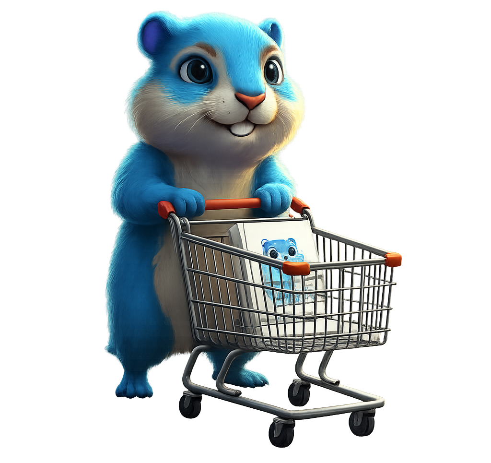

# The Gopher Shop 🐹📚

<div align="center">
  
</div>

Welcome to **The Gopher Shop** — a professional, hands-on educational journey designed to transform Go beginners into **Middle-level Backend Engineers**.

## 🚀 The Mission
Our goal is to build a production-ready REST API for a digital book store from scratch. We don't just teach syntax; we teach **architecture, patterns, and logic**.

## 🧠 Learning Methodology
This course uses a unique **Visual Anchor System**. Instead of long walls of text, we provide consistent metaphors:

| Concept | Visual Anchor | Meaning |
| :--- | :--- | :--- |
| **Variable** | 📦 The Box | A labeled storage container. |
| **Slice** | 📚 The Shelf | A window into a growable list. |
| **Map** | 🎫 The Coat Check | Key-Value lookup (Ticket -> Coat). |
| **Validation** | 🛡️ The Quality Gate | Rejecting bad data immediately. |
| **Interface** | 🔌 The Universal Plug | Accepting any tool that fits the socket. |

## 🗺 Curriculum Roadmap

### Level 1: The Junior (Foundations)
*Syntax, Memory operations, Logic, Loops, and Basic HTTP.*
- **Landing Page**: [Junior Path](./docs/junior-path.md)
- **Goal**: Write a program that listens and responds.

### Level 2: The Apprentice (Building)
*Structs, JSON, Configuration, In-Memory Storage.*
- **Focus**: Building the "Components" of the shop.
- **Key Skill**: Separation of Concerns.

### Level 3: The Professional (Production)
*Interfaces, PostgreSQL, Middleware, Testing, CI/CD.*
- **Focus**: Making the shop reliable and production-ready.
- **Key Skill**: Dependency Injection and Automation.

## 🛠 How to Run

### 1. View the Documentation
Read the course material locally.
```bash
npm install
npm run docs:dev
# Visit http://localhost:5173
```

### 2. Run the Educational Demo
A standalone, single-file web app to visualize the final goal (UI + In-Memory Store).
```bash
go run cmd/web-demo/main.go
# Visit http://localhost:8082
```

### 3. Run the Main API (Capstone)
The final production backend (requires Docker for PostgreSQL).
```bash
docker-compose up -d
go run cmd/api/main.go
# Visit http://localhost:8080/health
```

---
*Built with ❤️ for the Go Community.*

## 📜 License & Legal

This project is protected by the **GNU Affero General Public License v3.0 (AGPL-3.0)**.

### 🎓 For Students & Individuals
**You are free to use this project** to learn, fork, modify, and build your own learning portfolio. We encourage open-source contributions!

### 🏢 For Commercial Educational Platforms
If you intend to use this methodology, code, or materials in a **commercial course, bootcamp, or proprietary platform**:
1.  **Open Source**: You must open-source your entire platform code under AGPL-3.0.
2.  **Commercial License**: If you cannot open-source your platform, you **MUST purchase a commercial license**.

> **"If you profit from our work, you must either contribute back (Open Source) or pay it forward (Commercial License)."**

Contact `licensing@gopher-shop.com` for commercial inquiries.
