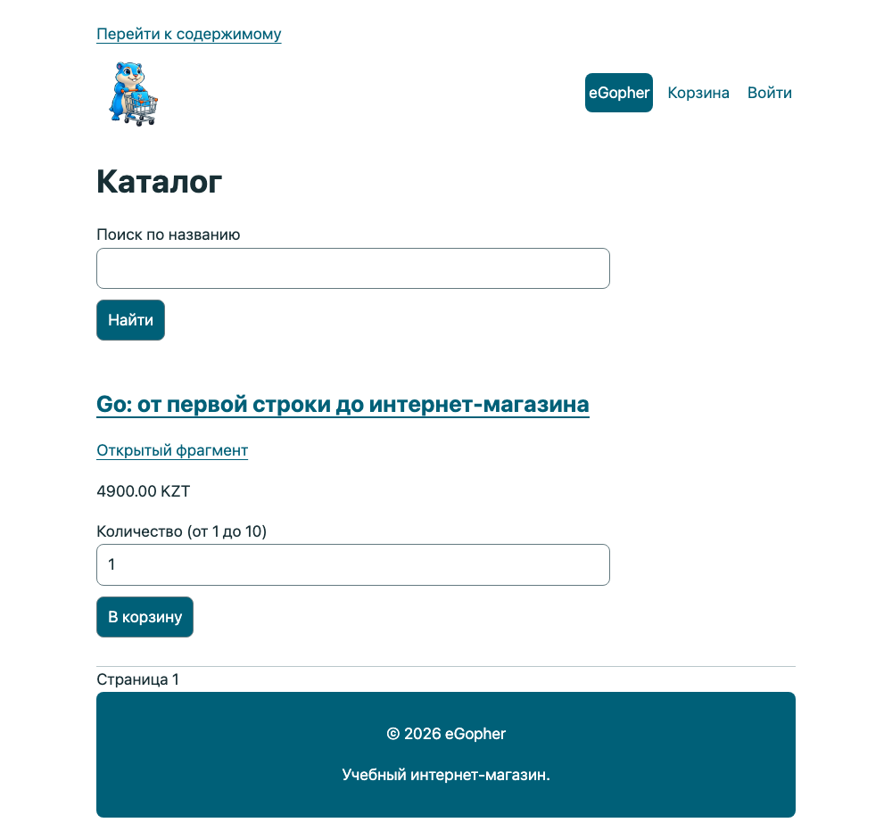

# Предисловие. Магазин начинается с одной книги

**Ознакомительный фрагмент.** Здесь доступны предисловие и главы 1–12. Вы начнёте с первой программы и дойдёте до HTTP-каталога с HTML-шаблонами. Полная книга содержит 42 главы; заказы, доступ к файлам, административная часть и эксплуатация рассматриваются в продолжении. [Карточка полной книги на shanraq.org](https://shanraq.org/shop/go-book). В учебном проекте используется тестовая оплата: реальные деньги не списываются.

Вы открыли книгу о Go. К её последней главе у вас будет магазин электронных книг. Первым товаром станет та самая книга, которую вы сейчас читаете.

Это удобно для учёбы: у каждой новой возможности есть понятная причина. Строка хранит название. Срез собирает каталог. Функция считает стоимость. Сервер показывает страницу. База помнит заказ после перезапуска. Проверка доступа решает, кому можно отдать файл.

Но магазин начинается раньше сервера. Он начинается с обещания: человек выбирает книгу, оплачивает её и получает возможность читать. Наша работа — написать программу, которая выполняет это обещание даже тогда, когда что-то идёт не по плану.

## Ориентир на экране

Снимок работающей контрольной точки 42 показывает итоговый интерфейс. В ранних главах мы будем приходить к нему постепенно; адреса, заказ и цены здесь учебные.

## Как пройти основы без пропущенных ступеней

Сначала выполните небольшие опыты, затем читайте применение в магазине. Команды `go run ./labs/...` запускаются из корня контрольной точки главы, где лежит её `go.mod`; это отдельные программы, а не запуск всего магазина. До запуска предскажите вывод, затем сравните его с объяснением, измените одну деталь и объясните разницу. Не переходите дальше только потому, что скопированный код скомпилировался.

| Где | Что нужно научиться объяснять |
| --- | --- |
| 1–2 | Текущая директория, файл программы, модуль; чем `go run` отличается от `go build`. |
| 3–5 | Переменные, типы, нулевые значения, условия, циклы, вызовы функций и проверка результата. |
| 6–7 | Байты и руны; массив, срез и map; копирование значения и общее хранилище. |
| 8–9 | Структуры, указатели и методы; функции как значения, замыкания, `defer` и ошибки. |
| 10–12 | Пакеты, HTTP-запрос и обработчик, HTML-шаблон, layout и partial, оформление страницы. |

В полной книге главы 15–18 отдельно разбирают JSON, SQL, транзакции и собственные интерфейсы. Стандартный интерфейс `error` нужен раньше — его минимальный контракт объясняется в главе 9, а общий механизм и ловушки интерфейсов возвращаются в главе 18. Горутины, каналы и синхронизация вводятся в главе 30; отмена работы — в 31; параметры типов и итераторы — в 34. До соответствующей главы от читателя не требуется знать эти механизмы целиком.

Если опыт не получается, сначала проверьте директорию, версию Go и точный текст ошибки. Вернитесь к указанной предпосылке; перепечатать решение без объяснения результата — недостаточный критерий готовности. Книга обучает языку через проект и не заменяет полный справочник по всем возможностям Go.

## Зачем учиться, если ИИ уже пишет код

Этот вопрос заслуживает прямого ответа. Если ваша цель — получить несколько строк программы, знание языка уже не единственный путь. ИИ может предложить реализацию, объяснить чужой код, подготовить тесты и помочь с исправлением ошибки. Учиться Go сегодня имеет смысл ради более сильной цели: уметь превращать свою задачу в работающий продукт, понимать основания решений и сохранять возможность изменить их.

Не стоит строить мотивацию на мысли, что ИИ «никогда не научится» делать какую-то часть работы. Возможности инструментов меняются. В феврале 2026 года исследователи METR прямо предупредили: их прежний результат о замедлении опытных разработчиков нельзя просто переносить на новые условия. Новое исследование столкнулось с отбором участников и задач, а величину современного ускорения надёжно оценить не удалось. Это аргумент в пользу измерения результата в своей работе, а не лозунга за или против ИИ. [Обновление исследования METR, 24 февраля 2026 года](https://metr.org/blog/2026-02-24-uplift-update/).

Что же дают знания, если помощник способен написать и код, и проверку к нему?

**Вы можете задать проверяемую цель.** «Сделай интернет-магазин» оставляет много решений неявными. Можно ли покупать снятое с продажи издание? Сохраняется ли старая цена заказа? Что делать, если деньги списаны, а ответ не пришёл? Программирование учит превращать такие вопросы в точные правила. Здесь важна не длина запроса к ИИ, а способность заметить недосказанность и выбрать поведение, которое действительно нужно покупателю.

**Вы можете отличить доказательство от убедительного объяснения.** Зелёный тест полезен лишь настолько, насколько верно его ожидание. Если код разрешает чужому пользователю скачать файл, а тест проверяет только владельца, они могут выглядеть согласованными и всё же пропускать ошибку. Знание HTTP, сессий и хранения данных позволяет самому сформулировать отрицательный сценарий: войти другим пользователем, подставить чужой ID и проверить отказ. Проверка становится независимой от предположений автора реализации — человека или модели.

**Вы сохраняете управление после первой удачной демонстрации.** У магазина появятся новые издания, изменится цена, закончится место на диске, придёт повторное уведомление об оплате. Чтобы исправить проблему, нужно связать наблюдаемый симптом с запросом, состоянием базы и конкретным изменением. Навык чтения кода помогает оценить предложенную правку до её применения, а тесты и история Git — проверить результат и вернуться к рабочей версии. Вы можете поручить значительную часть работы инструменту, сохраняя понимание того, что меняете и почему.

**Вы получаете больше самостоятельности в выборе задач.** Когда вы понимаете основы, помощник становится полезен не только на знакомом примере. Можно сравнить два варианта, проверить их на своих данных и отказаться от лишней сложности. Это позволяет быстрее пробовать идеи и делать небольшие полезные продукты. Но качество идеи, интерес покупателей и доход не следуют автоматически из умения писать код. Книга не обещает ни гарантированной работы, ни успеха бизнеса; она даёт практику создания и проверки системы, за которую вы можете отвечать.

Распространённость инструментов тоже не означает безусловного доверия к результату. В опросе Stack Overflow за 2025 год недоверие к точности ИИ-инструментов выражали 46% ответивших на соответствующий вопрос, доверие — 33%. Это ответы участников опроса, а не измерение доли ошибочных программ. Практический вывод для нашей книги: полезность помощника и необходимость проверки вполне совместимы. [Stack Overflow Developer Survey 2025: AI](https://survey.stackoverflow.co/2025/ai).

Поэтому мы не будем соревноваться с ИИ в скорости набора текста или требовать заучивания всей стандартной библиотеки. Сначала вы освоите достаточно языка, чтобы читать небольшую программу, объяснять её состояние и проверять результат. Затем последовательно разберёте данные, права доступа, транзакции, повторные события и остановку сервера. Эти знания связывают отдельные файлы в понятную вам систему.

Используйте помощника так, чтобы после работы с ним оставался собственный навык:

1. До подсказки запишите ожидаемое поведение и один случай, когда операция должна завершиться отказом.
2. Попробуйте выполнить небольшой шаг сами. Если застряли, попросите подсказку или объяснение конкретного места, затем проверьте его запуском.
3. Для предложенной правки прочитайте diff и объясните, какое правило она сохраняет. Попросите ИИ поискать контрпример, но сами проверьте, действительно ли он проверяет нужное условие.
4. На следующий день измените условие задачи и повторите ключевую часть без готового ответа. Если не получается, вернитесь к маленькому примеру: работающая вчера программа ещё не означает освоенный сегодня приём.

Уже в этой книге вы сможете проверить пользу такого подхода на собственном магазине: не только получить страницу покупки, но и объяснить, почему чужой заказ закрыт, повтор оплаты не выдаёт лишнего права, а снятая с продажи книга остаётся у прежнего покупателя. Именно эта способность — поставить задачу, проверить решение и осознанно его развивать — делает обучение осмысленным при развитии ИИ.

## Образ, который можно унести с собой

Закройте на секунду текст и представьте небольшой книжный стол: на нём лежит книга, рядом стоит ценник, под столом хранится тетрадь заказов. Покупатель выбирает книгу; продавец проверяет оплату и отдаёт экземпляр. В этой картине уже есть будущие данные, действия и правила нашего магазина.

Мы будем возвращаться к знакомым предметам: ценнику, карточке, полке, записанному адресу. Это опорные образы. Их задача — помочь вам вспомнить связь между частями программы. Адрес на бумаге, например, напоминает, что копирование адреса не создаёт вторую квартиру. В главе об указателях мы проверим похожее различие на данных книги.

Образ всегда имеет границу. Компьютерная память не устроена как квартира, а срез Go не является деревянной полкой. После знакомства с образом мы назовём точное правило, запустим пример и найдём случай, в котором бытовая подсказка уже недостаточна.

Так мы используем приёмы опорных сигналов В. Ф. Шаталова: сначала видим целое, потом разбираем детали, сжимаем их до понятной опоры и восстанавливаем смысл самостоятельно. Маленький рисунок на полях полезен только тогда, когда по нему вы можете объяснить действие. Художественные способности для этого не нужны: прямоугольник, стрелка и два слова вполне подойдут.

## Что мы построим

Посетитель увидит каталог и откроет описание. Покупатель создаст заказ и перейдёт к оплате. После подтверждения книга появится в его библиотеке. Он сможет вернуться завтра и скачать её снова.

У автора будет возможность добавить книгу, исправить описание и выпустить новую версию файла. При этом изменение сегодняшней цены не должно переписать вчерашнюю покупку. А человек, который подобрал адрес чужого заказа, не должен получить чужую библиотеку.

Сначала всё будет происходить на вашем компьютере. Для первых опытов нам не нужны настоящие деньги. Позже появится тестовая платёжная система: мы научимся обрабатывать успех, отказ и ситуацию, когда ответа нет. Подключение реальной оплаты требует отдельной настройки выбранного провайдера; учебный ответ «успешно» не означает, что деньги поступили.

## Три ступени одной работы

На первой ступени вы освоите основы языка и соберёте каталог. Мы будем останавливаться на вещах, которые опытный разработчик делает автоматически: где находится файл, что означает сообщение компилятора, почему изменение значения не всегда меняет исходные данные.

На второй ступени приложение начнёт хранить данные и различать пользователей. Здесь появятся заказы, сессии, платежи и файлы. Вам потребуется объяснять не только удачный путь, но и отказ: что произойдёт, если запрос пришёл второй раз или база не ответила.

На третьей ступени мы будем проверять решения под нагрузкой и при сбоях. Научимся находить причину задержки, завершать работу без брошенных задач, восстанавливать данные и выпускать изменения. Сложность здесь определяется последствиями решений, а не количеством установленных технологий.

Эти ступени называются Junior, Middle и Senior. Это ориентиры глубины работы. Прочитанная глава сама по себе не присваивает квалификацию. Более полезная проверка — сумеете ли вы объяснить решение и повторить его в задаче, которую ещё не видели.

## Кому адресована книга

Книга предназначена для самостоятельного изучения Go и использования в качестве дополнительного учебного материала на практических занятиях и в учебных проектах вуза. Начать можно без опыта программирования: первая ступень объясняет инструменты, запись языка и работу небольших программ. Если вы уже пишете на другом языке, первые главы помогут связать знакомые задачи с правилами Go.

В высшем образовании книга прежде всего адресована студентам бакалавриата ИТ-университетов, технических университетов и ИТ-факультетов многопрофильных вузов. Особенно близки нашему проекту следующие направления:

| Направление или специальность | Для каких учебных задач пригодится книга |
|---|---|
| Программная инженерия / Software Engineering | Разработка приложения, разделение ответственности, тестирование, совместная работа с кодом |
| Компьютерные науки / Computer Science | Практика языка, структуры данных, работа с памятью и конкурентное выполнение |
| Информационные системы | Проектирование каталога и заказов, базы данных, серверные интерфейсы и права доступа |
| Вычислительная техника и программное обеспечение | Создание и сопровождение серверных программ, сетевое взаимодействие, инструменты сборки |
| Прикладная информатика | Перевод требований пользователя в данные и поведение работающего продукта |
| Информационная безопасность / кибербезопасность | Практика проверки входных данных, управления доступом и безопасной разработки веб-приложений |

Таблица описывает назначение полной программы книги. В ознакомительном фрагменте доступны основы языка, пакеты, HTTP и шаблоны; база данных, доступ и эксплуатация входят в полную книгу. Книга не заменяет весь учебный план: математические основы, общие алгоритмы, теория вычислений и специальные дисциплины изучаются также по профильным источникам.

### Примеры образовательных программ в Казахстане

Для ориентира сопоставим проект книги с реально существующими программами. Названия и коды проверены по официальным страницам вузов 12 сентября 2026 года; оценка учебной пользы в последнем столбце — авторская.

| Вуз | Программа | Возможное применение книги |
|---|---|---|
| Astana IT University | [6B06102 Software Engineering](https://astanait.edu.kz/ru/Software-Engineering-bachelor) | Практикум по разработке ПО и веб-приложений; сквозной проект магазина |
| Международный университет информационных технологий — МУИТ / IITU | [6B06105 «Информационные системы»](https://iitu.edu.kz/en/facultie/fct/information-systems-bachelor/) | Проектирование и реализация информационной системы с каталогом, заказами и хранением данных |
| Satbayev University | [Computer Science](https://satbayev.university/en/specialties/kompyuternye-nauki-computer-sciences) | Практика программирования на Go и инженерная часть учебного проекта |

Этот перечень можно продолжить другими вузами с близкими направлениями. Включение книги в конкретную дисциплину и требования к работе определяет преподаватель или кафедра.

Для курса основ программирования подойдут первые контрольные точки и обязательные задания. Для проектного семинара — развитие магазина с объяснением принятых решений. В дипломной работе учебную основу потребуется расширить собственными требованиями, реализацией и проверками, явно указав использованные материалы.

Если вы учитесь на другой специальности или уже работаете инженером, путь для вас тоже открыт. Начните с первых глав и собственной задачи. Здесь важнее готовность проверить своё объяснение запуском программы, чем название диплома.

## Как читать и практиковаться

Перед запуском попробуйте угадать результат. Запишите ответ одной строкой. Затем запустите программу и сравните. Если ответы разошлись, у вас появилось точное место для разбора.

После примера измените одно условие. Уберите книгу из каталога. Поставьте нулевое количество. Передайте неизвестный идентификатор. Умение пользоваться программой начинается с понимания того, где она должна отказать.

Затем выполните обязательное задание без готового решения. Если застряли, прочитайте первую подсказку. Решение стоит открывать после собственной попытки: оно нужно для сравнения подходов и разбора ошибок.

Вопросы «Скажите своими словами» тоже часть работы. Можно ответить вслух, в заметках или объяснить товарищу. Если для объяснения приходится перечитать абзац, вернитесь к небольшому примеру и проверьте его ещё раз.

## Как устроены файлы и переходы

Примеры глав 2–12 доступны бесплатно в [открытом репозитории](https://github.com/dake-edu/gopher-shop/tree/main/book/examples) и в архиве `go-book-preview-code.zip` [ознакомительного выпуска](https://github.com/dake-edu/gopher-shop/releases). Распакуйте архив в отдельную рабочую папку. Короткий путь `examples/07-catalog` в главе означает `book/examples/07-catalog` внутри комплекта. Там же находятся `book/book.json` с составом выпуска и `book/TRANSITIONS.md` с изменениями между примерами.

Не запускайте файлы внутри архива. Откройте папку нужной контрольной точки, содержащую её `go.mod`, и запустите терминал там. Покупка и доступ к приватному репозиторию для этих глав не требуются. Git, Python, npm и Docker для запуска примеров не нужны; Python используется издателем для сборки книги.

Есть два способа работы. В готовой контрольной точке сначала запустите неизменённый пример, затем делайте задание в её копии. При самостоятельном наборе используйте отдельную папку для каждой главы, перенесите свой `go.mod` и только перечисленные в главе файлы. Так старый тест не потеряет свою функцию, а две функции `main` не окажутся в одном пакете. Сохраняйте предыдущую папку: это ваша точка возврата. Не запускайте `go mod init` повторно поверх готового `go.mod`. В архиве кода файл `book/TRANSITIONS.md` перечисляет точные новые, изменённые и удалённые файлы каждой контрольной точки. Список строится из самих исходников, чтобы перенос не зависел от догадки о пропущенном имени. Он дополняет объяснение главы; применяйте изменения в копии, сохраняя предыдущую работу.

После изменения сохраняйте файлы, выполняйте `gofmt -w .`, `go run .` в главах 2–9, `go run ./cmd/shop` начиная с главы 10, а начиная с главы 5 — `go test ./...`. `go run main.go` может пропустить другие файлы пакета; в книге запускается пакет целиком. Сообщение `[no test files]` означает, что тестов не найдено, а не что ваше задание проверено. Примеры вывода основной программы относятся к исходной контрольной точке; после задания вывод может намеренно измениться.

## Когда переходить дальше

Одна удачная попытка сразу после чтения ещё не показывает, что материал удержался в памяти. В начале следующего занятия восстановите вчерашнее правило без текста, затем сверяйтесь. Через несколько занятий вернитесь к нему в другой задаче. Интервалы подстраивайте под себя; обязательного числа минут и обещания одинакового темпа для всех здесь нет.

| После главы | Проверка без копирования | Если не получается, куда вернуться |
|---|---|---|
| 1 | Найти папку проекта и показать её `go.mod` | «Подготовьте папку» и «Дайте проекту имя» |
| 2 | Написать программу из двух строк вывода | «Читаем запись по символам» |
| 3 | Объяснить вывод цены `105` и отличие `:=` от `=` | «Как получилась точка и два нуля» |
| 4 | Предсказать обход четырёх изданий с пропуском третьего | «Цикл: начало, проверка, шаг» |
| 5 | Посчитать скидку для `105`, `10%` и написать тест отказа для `101%` | «Сначала договоримся о результате» |
| 6 | Объяснить, почему 80 букв `Ә` допустимы | «Байт, руна и то, что видит читатель» |
| 7 | Добавить карточку, сохранив порядок и проверку названия | «Почему витрина не обходит map» |
| 8 | Объяснить, почему публикация копии не меняет элемент среза | «Ловушка цикла: меняем копию» |
| 9 | Проследить результат при удачном чтении и отказе закрытия | «Записка defer: что и когда выполняется» |

Переходите дальше, когда можете предсказать результат, объяснить причину и самостоятельно внести небольшое изменение. При затруднении вернитесь к указанному разделу, измените один вход и снова проверьте объяснение. Подсказки и ответы ниже заданий предназначены для обратной связи после попытки, а не для оценки скорости чтения.

Такой порядок сочетает разобранные примеры, самостоятельные задачи, извлечение из памяти и распределённое повторение. Это адаптация общих рекомендаций [IES по организации обучения](https://ies.ed.gov/ncee/wwc/PracticeGuide/1), а не доказательство эффективности именно этой книги. Для её проверки нужны наблюдения за самостоятельными читателями.

## Первое упражнение: обещание покупателю

Пока без кода. Рассмотрим три события:

1. Человек нажал кнопку «Купить».
2. В браузере открылась страница «Спасибо».
3. Сервер получил и проверил подтверждение оплаты.

После какого события можно считать оплату подтверждённой?

Не спешите выбирать ответ только по названию страницы. Браузер показывает то, что ему отдали, а переход по ссылке сам по себе ничего не говорит о движении денег.

**Ответ.** Основанием служит проверенное подтверждение платёжной системы, связанное с нужным заказом, суммой и валютой. Нажатие кнопки выражает намерение. Страница благодарности сообщает результат пользователю, но не доказывает его серверу.

Теперь продолжение: подтверждение пришло дважды. Должен ли магазин создать два заказа или выдать две независимые покупки? Нет. Повтор одного события должен сохранять уже достигнутый результат. Позже мы назовём это идемпотентностью и проверим тестом.

Пока достаточно заметить: одно короткое требование к поведению приводит нас к устройству данных, обработке ошибок и проверкам. Так будет построена вся книга.

## Как понять, что вы продвигаетесь

В конце главы должно измениться что-то наблюдаемое. Появилась карточка. Неверная форма получила объяснение. Заказ сохранился после перезапуска. Чужой файл остался недоступен. Программа завершилась и не потеряла принятую работу.

Если пример запускается только после необъяснённых исправлений, это недостаток материала, а не ваша обязанность угадывать. Сохраняйте команду, сообщение, версию Go и номер контрольной точки. Эти сведения позволяют воспроизвести проблему.

Наш следующий шаг маленький: подготовить рабочую папку и вывести название книги в терминал. У этого вывода ещё не будет покупателей. Но уже будет важное свойство — вы сможете запустить его сами и объяснить каждую строку.
