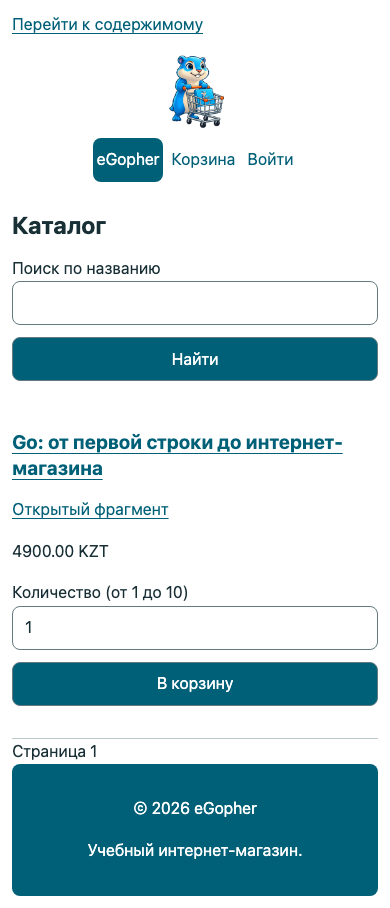
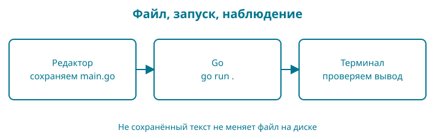

# 1. Рабочее место, которое можно проверить

В конце этой главы у вас будет папка проекта и терминал, в котором работает команда `go version`. Пока не нужно выбирать базу данных или оплачивать сервер. Сначала убедимся, что можем сохранять файлы и запускать инструменты.

## Ориентир на экране

Снимок работающей контрольной точки 42 показывает итоговый интерфейс. В ранних главах мы будем приходить к нему постепенно; адреса, заказ и цены здесь учебные.



## Образ: свой рабочий стол

Представьте стол, на котором вы собираетесь написать письмо. На нём лежит папка, внутри — листы; у папки есть название. Если оставить письмо на соседнем столе, открытая перед вами папка его не получит. С программой происходит похожая путаница: вы исправили один `main.go`, а терминал запускает другой.

Наша опора — **стол, папка, сохранённый лист**. Рабочая папка объединяет файлы проекта. Текущая папка терминала определяет, где команда начинает работу. Сохранение переносит набранный в редакторе текст в файл, который прочитает инструмент Go. Редактор может показывать несколько проектов, поэтому взгляд на вкладку ещё не доказывает, что терминал открыт там же.

У образа есть граница: на компьютере команды могут принимать полный путь к чужой папке. Пока мы намеренно работаем из папки проекта. Нарисуйте прямоугольник с названием `bookshop`, а внутри — `go.mod`. Перед запуском показывайте пальцем: «Команду выполняю здесь». Это маленькая привычка, которая избавляет от долгих поисков не той ошибки.


## Сначала целое

Наша работа будет устроена так:

| Где | Что вы делаете | Что получаете |
|---|---|---|
| Редактор | Пишете и сохраняете файл `main.go` | Текст программы на диске |
| Терминал | Вводите `go run .` | Go собирает и запускает программу |
| Терминал | Читаете ответ | Проверяете, совпал ли результат с ожиданием |

Сохранённый файл и открытая вкладка редактора — не одно и то же. Если вы изменили текст, но не сохранили его, команда может запустить предыдущую версию. Эту причину стоит проверять прежде, чем переписывать программу.

Терминал — программа, принимающая команды. Оболочка внутри него разбирает эти команды. В macOS вы обычно встретите zsh, в Linux — bash, в Windows будем использовать PowerShell. Там, где команды различаются, книга покажет оба варианта.

## Установите Go

Откройте [официальную страницу установки](https://go.dev/doc/install). Выберите свою операционную систему и процессор. Для Windows используется установщик MSI, для macOS — PKG; на Linux следуйте инструкции для архива вашей архитектуры. Не вставляйте в терминал команды удаления старой установки, если не понимаете, какой каталог они затронут.

Материалы этого рабочего выпуска проверяются на Go 1.27.1. Ваша версия указана в выводе команды, а не в названии скачанного файла. После установки закройте терминал и откройте новый: так он получит обновлённые настройки поиска программ.

Введите только команду, без символов приглашения вроде `$` или `>`:

```sh
go version
```

Форма ответа:

```text
go version go1.27.1 darwin/arm64
```

Последняя часть зависит от компьютера. `darwin` означает macOS, `arm64` — архитектуру процессора. На Windows или Linux она будет другой. Здесь важно, что вы получили ответ программы Go, а не сообщение «команда не найдена».

Если Go установлен раньше, не удаляйте его наугад. Сначала посмотрите версию и сверьтесь с инструкцией обновления. Работающий чужой проект может зависеть от своего набора инструментов.

## Подготовьте папку

Выберите место для учебных проектов, к которому у вас есть доступ. Не создавайте новый магазин внутри другого проекта. Откройте терминал в выбранной папке и выполните:

```sh
mkdir bookshop
cd bookshop
```

Эти две команды подходят и для PowerShell, и для bash/zsh. Первая создаёт папку, вторая делает её текущей: следующие команды будут работать относительно неё.

Если `bookshop` уже существует, сначала посмотрите, что внутри. Для чистого начала можно выбрать другое имя, например `bookshop-study`; тогда используйте его и в команде `cd`.

Проверьте, где вы находитесь. В macOS/Linux:

```sh
pwd
ls
```

В PowerShell:

```powershell
Get-Location
Get-ChildItem
```

Первая команда показывает путь, вторая — содержимое. Не надо добиваться точного совпадения пути с книгой: у каждого своя домашняя папка. Важно увидеть выбранную вами папку `bookshop`.

Откройте её в редакторе через меню открытия папки. Подойдёт редактор обычного текста, который сохраняет UTF-8. Если используете VS Code, открывайте всю папку, а не случайный файл из соседнего проекта. Для первых глав дополнительные расширения необязательны.

## Дайте проекту имя

В терминале внутри `bookshop` выполните один раз:

```sh
go mod init example.com/bookshop
```

Появится `go.mod`. Модуль — группа пакетов Go с общим описанием версии и зависимостей. Пока достаточно понимать: этот файл обозначает корень нашего проекта. Запись `example.com/bookshop` служит именем учебного модуля; для этого упражнения не нужно покупать домен или создавать сайт по такому адресу.

Код книги связан с репозиторием [dake-edu/gopher-shop](https://github.com/dake-edu/gopher-shop). Контрольные точки находятся в `book/examples/`; их имена модулей отражают путь в репозитории. Для собственного проекта мы используем учебное имя `example.com/bookshop`, чтобы отличать его от готовых примеров.

Не редактируйте `go.mod` ради буквального совпадения с изображением в чужом уроке: версия в нём зависит от инструмента, который его создал. В комплекте книги лежат самостоятельные контрольные точки со своими готовыми `go.mod`; для них повторный `go mod init` не нужен.

## Если не получилось

| Симптом | Что проверить |
|---|---|
| `go` не найден | Установка завершена? Открыт новый терминал? Найден ли каталог Go через PATH? |
| `go.mod already exists` | Модуль уже создан; повторная инициализация не нужна |
| Отказ в создании папки | Выберите доступную папку пользователя |
| Редактор показывает другие файлы | Сравните открытую папку с выводом `pwd` или `Get-Location` |

PATH — список папок, где оболочка ищет исполняемые программы. Он похож на список адресов доставки, но саму программу не устанавливает. Если адрес записан верно, а файла по нему нет, поиск всё равно не сработает.

## Опорные пункты: команда состоит из частей

В `go mod init example.com/bookshop` пробелы отделяют имя программы `go`, подкоманду `mod`, действие `init` и имя модуля. Слеш `/` здесь является частью имени модуля, а не командой перехода в папку. В `go run .` последняя точка — отдельный аргумент «текущий пакет».

Символы приглашения терминала (`$`, `>`, иногда `%`) перед командой не набирают. Они принадлежат оболочке. Круглых или фигурных скобок в этих командах нет: это команды инструменту, а не исходный код Go.



**Восстановите по памяти.** Закройте пример и назовите три места: где редактируем, что запускаем, где проверяем результат. Если путаются путь и имя модуля, вернитесь к выводу текущей папки и откройте `go.mod`.

## Разминка

**Предскажите.** Если создать файл в папке A, а команду запустить из папки B, обязана ли команда увидеть этот файл?

**Заполните.** Какая команда меняет текущую папку на `bookshop`?

**Почините.** Редактор сохранил файл в `bookshop-old`, а терминал открыт в `bookshop`. Как проверить расхождение, не переустанавливая Go?

## Задание

**Обязательное.** Создайте рабочую папку и модуль. Сохраните в `environment.txt` вывод `go version` и путь к папке. Проверьте в редакторе, что рядом существует `go.mod`.

**На своих данных.** Назовите папку по-своему и повторите проверку пути. Имя папки и имя модуля не обязаны совпадать.

**По желанию.** Найдите путь к установленной команде Go: `command -v go` в bash/zsh или `Get-Command go` в PowerShell.

## Ответы и самопроверка

Команда работает в своей текущей папке и не обязана искать файл в соседней. Для перехода используется `cd bookshop`. Чтобы найти расхождение, сравните путь терминала с местом сохранения файла в редакторе.

Вы готовы двигаться дальше, если можете объяснить, где лежит проект, показать `go.mod` и получить версию Go. Следующая глава даст этой папке первую программу.
