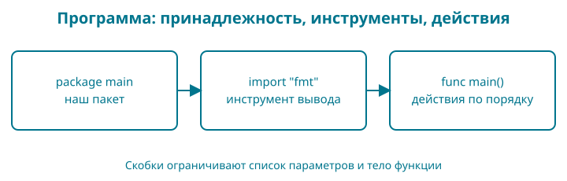

# 2. Книга появляется в терминале

У нас есть рабочая папка и файл `go.mod`. Теперь напишем программу, которая выводит название книги и три формата её будущего издания. Результат маленький, но проверяемый: две строки в нужном порядке.

Контрольная точка: `examples/02-first-program`. Если начинаете с неё, откройте эту папку и сразу выполняйте команды запуска. Если пишете сами, продолжайте в своей `bookshop`.

## Образ: записка с двумя поручениями

Положите перед собой записку: «Покажи название книги. Затем покажи форматы». Если читать её сверху вниз, порядок понятен. Если поменять поручения местами, сначала появятся форматы. Именно такой небольшой порядок действий мы сейчас зададим программе.

На нашей опорной записке будет три строки: **пакет — нужный инструмент — поручения**. `package main` связывает файл с исполняемым пакетом; `import "fmt"` делает доступным инструмент вывода; внутри `main` стоят два вызова `fmt.Println`. Фигурные скобки можно мысленно обвести рамкой вокруг поручений.

Только не переносите образ дальше нужного: компьютер не понимает просьбы «покажи красиво», пока мы не запишем конкретное действие. И в больших программах порядок может быть сложнее простого чтения сверху вниз. Здесь мы проверяем ровно два последовательных вызова. После запуска спрячьте исходник и восстановите свою записку: что принадлежит пакету, что подключено, что выполняется?


## Сразу целиком

Создайте файл `main.go` рядом с `go.mod` и сохраните в нём:

<!-- include:examples/02-first-program/main.go -->

Перед запуском запишите предполагаемый вывод. Будут ли видны кавычки? Появится ли пустая строка между названием и форматами?

Для первого запуска используем `go run .`. `go` — установленный инструмент, `run` — действие «собрать и сразу выполнить», а отдельная точка `.` — пакет в текущей папке. Пока пакет — наши Go-файлы, лежащие рядом и начинающиеся с `package main`. Сначала сохраните `main.go`, затем в терминале в этой же папке выполните:

```sh
go run .
```

Результат:

<!-- include:examples/02-first-program/stdout.txt -->

Здесь программа заканчивает работу после двух вызовов печати, и приглашение терминала появляется снова. Это ожидаемое поведение. `go run .` не открывает редактор и не следит за изменениями: после каждой сохранённой правки запускайте команду заново. Сравнение с отдельной сборкой приведено ниже в разделе «Запуск и сборка».

## Цвет помогает найти знакомое

В книге исходник подсвечен как в редакторе. Та же запись сохраняет свои цвета в предложении: например, `import "fmt"`. Посмотрите сначала на строку программы, затем на её объяснение ниже — вам не придётся заново искать, какая часть относится к языку, а какая содержит данные.

| Пример | Цвет и подсказка |
|---|---|
| `package` | Оранжевый: объявляем, к какому пакету относится файл |
| `import` | Розовый: подключаем другой пакет |
| `func` | Синий: объявляем функцию или метод |
| `var`, `const`, `type`, `if`, `for`, `return` | Фиолетовый: другие ключевые слова; точное действие определяем по самому слову |
| `priceMinor`, `fmt`, `Println` | Тёмный сине-голубой: имена; их роль определяем по месту в программе |
| `"Книга"` | Зелёный: строковые данные внутри кавычек |
| `42` | Коричневый: число, записанное прямо в исходнике |
| `// название книги` | Серый: комментарий для человека |
| `{`, `}` | Малиново-фиолетовый: границы блока, а позднее — также записи составного типа или значения |
| `(`, `)`, `[`, `]` | Тёмно-фиолетовый: круглые и квадратные скобки; назначение зависит от места |
| `.`, `,`, `:=`, `+`, `-` | Серый: остальные разделители и операторы |

В первой программе можно прочитать цветовую опору так: оранжевый — принадлежность пакету, розовый — подключение, синий — объявление функции, малиново-фиолетовые скобки — границы её тела. Эти цвета повторяются в поясняющих предложениях.

Пока не нужно учить новые слова из таблицы: к каждому мы вернёмся по делу. Зелёная строка `"Книга"` хранит данные. А сине-голубой `priceMinor` — имя, по которому программа обращается к значению. Цвет помогает быстро заметить это различие.

Сине-голубой не означает «это обязательно переменная»: имена пакетов и функций в нашей палитре тоже сине-голубые. Предопределённые имена, например `int64`, `true` и `nil`, тоже сине-голубые: они не являются ключевыми словами Go. Что обозначает каждое из них, разберём при первом использовании. Подсветка разбирает запись, но не доказывает, что программа правильная.

В вашей IDE — редакторе со средствами разработки — цвета могут отличаться: их выбирает тема оформления. У языка Go нет обязательного цвета для переменной или строки. В читалке с собственными настройками и на чёрно-белом экране краски тоже могут измениться или исчезнуть. Кавычки, слова, подписи и наши объяснения сохраняют смысл без цвета.

**Попробуйте глазами.** Найдите в первой программе слово `import`, затем строку `"fmt"`. Назовите их назначение без слов «розовое» и «зелёное». Если получается, цвет уже работает как подсказка, а не как единственный способ понять запись.

## Разбор по строкам

`package main` сообщает, что файл относится к пакету `main`. Из такого пакета можно собрать исполняемую программу. Одного объявления пакета недостаточно: программе нужна функция `main`.

`import "fmt"` подключает пакет стандартной библиотеки для форматирования и вывода. Нам не пришлось отдельно скачивать библиотеку: она поставляется вместе с Go.

`func main()` объявляет функцию с именем `main`. Скобки после имени относятся к параметрам; у нашей функции их нет. Фигурные скобки ограничивают тело функции — команды, которые она выполняет. Подробно параметры разберём в главе 5. Перед `main` Go выполняет инициализацию программы, поэтому запоминать правило «main всегда первая строка исполнения» не нужно.

`fmt.Println` означает: взять функцию `Println` из пакета `fmt` и вызвать её. Текст в двойных кавычках — строковое значение. Кавычки отделяют текст программы от её данных, поэтому сами в вывод не попадают. `Println` добавляет перевод строки после вывода.

Внутри `main` команды выполняются последовательно. Поменяете вызовы местами — поменяется и порядок строк. Go пока не знает ни о книге как товаре, ни о форматах как файлах. Мы передали функции печати обычный текст.

## Оформление без споров

Введите:

```sh
gofmt -w main.go
```

`gofmt` приводит код к стандартному оформлению; `-w` записывает результат в файл. Это может изменить отступы. Форматирование не проверяет, правильную ли книгу вы назвали, и не заменяет запуск программы.

Наберите лишние пробелы перед одним вызовом, сохраните и повторите `gofmt`. Затем снова запустите программу. Оформление изменится, результат останется прежним.

## Запуск и сборка

У нас два способа проверить один и тот же исходник. **Во время обучения после правки используйте `go run .`**: инструмент соберёт временную программу и сразу запустит её. Это работает одинаково в PowerShell, bash и zsh. Отдельный готовый файл `bookshop` в папке проекта эта команда не оставляет. Предварительно выполнять `go build` не требуется.

Когда нужен сохраняемый исполняемый файл, используется `go build`. Само слово `build` означает сборку, без запуска. Флаг `-o` задаёт имя результата; следующий за ним `bookshop` — выбранное нами имя файла. Последняя точка снова обозначает текущий пакет. Для macOS/Linux:

```sh
go build -o bookshop .
./bookshop
```

Для Windows PowerShell:

```powershell
go build -o bookshop.exe .
.\bookshop.exe
```

Первая команда создаёт программу, вторая её запускает. При успешной сборке `go build` обычно ничего не печатает: проверьте появление файла через `ls` или `Get-ChildItem`. Префиксы `./` и `.\` говорят оболочке запускать файл из текущей папки; `.exe` — обычное расширение исполняемой программы Windows. Это пути файла, а не замена аргументу `.` у инструмента Go.

| Что нужно | Команда | Что происходит |
|---|---|---|
| Проверить сохранённую правку | `go run .` | Сборка и немедленный запуск |
| Получить готовый файл | `go build -o bookshop .` | Только сборка; для Windows имя `bookshop.exe` |
| Запустить уже собранный файл | `./bookshop` или `.\bookshop.exe` | Исходники заново не читаются |

Если после сборки изменить `main.go`, уже собранный файл сам не изменится: его нужно собрать ещё раз. Проверьте это маленьким опытом: соберите файл, измените название в исходнике и сохраните. Готовый файл покажет старое название, а новый `go run .` — новое. Затем повторите сборку: вывод обоих способов совпадёт.

Не подменяйте команду книги на `go run main.go`. Сейчас результат может совпасть, но такой запуск выбирает только названный файл. Когда появится второй рабочий файл, его объявления не попадут в сборку. `go run .` выбирает пакет целиком; тестовые файлы `_test.go` в обычный запуск не входят. В главе 10 исполняемый пакет переедет в `cmd/shop`, и путь в команде изменится вместе с ним.

Этот пример не требует установки Go для запуска готового файла на совместимой системе. Но файл для macOS нельзя просто запускать как программу Windows: операционная система и архитектура сборки имеют значение. Позже мы также будем отдельно учитывать конфигурацию, данные и внешние сервисы приложения. Сопоставление способов запуска есть и в [официальном уроке Go о сборке](https://go.dev/doc/tutorial/compile-install).

## Сломайте безопасно

Удалите закрывающую кавычку у названия книги. Сохраните и запустите `go run .`. Сборка завершится ошибкой. Прочитайте имя файла и номер строки; конкретное сообщение может различаться между версиями инструмента.

Верните кавычку и повторите запуск. Мы исправили причину в исходнике. Переустановка Go здесь ничего бы не дала.

## Читаем запись по символам

| Запись | Что означает именно здесь |
|---|---|
| `package main` | Файл принадлежит пакету с именем `main` |
| `import "fmt"` | Подключаем пакет по пути, записанному строкой |
| `func` | Начинается объявление функции |
| `main` | Имя функции входа в нашу программу |
| `()` после имени в объявлении | Список параметров пуст |
| `{` и `}` | Начало и конец тела функции |
| `fmt.Println` | Точка связывает имя пакета с именем доступной из него функции |
| `("текст")` при вызове | Внутри скобок передаётся аргумент — строка |
| `"` | Граница строкового литерала; сама кавычка не выводится |

Точка в `fmt.Println` и точка в `go run .` выполняют разные роли: первая относится к записи Go, вторая — к аргументам команды терминала. Пробелы и переносы между словами помогают разделить запись, а внутри кавычек являются частью текста.

В Go есть точки с запятой, но в обычном исходнике их чаще не пишут: по правилам языка они автоматически вставляются после определённых токенов в конце строки. Поэтому пока ставьте открывающую `{` функции на той же строке, что и `func main()`. Перенос этой скобки на следующую строку может изменить разбор программы; `gofmt` не исправит любой синтаксический дефект вместо вас.



**Восстановите по памяти.** Нарисуйте три блока, затем напишите программу заново без копирования. Если не помните скобку, найдите её пару и объясните, что она ограничивает.

## Разминка

**Предскажите.** Что изменится, если два вызова `Println` поменять местами?

**Заполните.** Какое имя пакета должно стоять перед точкой в вызове `___.Println("Книга")`?

**Почините.** Сообщение говорит `undefined: Fmt`. Найдите разницу между написанным именем и `fmt`.

## Задание

**Обязательное.** Добавьте третью строку `Статус: готовится`. Первые две строки должны остаться прежними. Сохраните файл, отформатируйте и запустите.

**На своих данных.** Замените название на название собственной будущей книги. Не меняйте список форматов: наш итоговый продукт должен поддерживать PDF, EPUB и HTML.

**По желанию.** Соберите программу, затем поменяйте название в исходнике. Сравните запуск готового файла и `go run .`. Объясните различие до повторной сборки.

## Скажите своими словами

Почему сохранение файла важно перед запуском? Что делает `import`? Почему `go build` не показывает название книги в терминале?

## Ответы

Порядок вызовов задаёт порядок строк. Нужен пакет `fmt`, с маленькой буквы: регистр символов различается. Дополнительная строка — ещё один вызов `fmt.Println("Статус: готовится")` внутри `main`, после двух существующих.

Сборка читает сохранённые файлы. `import` делает доступным указанный пакет. `go build` создаёт исполняемый файл и сам его не запускает.

В магазине появилась первая публичная информация — название и форматы. Пока она записана прямо в вызовах печати. В следующей главе отделим данные от действий над ними.
