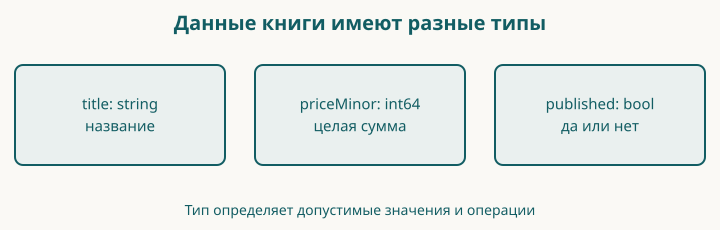

# 3. Название, цена и состояние книги

Мы уже умеем выводить две строки. Но цена будет участвовать в расчётах, а состояние публикации — определять доступность товара. Поэтому данные должны иметь подходящие типы.

Контрольная точка: `examples/03-values`. В своей рабочей папке замените `main.go` полным примером ниже. Цена учебная: это не объявленная стоимость будущей книги.

## Образ: ценник с подписанными местами

Возьмите воображаемый ценник. Сверху оставьте место для названия, ниже — для цены, сбоку — для отметки «показывать покупателю». Не нужно каждый раз переписывать весь ценник, чтобы поменять сумму. Достаточно найти нужное место по подписи.

Имя переменной помогает найти значение в программе. Тип задаёт, какие значения и действия допустимы. Строка названия и целочисленная цена решают разные задачи: мы не станем складывать название с процентом скидки. Изменение переменной меняет её текущее значение; `const` объявляет константу, которой новое значение присвоить нельзя.

На бумаге можно зачеркнуть всё что угодно. Правила языка строже: компилятор проверяет допустимость операций. Поэтому образ ценника помогает связать имя с назначением, а точный ответ о типе мы получаем из Go. Нарисуйте три подписанных места и, не глядя в код, впишите в каждое пример значения. Где можно поставить `false`, а где оно нарушит вашу задумку?


## Перед началом: значение, переменная и тип

После главы 2 вы умеете запустить программу и вывести текст. Теперь научимся хранить данные, менять их и отличать ошибку типа от ошибки в расчёте. До цены магазина разберём эти действия по отдельности.

**Значение** — конкретные данные: число `150`, строка `"Go"`, логическое значение `false`. **Переменная** — именованное место хранения значения определённого типа. **Тип** задаёт допустимые значения и операции. Это три разных понятия: `priceMinor` — имя, `int64` — тип, `150` — текущее значение. Изменение значения не меняет тип переменной.

Литерал — запись значения прямо в исходнике. `150` и `"150"` различаются: первый — число, второй — строка из трёх цифр. Компилятор не угадывает, хотите ли вы считать деньги или напечатать номер. Преобразование пользовательского текста в число с возможной ошибкой появится при изучении форм; сейчас работаем с числовыми значениями.

### Три способа объявить переменную

| Запись внутри `main` | Что появляется |
| --- | --- |
| `var quantity int` | Переменная типа `int` с нулевым значением `0` |
| `var quantity int = 2` | Тот же тип с явно указанным начальным значением |
| `quantity := 2` | Новая переменная; по этому литералу Go выбирает тип `int` |

Это **альтернативные** записи. Не вставляйте все три объявления одного имени подряд в один блок. В коротком объявлении `:=` двоеточие — часть оператора. Для изменения уже объявленной переменной используйте `quantity = 3`. Запись `quantity := 3` в том же блоке без нового имени приведёт к сообщению `no new variables on left side of :=`.

Блок — группа команд в `{` и `}`. Пока наши переменные объявлены внутри блока `main` и доступны от своего объявления до конца этого блока. Перед объявлением обратиться к имени нельзя. В главе 4 появятся вложенные блоки условий, а в главе 5 — отдельные функции с собственными параметрами.

### Какие типы нужны в начале

| Тип | Какие данные хранит | Наше применение |
| --- | --- | --- |
| `bool` | `true` или `false` | Опубликована ли книга |
| `string` | Последовательность байтов; подробности текста — в главе 6 | Название и валюта |
| `int` | Знаковое целое; 32 или 64 бита в зависимости от платформы | Количество и индексы |
| `int64` | Знаковое целое из 64 бит | Сумма в минимальных денежных единицах |
| `float64` | Число с плавающей точкой, обычно приближённое | Измерения, но не цена нашей модели |

Есть также `int8`, `int16`, `int32`, беззнаковые `uint8`, `uint16`, `uint32`, `uint64`, `uint` и `float32`. Размер ограничивает диапазон: например, `int8` допускает −128…127, а `uint8` — 0…255. Отсутствие отрицательных значений у беззнакового типа не делает арифметику защищённой от переполнения. `byte` и `rune` — другие имена `uint8` и `int32`; их назначение для текста разберём в главе 6. `uintptr` и комплексные числа в этих упражнениях не используются и не являются предпосылкой следующей главы.

Литерал `2` в `quantity := 2` даёт `int`; `2.5` даёт `float64`, `"Go"` — `string`, `true` — `bool`. Чтобы увидеть выбранный тип, используйте формат `%T` в `fmt.Printf`. `%t` печатает значение `bool`. Это команды форматирования внутри строки, а не объявления типов.

### Нулевые значения и копирование

Объявление без правой части не оставляет «случайный мусор»: Go задаёт нулевое значение. Число начинается с `0`, строка — с `""`, логическое значение — с `false`. Нулевое значение может быть допустимым для языка и недопустимым для задачи: пустое название потребуется отклонить отдельно.

Если написать `otherTitle := title`, вторая переменная получает текущее строковое значение. Она не становится автоматически обновляемым вторым именем первой переменной. Когда позднее `title` получит другую строку, `otherTitle` сохранит прежнюю. Это правило о присваивании строковых значений, а не обещание независимости всех будущих составных данных: общий массив среза рассмотрим в главе 7.

### Разные числовые типы не складываются сами

Переменная `quantity` типа `int` и `priceMinor` типа `int64` — разные типы. Знак `*` между числами означает умножение. Для произведения явно запишем `int64(quantity) * priceMinor`. Запись `int64(quantity)` — **преобразование типа**, хотя по круглым скобкам похожа на вызов функции. Для нашего количества `2` значение после преобразования остаётся `2`; исходная переменная по-прежнему имеет тип `int`.

Преобразование не является универсальной проверкой корректности. При переводе большого целого в более узкий целый тип информация может потеряться. Строку с цифрами эта запись также не разбирает. Не добавляйте преобразования наугад ради исчезновения ошибки компилятора: сначала определите единицы и допустимый диапазон.

`const percent = 10` объявляет нетипизированную числовую константу. Её можно присвоить `int64`, если значение представимо этим типом. А `const percent int64 = 10` сразу задаёт тип константы. В отличие от переменной константа не получает новое значение. Константное `300` нельзя присвоить `uint8`: компилятор обнаружит выход за диапазон ещё до запуска.

## Маленький опыт до ценника

В готовой контрольной точке откройте `labs/01-values/main.go`. `labs` — обычная папка с небольшими опытами, не специальное слово Go. У каждого опыта собственная папка `package main`, но общий `go.mod` этой главы. Поэтому несколько функций `main` из разных папок не конфликтуют. Основной `main.go` магазина не меняйте.

Если набираете сами, создайте указанные вложенные папки рядом с основным `main.go` и сохраните в них полный листинг. Дополнительный `go mod init` не нужен. Терминал остаётся в корне контрольной точки:

```sh
go run ./labs/01-values
```

Путь после `run` выбирает пакет опыта, а не меняет текущую папку терминала. Команда `go run .` по-прежнему запускает основной пример главы.

<!-- include:examples/03-values/labs/01-values/main.go -->

Перед запуском запишите значения обеих переменных с названием после каждого присваивания. Ожидаемый вывод:

<!-- include:examples/03-values/labs/01-values/stdout.txt -->

В первой строке квадратные скобки — просто напечатанные символы, между которыми видна пустая строка. Затем видны две разные строки, два числовых типа и сумма `300`. Последняя строка показывает присваивание константы переменной подходящего типа.

**Измените и объясните.** Замените количество `2` на `3`: сумма станет `450`, а строка типов не изменится. В копии опыта уберите `int64(...)` вокруг количества: компиляция должна отказать из-за разных типов. Восстановите преобразование. Затем попробуйте присвоить цене строку `"150"` и объясните, почему это другая ошибка того же правила типов.

**Проверка перед магазином.** Без просмотра листинга объявите нулевую переменную `bool`, присвойте ей `true` и напечатайте. Затем объявите две независимые переменные с одним начальным строковым значением и измените только одну. Если не получается, повторите разделы об объявлении и копировании; исправлять цену магазина пока рано.

## Сразу целиком

<!-- include:examples/03-values/main.go -->

Запустите `go run .` после того, как попробуете предсказать две последние строки.

<!-- include:examples/03-values/stdout.txt -->

Одна переменная участвовала в выводе дважды, и результат различается. Между вызовами мы поменяли её значение.

## Значение и его имя

`title := "..."` создаёт переменную `title` и помещает в неё строку. Go определяет тип по правой части. Короткое объявление `:=` применяется внутри функций.

`published := false` создаёт переменную типа `bool`. У логического типа два значения: `true` и `false`. Это удобно для вопроса с двумя ответами: опубликована книга или нет.

`published = true` меняет значение существующей переменной. Здесь стоит `=`, а не `:=`. Для повторного присваивания одному уже объявленному имени новое объявление не требуется.

`var priceMinor int64 = 249900` — более подробная форма: мы явно выбрали тип `int64`. Это знаковое целое фиксированной разрядности. Тип `int`, который часто используют для счётчиков и индексов, зависит от архитектуры. Для представления сумм в модели магазина мы выберем фиксированный целый тип.

Если объявить переменную без начального значения, Go задаст нулевое: для целого числа — `0`, для строки — пустую строку, для `bool` — `false`. Это правило языка, но не бизнес-решение. Не стоит считать нулевую цену автоматически разрешённой, пока магазин не определил правила бесплатных книг.

## Константа не меняется

`const currency = "KZT"` задаёт константу. Ей нельзя присвоить другое значение во время работы программы. В этом примере валюта одна, поэтому она неизменна.

Это не означает, что любой магазин обязан иметь одну валюту. Когда появится несколько валют, код валюты станет частью данных, а правила пересчёта и округления придётся определить отдельно.

`minorPerUnit` задаёт число минимальных денежных единиц в основной для нашего учебного представления KZT: сто. Имя помогает увидеть смысл числа в выражении. Число `100` без имени могло бы означать и процент, и ограничение длины, и количество товаров.

## Почему цена целая

Сумму `2499.00 KZT` мы храним как `249900` минимальных единиц. Такой способ позволяет выполнять расчёты целыми числами и явно решать, что делать с дробной минимальной единицей.

Тип `float64` полезен для приближённых вычислений, измерений и многих научных задач. Но многие десятичные дроби не представимы в двоичной форме точно. Для денежных правил нам важна воспроизводимая единица учёта, а не приближение, которое случайно выглядит правильно после печати.

Целое число тоже имеет предел. Сам по себе переход на `int64` не защищает от переполнения при умножении. В главе 5 мы ограничим входную цену до расчёта и проверим границы тестами. Сумму и валюту позже объединим в модель, чтобы не перепутать единицы.

## Как получилась точка и два нуля

В выражении `priceMinor / minorPerUnit` целочисленное деление даёт целую часть. В выражении с `%` получаем остаток. Для `249900` это `2499` и `0`.

`fmt.Printf` печатает по шаблону. В нашем шаблоне:

| Запись | Значение |
|---|---|
| `%d` | Целое десятичное число |
| `%02d` | Целое число шириной не менее двух позиций, с ведущим нулём |
| `%s` | Строка |
| `\n` | Перевод строки |

Поэтому остаток `0` становится `00`, а остаток `5` стал бы `05`. В отличие от `Println`, `Printf` не добавляет перевод строки автоматически: он записан в шаблоне.

Этот вывод рассчитан на неотрицательную цену. Он не является готовым форматировщиком отрицательных сумм или всех валют. Мы отделим такие правила, когда появится необходимость.

## Читаем новую запись по символам

| Запись | Как прочитать |
|---|---|
| `:=` | Объявить переменную и дать начальное значение; двоеточие вместе с равно — один оператор |
| `=` | Присвоить новое значение уже существующей переменной |
| `const` | Объявить константу |
| `var` | Объявить переменную |
| `int64`, `string`, `bool` | Имена типов, то есть допустимых видов значений |
| `249900` | Целочисленный литерал без кавычек |
| `false`, `true` | Логические значения без кавычек |
| `,` в `Printf(...)` | Разделитель аргументов одного вызова |
| `/`, `%` между числами | Деление и остаток от целочисленного деления |
| `%d` внутри кавычек | Часть формата `Printf`, а не оператор остатка |

Одни и те же видимые знаки читаются по месту. `%` снаружи строки участвует в арифметике Go; `%02d` внутри строки получает смысл, когда `Printf` читает шаблон. Обратный слеш в `\n` начинает управляющую последовательность строкового литерала, обозначающую перевод строки; это не два печатаемых символа.



**Проверка понимания.** Покажите в примере присваивание, которое изменяет данные, и место, которое только задаёт вид вывода. Если `%` пока означает для вас одно и то же в обоих местах, перечитайте разбор цены.

## Разминка

**Предскажите.** Как будет выглядеть цена при `priceMinor = 105`?

**Заполните.** Для изменения опубликованной книги на черновик используйте `published ___ false`.

**Почините.** Кто-то написал `priceMinor = "249900"`. Почему это не то же самое, что число `249900`?

## Задание

**Обязательное.** Установите цену `350050`. Программа должна напечатать `Цена: 3500.50 KZT`. Вторая строка состояния должна оставаться `Опубликована: true`.

**На своих данных.** Возьмите положительную цену, у которой последние две цифры — `05`, и предскажите вывод перед запуском.

**По желанию.** Попробуйте присвоить константе `currency` другое значение. Прочитайте ошибку и отмените изменение.

## Скажите своими словами

Чем отличается объявление от присваивания? Почему сумма без валюты неполна? Почему целый тип не освобождает нас от проверки диапазона?

## Ответы

`105` минимальных единиц даст `1.05 KZT`. Для присваивания нужен `=`. Значение в кавычках имеет строковый тип, а `priceMinor` объявлена целой: это несовместимые типы для прямого присваивания.

В обязательном задании меняется только начальное значение цены. Не исправляйте шаблон вывода под конкретный ответ: он должен работать и для предыдущей цены.

У нашей книги появились данные трёх видов. Следующий шаг — принимать решение по этим данным, а не всегда печатать одно и то же.
