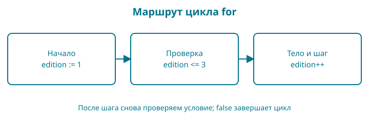

# 4. Какие издания можно показать

Книга может быть черновиком, а одно из старых изданий — снятым с продажи. Напишем небольшую проверку, которая обходит три номера изданий и сообщает, какие доступны.

Контрольная точка: `examples/04-conditions`. Это упражнение над состоянием каталога. Оно не удаляет купленные книги из библиотеки покупателя: правила доступа к уже приобретённому изданию будут отдельными.

## Сразу целиком

<!-- include:examples/04-conditions/main.go -->

Сначала отметьте на бумаге, какие строки сработают для номера `2`. Затем запустите `go run .`.

<!-- include:examples/04-conditions/stdout.txt -->

Число `2` не потерялось: у него другой результат. Мы явно сообщили, что издание снято с продажи.

## Условие — вопрос с логическим ответом

`if edition == 2` проверяет равенство. Если условие истинно, выполняется блок в фигурных скобках. Один знак `=` присваивает значение; два знака `==` сравнивают значения. Перепутать их легко, поэтому читайте выражение словами: «номер издания равен двум?».

`!published` означает «не опубликована». Знак `!` меняет логическое значение на противоположное. Если книга ещё не опубликована, нет смысла показывать доступные издания этого учебного каталога.

Условия могут использовать `<`, `<=`, `>`, `>=` и `!=`. У равенства и сравнения тоже есть ограничения типов: не все значения языка сравниваются любым оператором. Сейчас мы работаем с целыми числами и логическим значением.

## Цикл: начало, проверка, шаг

В заголовке `for edition := 1; edition <= 3; edition++` три части.

Первая создаёт счётчик со значением `1` перед обходом. Вторая проверяется перед каждым выполнением тела: можно ли продолжать? Третья увеличивает счётчик на единицу после очередного завершённого прохода.

Получается последовательность: `1`, `2`, `3`. Когда счётчик станет равен `4`, условие `4 <= 3` окажется ложным, и цикл закончится. Переменная `edition` объявлена в заголовке цикла и недоступна после него. Это пример области видимости: имя существует не во всех местах файла.

`edition++` — отдельная команда увеличения, а не выражение, которое надо вкладывать в печать. Здесь она управляет переходом к следующему изданию.

## Два разных способа прекратить работу

`continue` завершает текущий проход цикла. В нашем случае при номере `2` строка «Доступно издание» пропускается. Для такого `for` затем выполняется шаг `edition++`, проверяется условие и начинается следующий проход.

`break` выходит из цикла целиком. Если изменить `published` на `false`, программа один раз напечатает `Книга готовится` и прекратит обход.

> Представьте проверку полки. `continue` — перейти к следующей книге на полке. `break` — прекратить проверку этой полки. Но в программе границу определяет именно цикл, а не любое место, которое кажется нам «следующей задачей».

## Проверим границы

Измените `edition <= 3` на `edition < 3`. Третье издание исчезнет из вывода. Это не сбой инструмента: условие больше не разрешает проход с номером `3`.

Верните `<=`. Затем установите начальное значение `4`. Тело не выполнится ни разу, потому что условие проверяется до первого прохода.

Наконец, верните исходник и попробуйте убрать `edition++`, сохранив обе точки с запятой. Счётчик перестанет меняться, и при опубликованной книге программа будет повторять сообщение. Остановите её `Ctrl+C` и восстановите шаг. Не оставляйте такой вариант работающим: пользы от повторного вывода нет.

## Читаем условие и цикл по символам

| Запись | Роль |
|---|---|
| `for` | Начало цикла |
| `;` в заголовке `for` | Отделяет начало, условие и шаг |
| `<=` | Меньше или равно; два знака образуют один оператор |
| `++` | Увеличить переменную на единицу; отдельная команда |
| `if` | Выполнить блок, если условие истинно |
| `!` | Логическое отрицание |
| `==` | Проверка равенства; это не присваивание |
| `break` | Закончить этот цикл |
| `continue` | Закончить текущий проход и перейти к следующему |

Фигурные скобки вложенных блоков закрываются в обратном порядке: сначала внутренний `if`, потом внешний `for`, потом `main`. Отступы помогают это видеть; если потерялись, временно подпишите закрывающие скобки в заметках. Круглые скобки вокруг условия `if` Go не требует.



**Пройдите маршрут пальцем.** Для номеров 1, 2 и 3 укажите, какие условия сработают и где заканчивается проход. Сначала без запуска, затем сравните с выводом.

## Разминка

**Предскажите.** Сколько строк появится при `published := false`?

**Заполните.** Какой оператор оставляет номера до трёх включительно: `<` или `<=`?

**Почините.** У снятого издания удалили `continue`, и теперь оно одновременно «снято» и «доступно». Объясните, почему выполняются обе строки.

## Задание

**Обязательное.** Обойдите номера от `1` до `4` включительно. Снятым должно быть издание `3`. Ожидаемый вывод:

```text
Доступно издание 1
Доступно издание 2
Издание 3 снято с продажи
Доступно издание 4
```

**На своих данных.** Выберите другой снятый номер внутри диапазона. Перед запуском перечислите ожидаемые строки.

**По желанию.** Снимите два издания с помощью двух отдельных условий. Затем найдите в документации логический оператор `||` и объедините проверку. Сравните читаемость.

## Ответы

Для черновика будет одна строка. Включённая правая граница записывается через `<=`. Без `continue` программа после сообщения о снятии идёт дальше и печатает обычную строку этого же прохода.

В обязательном задании верхняя граница меняется на `4`, а проверка снятого номера — на `edition == 3`. Начальное значение остаётся `1`.

Мы научились повторять действие и выбирать его по данным. Теперь вынесем самостоятельное правило — расчёт скидки — в функцию и закрепим ожидаемое поведение тестами.
