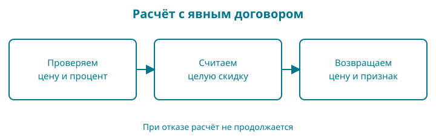

# 5. Правило цены и первый тест

Цена из главы 3 пока только выводилась на экран. Добавим скидку. Мы хотим один раз записать правило расчёта и вызывать его из разных мест, а не копировать арифметику по всему магазину.

Контрольная точка: `examples/05-functions`. Для этой главы нужны условия, целочисленное деление и понимание переменной. Структуры и коллекции пока не требуются.

## Сначала договоримся о результате

Наше учебное правило принимает цену в минимальных денежных единицах и целый процент скидки. Цена допустима от `0` до `100000000`, процент — от `0` до `100`, обе границы включены. Ограничение цены выбрано для упражнения и безопасного расчёта, а не как универсальный предел торговли.

Мы сначала считаем размер скидки. Если получается дробная минимальная единица, отбрасываем дробную часть скидки. Например, 10% от `105` — это `10.5`; скидка будет `10`, а покупатель заплатит `95`. Это конкретное правило округления в пользу продавца. Другой магазин может выбрать другое, но обязан описать и проверить его.

При недопустимых аргументах функция возвращает признак отказа. Возвращаемое число в этом случае нельзя использовать как цену.

## Сразу целиком

Файл `main.go`:

<!-- include:examples/05-functions/main.go -->

Запустите `go run .`:

<!-- include:examples/05-functions/stdout.txt -->

Две величины на выходе помогают различить бесплатную книгу и ошибку. Для допустимой нулевой цены получим `(0, true)`, для недопустимой — `(0, false)`.

## Параметры и аргументы

В объявлении функции `priceMinor` и `percent` — параметры: имена для входных значений. В вызове `priceAfterDiscount(249900, 10)` числа — аргументы, переданные этим параметрам.

Функция не печатает ответ. Она возвращает его вызывающему коду. Благодаря этому одно правило можно будет использовать в терминале, HTTP-обработчике и тесте без захвата вывода с экрана.

`(int64, bool)` после списка параметров описывает два возвращаемых значения. `return 0, false` немедленно завершает вызов. Если проверки прошли, вычисляется скидка и возвращаются цена и `true`.

В строке `priceMinor, ok := ...` оба результата получают имена. `ok` — привычное имя для признака успеха. Сначала проверяем его и только потом используем цену. Позже, когда потребуется объяснить разные причины отказа, заменим логический признак на значение `error`.

Область видимости параметра ограничена функцией. Имя `priceMinor` в `main` — другая переменная, хотя написано одинаково. Передача целого числа копирует его значение; функция не изменяет переменную вызывающего кода.

## Почему проверки стоят до умножения

Операторы `||` соединяют условия значением «или». Цена не подходит, если она меньше нуля **или** превышает верхнюю границу. Процент проверяется отдельно.

Максимальное произведение в нашем договоре — `100000000 * 100`, то есть `10000000000`. Оно помещается в `int64`. Произвольную большую цену мы не умножаем: функция откажет раньше.

Переставить проверку после вычисления опасно. Если арифметика уже переполнилась, проверка искажённого результата не восстановит исходный смысл. Ограничения полезны только тогда, когда реально охватывают путь вычисления.

## Проверка, которая остаётся

Создайте рядом `main_test.go`. Минимальный первый тест выглядит так:

<!-- include:examples/05-functions/main_test.go#first-test -->

Запустите:

```sh
go test ./...
```

В успешном отчёте будет строка `ok` с именем модуля. Время и отметка кеша могут различаться. Для принудительного повторного выполнения используется `go test -count=1 ./...`.

Имя файла заканчивается на `_test.go`: инструмент Go включает такие файлы при тестировании. `TestPriceAfterDiscount` начинается с `Test`, а параметр `t *testing.T` даёт тесту способы сообщить о провале. Пока используйте эту сигнатуру как договор инструмента; указатель и методы разберём отдельно. Звёздочка здесь не участвует в формуле скидки.

`got` означает полученный результат. Условие проверяет и число, и признак успеха. `t.Fatalf` помечает тест неуспешным, печатает сообщение и прекращает этот тест. `%d` выводит число, `%t` — логическое значение. В сообщении указано и полученное, и ожидаемое: это помогает разбирать ошибку.

## Убедитесь, что тест умеет падать

В функции замените `priceMinor - discountMinor` на `priceMinor + discountMinor`. Это правдоподобная ошибка знака: скидка увеличит цену. Запустите тест и найдите сообщение о несовпадении.

Верните минус и снова выполните тест. Один успешный запуск полезен только вместе с пониманием того, какую ошибку проверка действительно замечает.

Не вычисляйте ожидаемый результат в тесте той же формулой, которую проверяете. Иначе опечатка может переехать в обе половины, и сравнение подтвердит их общую ошибку.

## Края важнее одного удачного числа

| Цена | Скидка | Результат | Успех |
|---:|---:|---:|---|
| 249900 | 0 | 249900 | true |
| 249900 | 100 | 0 | true |
| 105 | 10 | 95 | true |
| 0 | 10 | 0 | true |
| -1 | 10 | не использовать | false |
| 100 | 101 | не использовать | false |

В полной контрольной точке есть также проверки отрицательной скидки, предельной цены и цены на единицу выше предела. Тесты не доказывают правильность для всех мыслимых программ, но сохраняют важные примеры нашего договора.

## Читаем функцию и тест по символам

| Запись | Как прочитать |
|---|---|
| `//` | Однострочный комментарий: текст до конца строки не исполняется |
| `(priceMinor int64, percent int64)` | Два параметра; после каждого имени указан его тип |
| `(int64, bool)` после параметров | Два возвращаемых значения, в этом порядке |
| `return` | Завершить функцию и передать результаты вызывающему коду |
| `||` | Логическое «или»: достаточно истинности одного условия |
| `*`, `-` в формуле | Умножение и вычитание |
| `!=` в тесте | Не равно |
| `_` вместо имени результата | Пустой идентификатор: этот результат сознательно не используем |
| `t *testing.T` | Параметр `t` содержит указатель на объект тестирования типа `T` из пакета `testing` |
| `t.Fatalf` | Вызов метода объекта тестирования через точку |

Звёздочка между числами означает умножение. Звёздочка перед типом `testing.T` означает тип указателя: значение, через которое тест обращается к своему объекту отчёта. Это разные грамматические места. Объект создаёт тестовый инструмент; руками выделять его сейчас не нужно. В главе 8 вы сами создадите значение и проверите, как адрес помогает сохранить изменение.

В `if !ok || got != 224910` сначала читаем «успеха нет» и «число не совпало», затем соединяем через «или». Логическое `||` вычисляет правую часть только если левая ложна. При вычислении арифметики умножение и деление имеют приоритет перед вычитанием; операции одного такого приоритета группируются слева направо. Скобки позволяют явно изменить группировку.

`%t` в сообщении выводит логическое значение, `\n` внутри строки задаёт перевод строки. Комментарий описывает договор, но компилятор не доказывает, что код ему соответствует: для этого мы пишем проверки.



**Проверка понимания.** Назовите два разных значения `*` в этой главе и покажите место, где ошибка прекращает вычисление до умножения.

## Разминка

**Предскажите.** Что вернёт `priceAfterDiscount(105, 100)`?

**Заполните.** После получения `price, ok` можно ли печатать цену до проверки `ok`?

**Почините.** Тест проверяет только, что цена равна нулю. Почему он не отличит бесплатную книгу от отказа?

## Задание

**Обязательное.** Напишите тест `TestSmallDiscount`: цена `105`, скидка `1`; ожидаются `104` и `true`. Сначала вычислите результат на бумаге, затем запустите тест. Не меняйте функцию, чтобы подогнать её под ошибочное ожидание.

**На своих данных.** Выберите цену и процент, при которых размер скидки получается дробным. Объясните итог по нашему правилу округления.

**По желанию.** Измените правило: округляйте размер скидки вверх до целой минимальной единицы. Сначала сформулируйте новые ожидания для `105` и `10%`, затем измените отдельную копию функции и тесты. Основную контрольную точку сохраните с прежним договором.

## Ответы

При стопроцентной скидке на допустимую цену получим `(0, true)`. До проверки `ok` число не следует считать ценой. В тесте бесплатной книги надо проверить и ноль, и признак успеха.

Для обязательного задания скидка равна `105 * 1 / 100`, то есть `1`, а итог — `104`. По форме тест похож на первый: меняются аргументы, ожидаемое число и имя.

Теперь в проекте есть самостоятельное правило и автоматическая проверка. В следующей главе займёмся названием книги: выясним, почему длина строки в байтах не равна числу видимых букв.
