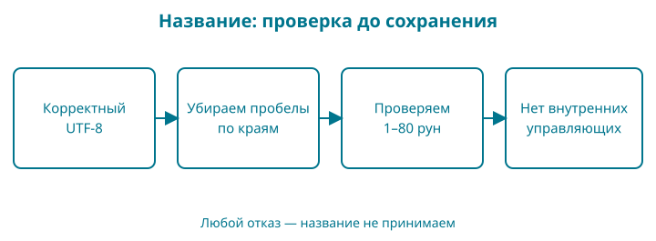

# 6. Сколько букв в названии книги

Название книги должно одинаково хорошо работать с русским, казахским и английским текстом. Если проверять его длину неподходящим способом, короткое название может неожиданно не пройти ограничение, а обрезанный текст — перестать читаться.

В этой главе мы научимся измерять строку и введём правило названия: убрать пробельные символы по краям, проверить кодировку и ограничить длину. Контрольная точка: `examples/06-strings`.

Набираете сами: подготовьте отдельную папку с вашим `go.mod`, файлами `main.go` и `title.go` ниже; `title_test.go` возьмите из контрольной точки. Тесты скидки оставьте в папке главы 5. Здесь исследуем отдельное правило; в главе 8 соединим название и цену.

## Образ: мозаика и её кусочки

Посмотрите на короткое название `ӘGo`. Глаз легко различает три буквы. Теперь представьте, что каждую букву собирают из маленьких кусочков, а размер коробочки измеряют числом кусочков, а не числом букв. В записи UTF-8 латинским `G` и `o` нужен один байт каждой, а `Ә` — два.

Поэтому `len("ӘGo")` даст `4`: он считает байты строки. Обход `range` декодирует руны — кодовые точки Unicode. Для этого названия их три, а начальные байтовые позиции — `0`, `2`, `3`. Нарисуйте четыре клеточки и объедините первые две одной дугой. Так легче вспомнить, почему следующий символ начинается с позиции два.

Мозаика — только опора различия единиц счёта. Руна тоже не всегда равна одной видимой букве: букву с отдельным комбинируемым знаком можно представить несколькими кодовыми точками. Поэтому не запоминайте «руна — это буква» без оговорки. Каждый раз уточняйте, что требуется посчитать: байты, кодовые точки или воспринимаемые человеком символы.

## Сначала наблюдение

В контрольной точке два рабочих файла: `main.go` запускает опыт, а `title.go` содержит правило. Оба относятся к одному пакету и лежат рядом с `go.mod`. Команда `go run .` соберёт их вместе.

Файл `main.go`:

<!-- include:examples/06-strings/main.go -->

Пока не запускайте: попробуйте посчитать длину `Шаңырақ Go`. В слове семь букв, затем пробел и ещё две буквы. Почему у программы будет два разных числа?

Файл `title.go`:

<!-- include:examples/06-strings/title.go -->

Теперь выполните `go run .`:

<!-- include:examples/06-strings/stdout.txt -->

И `17`, и `10` верны: они отвечают на разные вопросы.

## Байт, руна и то, что видит читатель

Байт — единица из восьми бит. В Go `byte` является другим именем типа `uint8`, то есть беззнакового целого от 0 до 255. Строка хранит последовательность байтов. Её длина `len(title)` измеряется именно в байтах.

UTF-8 — способ представить кодовые точки Unicode байтами. ASCII — небольшой набор кодов для латинских букв, цифр, знаков и управляющих символов. Его символы, например `G`, в UTF-8 занимают один байт. Для букв в нашем казахском примере — по два. Поэтому семь букв дают четырнадцать байтов, а пробел и `Go` добавляют ещё три.

Руна в Go — другое имя типа `int32`; при работе с Unicode ею представляют кодовую точку. Функция `utf8.RuneCountInString` считает такие кодовые точки. Не путайте это с обещанием посчитать видимые знаки.

Один воспринимаемый знак может состоять из нескольких кодовых точек: например, буква и отдельно записанное ударение. Такие последовательности называют графемными кластерами. Ограничение в восемьдесят рун — понятное правило нашей учебной модели, но оно не равнозначно ограничению в восемьдесят видимых знаков.

## Что возвращает range

В цикле `for offset, letter := range "ӘGo"` первое значение — смещение в байтах, второе — руна. Смещения получились `0`, `2`, `3`. После `Ә` мы перешли сразу к байту с номером `2`, потому что эта буква занимает два байта.

Если вместо обхода написать `title[0]`, мы получим первый байт. Это может быть только часть многобайтовой последовательности. Для нашей строки такой байт нельзя считать первой буквой.

Пустая строка тоже имеет длину — ноль. Но элемента с индексом `0` у неё нет. Проверка длины до обращения по индексу нужна независимо от языка текста.

## Зачем проверять UTF-8

Исходные файлы Go записываются в UTF-8, но строка, полученная во время работы, может содержать произвольные байты. Например, файл мог прийти в другой кодировке или быть повреждён.

`utf8.ValidString` отвечает, является ли последовательность корректным UTF-8. В нашем правиле неверная последовательность приводит к отказу. Мы не пытаемся угадать исходную кодировку и не выдаём заменённые символы за первоначальное название.

Это отдельная проверка от подсчёта рун. Сам по себе успешный вызов счётчика не подтверждает, что исходные байты были корректным текстом.

## Четыре шага проверки

Сначала проверяем UTF-8. Затем `strings.TrimSpace` убирает пробельные символы с обоих краёв. Пробел между словами остаётся на месте.

После удаления краевых пробелов название не должно быть пустым, а его длина в рунах — превышать восемьдесят. В конце обходим оставшийся текст и отказываем при управляющих символах, например переводе строки внутри названия. Отдельно исключаем U+2028 (разделитель строки) и U+2029 (разделитель абзаца): `unicode.IsControl` проверяет категорию управляющих символов, а эти два разделителя относятся к другим категориям Unicode.

Обратите внимание на порядок. Строка из пробелов и переводов строк превратится в пустую и получит отказ. Название `Go` с переводом строки только в конце станет `Go`: краевые пробелы мы согласились удалять. А `Go`, перевод строки, `магазин` останется многострочным и будет отклонено.

Эта функция не выполняет полную Unicode-нормализацию и не защищает от всех визуально похожих символов. Её имя означает подготовку названия по перечисленным правилам. Когда понадобится поиск, мы отдельно обсудим сравнение и нормализацию Unicode, чтобы не менять авторское написание без объяснения.

## Строка не меняется внутри себя

Функция `TrimSpace` возвращает строку. Мы сохраняем её в переменной `title` внутри `normalizeTitle`. Это новое присваивание локальному имени, а не изменение отдельных байтов переданного значения.

Поэтому вызывающий код получает подготовленное название через `return`. Если проигнорировать возвращённую строку, исходная переменная у вызывающего кода не станет автоматически обрезанной.

## Проверяем границу, а не впечатление

В `title_test.go` есть проверка строки из восьмидесяти букв `Ә`. Её создаёт `strings.Repeat("Ә", 80)`: первый аргумент — повторяемая строка, второй — число повторов. Она занимает сто шестьдесят байтов, но должна пройти наш лимит в рунах. Следующая проверка добавляет ещё одну такую букву и ожидает отказ.

Запустите `go test ./...`. Затем замените в функции подсчёт рун на `len(title)` и повторите тесты. Граница для казахского текста сломается. Верните исходную проверку и снова запустите тесты.

Это полезнее проверки только короткого английского слова: для него число байтов и рун совпадает, и неправильная реализация могла бы выглядеть правильной.

## Читаем новую запись по символам

`import (...)` объединяет несколько импортов в группу; скобки здесь не вызывают функцию. В `for offset, letter := range text` запятая разделяет два имени, а `range` задаёт обход строки. Когда первое значение не нужно, вместо `offset` ставят `_`.

В выводе `%q` показывает строку в кавычках с экранированием при необходимости, `%c` выводит символ по значению руны. Путь `"unicode/utf8"` внутри импорта содержит слеш: это часть пути пакета, а не арифметическое деление.

В тестах `\t` означает табуляцию, `\n` — перевод строки, `\xff` задаёт один байт по шестнадцатеричному коду. Последняя запись позволяет намеренно построить неверный UTF-8. Запись `\u0301` задаёт кодовую точку Unicode; язык сам кодирует её в UTF-8 внутри строки. Такие последовательности полезны для опытов, где обычный вид текста скрыл бы различие.

`'\u2028'` и `'\u2029'` в одинарных кавычках — литералы рун: каждый задаёт одну кодовую точку. В двойных кавычках `"\u2028"` была бы строка. Мы сравниваем `letter` с рунами через `==`, а не со строками.

**Проверка понимания.** Не называя просто «длину», произнесите полное условие нашего ограничения: сколько чего мы считаем и что делаем с пробелами по краям.

## Разминка

**Предскажите.** Сколько байтов и рун у строки `Go`? А у `Ә`?

**Заполните.** Индекс в `for offset, letter := range title` измеряется в байтах или в рунах?

**Почините.** Ограничение названия обещает восемьдесят рун, но функция проверяет `len(title) <= 80`. Какой пример покажет ошибку?

## Задание

**Обязательное.** Допишите тест `TestInternalSpaces`: `normalizeTitle("  Go  дүкені  ")` должна вернуть `"Go  дүкені"` и `true`. Между словами два пробела; наша функция их не объединяет.

**На своих данных.** Возьмите название на знакомом вам языке, предскажите число рун и сравните с результатом. Если ожидание разошлось с выводом, сначала уточните, не включает ли видимый знак несколько кодовых точек.

**По желанию.** Сравните строки `"é"` и `"e\u0301"`: напечатайте их длины в байтах, длины в рунах и результат `==`. Не исправляйте сравнение удалением ударения: это меняет данные.

## Ответы

У `Go` два байта и две руны; у `Ә` — два байта и одна руна. `range` возвращает байтовое смещение. Восемьдесят букв `Ә` обнаружат ошибку проверки через `len`: рун восемьдесят, а байтов сто шестьдесят.

В обязательном тесте сравните оба результата: подготовленный текст и признак успеха. Для дополнительного опыта два варианта `é` занимают соответственно два и три байта, содержат одну и две руны и не равны как строки. Они могут выглядеть одинаково, но последовательности байтов различны.

У магазина появилось правило названия. В следующей главе соберём несколько названий в упорядоченный каталог.
