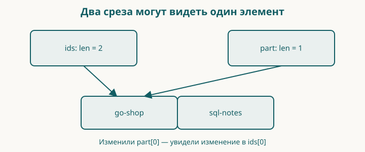

# 7. Каталог: список, массив и словарь

До сих пор программа работала с одной книгой. Теперь их будет несколько, и порядок на витрине станет частью результата. Для этого нам понадобятся три вида данных: фиксированный набор форматов, список идентификаторов и словарь названий.

Контрольная точка: `examples/07-catalog`. Книга о SQL — учебная карточка для второго элемента каталога, а не обещание готового второго издания в магазине shanraq.org.

Набираете сами: подготовьте отдельную папку с вашим `go.mod`, новыми `main.go` и `catalog.go`, перенесите `title.go` и `title_test.go` из главы 6 и добавьте `catalog_test.go` из контрольной точки. Названия продолжают проходить прежнюю проверку.

## Образ: ряд карточек и окно

Разложите три карточки в ряд. Теперь прикройте ряд листом бумаги с прямоугольным окном: видны только две карточки. Передвинуть границу окна и переписать карточку — разные действия. Если два окна открывают одну карточку, исправление на ней будет видно через оба.

Такой образ помогает разобраться со срезом: он описывает участок базового массива. Копия среза сама по себе не создаёт независимые копии элементов. А вот копирование массива копирует его элементы. Для независимого набора элементов среза мы явно выделим новое хранилище и скопируем туда данные.

У окна есть важная граница сходства. `append` может использовать оставшееся место старого массива, а может выделить новый; это зависит от вместимости. Поэтому после добавления нельзя судить об общем хранилище только по похожим названиям переменных. Нарисуйте два окна над одним рядом, затем отдельный ряд для копии. В проверяемом примере измените одну карточку и предскажите, через какое окно изменение станет видно.

А `map` представьте отдельным набором карточек «ключ — название». Этот набор помогает найти название по ключу, но не обещает порядок витрины. Для порядка у нас остаётся собственный список ключей.

## Сразу целиком

Файл `main.go`:

<!-- include:examples/07-catalog/main.go -->

Файл `catalog.go`:

<!-- include:examples/07-catalog/catalog.go -->

Запустите `go run .`:

<!-- include:examples/07-catalog/stdout.txt -->

Первая книга в списке — наша книга. Словарь помогает получить название по идентификатору, а список задаёт последовательность показа.

## Массив: длина входит в тип

`[3]string` означает массив из трёх строк. Число стоит между квадратными скобками и является частью типа: `[2]string` и `[3]string` — разные типы.

Мы сразу записали три значения: `PDF`, `EPUB`, `HTML`. К первому обращаются по индексу `0`, к последнему — по `2`. Индекса `3` у этого массива нет.

Массив выбран для демонстрации фиксированного набора. Это не утверждение, что вся архитектура магазина навсегда обязана хранить форматы в массиве. Когда у разных книг будет разный набор файлов, понадобится другая модель.

При присваивании массива другому массиву копируются элементы. Для массива строк можно поменять элемент копии, не заменяя строку в исходном массиве. Но если сами элементы содержат ссылки на общие данные, копирование внешнего массива не делает эти данные независимыми автоматически.

## Срез: видимая часть массива

`[]string` означает срез строк. Числа между скобками нет. Начальный срез `ids` содержит один идентификатор. Вызов `append(ids, "sql-notes")` возвращает срез с добавленным элементом, и мы сохраняем этот результат обратно в `ids`.

Почему возвращённое значение важно? В срезе есть информация о начале данных, длине и доступной ёмкости. Добавление меняет длину, а иногда требует другого массива. Если не сохранить результат `append`, у вас не будет правильного описания расширенного среза.

`len` отвечает, сколько элементов сейчас видно. `cap` — сколько элементов доступно от начала этого среза до конца доступной ему области массива. Для среза, начинающегося в середине массива, это не обязательно размер всего исходного массива.

`make([]string, 0, len(ids))` создаёт срез с нулевой длиной и заранее достаточной ёмкостью для нашего результата. Длина ноль означает, что обращаться к `ordered[0]` пока нельзя. Сначала нужно добавить элемент.

## Общее хранилище: важная граница образа

Срез удобно представлять окном в массив. Но два окна могут показывать одни и те же ячейки. Выражение `part := ids[:1]` не обещает независимую копию первого элемента.

Здесь левая граница пропущена и равна нулю, правая не включается: виден только элемент с индексом `0`. Если присвоить `part[0]` новое значение, оно будет видно через `ids[0]`.

Для независимого списка строк можно создать срез нужной длины через `make` и вызвать встроенную функцию `copy`. Она копирует столько элементов, сколько помещается в оба среза, и возвращает число скопированных элементов. Если создать приёмник длиной ноль, ничего не скопируется, даже при большой ёмкости.

Копирование списка строк достаточно для независимой замены его строковых элементов. Для среза структур с вложенными map или другими срезами вопрос независимости придётся рассматривать глубже.

Не запоминайте конкретный коэффициент роста `cap` после `append`: наш код не должен зависеть от стратегии выделения памяти. Проверять нужно наличие элементов и требуемую независимость данных.

## Словарь: ключ вместо позиции

В `map[string]string` первый тип относится к ключу, второй — к значению. Ключ `go-shop` связывается с названием книги.

Операция `title, ok := titles[id]` возвращает значение и признак присутствия ключа. Для неизвестного ключа строка будет пустой, а `ok` — ложным. Если ключ существует и хранит пустую строку, `ok` будет истинным. Поэтому функция сначала проверяет наличие ключа, затем вызывает `normalizeTitle` из главы 6: проверяются UTF-8, краевые пробелы, длина и однострочность. В результат попадает подготовленное название. Полезное правило не должно исчезать при переходе от одной книги к нескольким.

Нулевое значение map — `nil`. Из неё можно читать, получая отсутствие ключа. Записывать в nil map нельзя: нужен созданный словарь, например через `make(map[string]string)` или литерал, как в нашем примере. Это связано с начальным значением, а не со словом `var`: запись `var titles = make(map[string]string)` создаёт рабочий словарь.

При присваивании map другой переменной данные словаря не копируются в независимое хранилище. Изменение элемента через одно имя будет видно через другое. Подробнее проверим это вместе со структурами.

## Почему витрина не обходит map

Порядок обхода map не определён. Даже если несколько запусков случайно дали удобную последовательность, полагаться на неё нельзя.

Поэтому мы обходим `ids`. Для каждого идентификатора получаем соответствующее название. Если данных не хватает, возвращаем `nil, false` и не показываем частично собранный результат как полноценный каталог.

Два отдельных контейнера требуют согласованности. Можно добавить идентификатор и забыть название. В этой главе мы намеренно делаем такой риск видимым; следующая объединит поля книги в структуру и сократит число мест, которые нужно менять вместе.

Словарь полезен для поиска по ключу, но образ «мгновенного гардероба» не означает нулевого времени или гарантированной одинаковой стоимости любой операции. Производительность измеряют на задаче и данных, а не выводят из метафоры.

## Проверяем поведение

`catalog_test.go` проверяет заданный порядок, отсутствующий ключ, пустое название и пустой каталог. Запустите `go test ./...`.

Пустой каталог считается допустимым: список результатов пуст, признак успеха истинен. Каталог с обещанным идентификатором, для которого не найдено название, — ошибка. Эти случаи отличаются смыслом, хотя оба могут не дать ни одной строки на витрине.

## Читаем коллекции по символам

| Запись | Как прочитать |
|---|---|
| `[3]string` | Массив ровно из трёх строк |
| `[]string` | Срез строк |
| `{"PDF", "EPUB", "HTML"}` после типа | Значения составного литерала |
| `[0]` после переменной | Обращение к элементу по индексу |
| `[:1]` после среза | Диапазон от начала до индекса 1, не включая его |
| `map[string]string` | Словарь: строки в качестве ключей и значений |
| `"go-shop": "Название"` | Двоеточие разделяет ключ и значение записи словаря |
| `make`, `append`, `copy`, `len`, `cap` | Встроенные функции языка; отдельный импорт не нужен |
| `nil` | Нулевое значение для среза, map и ряда других типов, но не для строки или целого числа |

В многострочном составном литерале после последнего элемента тоже стоит запятая. Она нужна для такой записи с переносом перед закрывающей скобкой. Не переносите правило на список аргументов в одну строку бездумно: здесь мы объясняем конкретный многострочный пример.

`range ordered` даёт индекс и значение элемента среза. Выражение `index+1` только меняет печатаемый номер: индекс самого среза по-прежнему начинается с нуля. Формат `%v` в сообщении теста показывает значение в обычном представлении.

**Восстановите по памяти.** Нарисуйте словарь как карточки «ключ — название» и отдельно список ключей для витрины. Проведите путь от первого элемента списка к его названию. Если хочется взять «первую запись map», вернитесь к правилу порядка обхода.

## Разминка

**Предскажите.** Сколько элементов видит срез после `make([]string, 0, 10)`?

**Заполните.** Как сохранить результат добавления: `ids = ___(ids, "new-book")`?

**Почините.** `copy` вернул ноль, хотя у приёмника ёмкость десять. Какое второе свойство приёмника нужно проверить?

## Задание

**Обязательное.** Добавьте третью карточку с идентификатором `go-tests` и названием `Тесты на Go`. Она должна появиться третьей. Затем удалите только её название из map: программа должна вывести `Каталог неполон`, а не первые две карточки как будто всё получилось.

**На своих данных.** Поменяйте порядок идентификаторов. Убедитесь, что меняется порядок витрины, а пары в словаре переписывать не нужно.

**По желанию.** Создайте срез из двух строк, получите `part := original[:1]`, поменяйте `part[0]`. Повторите с отдельным приёмником и `copy`. Сравните результаты.

## Ответы

У среза длина ноль: ёмкость не даёт права обратиться к ещё не существующему элементу. Для добавления используется `append`. `copy` учитывает длину приёмника, поэтому её тоже надо проверить.

В обязательной задаче изменяются два места: добавление идентификатора и запись в словаре. Структура объединит поля одной книги; для полного каталога структур всё равно понадобятся список и правило поиска. В следующей контрольной точке начнём с одной такой структуры.

После этой главы у нас есть работающий каталог с явным порядком и отказом при неполных данных. Следующая глава объединит идентификатор, название, цену и состояние публикации в одно значение.
