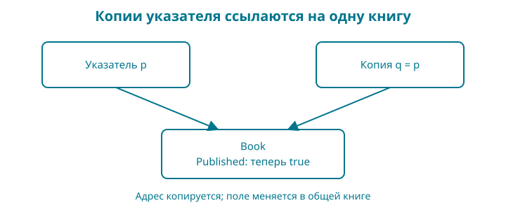

# 8. Книга как значение: структуры, методы и указатели

Название, цена и признак публикации относятся к одной книге. Если хранить их в отдельных переменных или параллельных словарях, легко перепутать, что к чему относится. Объединим данные и сохраним уже написанные правила.

Контрольная точка: `examples/08-books`. В ней `pricing.go` содержит расчёт скидки из главы 5, а `title.go` — проверку названия из главы 6. Их поведение осталось прежним и проверяется теми же тестами.

Набираете сами: в новой папке нужны ваш `go.mod`, `main.go`, `book.go`, `pricing.go`, `title.go` и тесты `book_test.go`, `pricing_test.go`, `title_test.go`. Готовые файлы есть в контрольной точке. Из главы 5 переносите только функцию расчёта и её тесты (тестовый файл здесь назван `pricing_test.go`), а не вторую функцию `main`. Словарь из главы 7 остаётся учебным опытом; этот пример пока показывает одну карточку `Book`, не полный каталог структур.

## Образ: карточка книги и записанный адрес

На карточке книги стоят название, цена и отметка о публикации. Сделайте её копию и исправьте название на копии. Первая карточка сохранит прежний текст. Для нашей структуры `Book` с её нынешними полями это хорошее начало понимания копирования значения.

Теперь вместо карточки перепишите на другой лист её адрес. У вас два листа с адресом, но сама карточка одна. Если оба человека пришли по этому адресу и один поставил отметку о публикации, второй увидит эту же отметку. Так удобнее представить копирование указателя: копируется значение адреса, а новая книга от этого не появляется.

Опора: **копия карточки — другая карточка; копия адреса — путь к прежней карточке**. Вызов метода с получателем-указателем позволяет изменить исходную книгу. Но если внутри структуры появятся срезы или `map`, одной картинки двух независимых карточек уже мало: их копии могут обращаться к общим внутренним данным. Ниже мы отдельно проверим эту границу. Попробуйте нарисовать два адресных листка и только одну книгу, а затем объяснить, что именно копирует присваивание указателя.

## Сначала работающий результат

Новый файл `book.go`:

<!-- include:examples/08-books/book.go -->

Файл `main.go`:

<!-- include:examples/08-books/main.go -->

Добавьте из предыдущих контрольных точек `title.go` и функцию `priceAfterDiscount` в файл `pricing.go`. В готовой папке они уже есть. Не копируйте второй `main.go`: внутри пакета нам нужна одна функция `main`.

Запуск: `go run .`. Результат:

<!-- include:examples/08-books/stdout.txt -->

У книги изменилось состояние публикации, название потеряло краевые пробелы, а вычисленная цена использует прежнее правило скидки. Мы не написали магазин заново: соединили уже проверенные части.

## Структура связывает поля

`type Book struct` объявляет тип `Book` с перечисленными полями. У каждого поля есть имя и тип. В `main` мы создаём значение литералом `Book{...}` и явно подписываем поля.

Поле `Published` не указано в литерале, поэтому получает нулевое значение `false`. По нашему правилу новая книга начинается как черновик. Это уже осмысленное применение нулевого значения: правило программы согласовано с правилом языка.

`book.Title` обращается к полю конкретного значения. Две разные переменные типа `Book` могут содержать разные названия и цены. Сам тип описывает форму данных, а не единственную книгу на весь магазин.

Имена полей с заглавной буквы экспортируются из пакета. В этой главе весь код ещё внутри `main`; границы пакетов разберём позже. Экспортированное поле не обеспечивает запрета на некорректное присваивание: вызывающий код может записать туда отрицательную цену. Поэтому проверка перед публикацией остаётся необходимой.

## Метод — функция с получателем

У `PriceAfterDiscount` перед именем стоит `(b Book)`. Это получатель: значение книги, для которого вызывается метод. Вызов `book.PriceAfterDiscount(10)` передаёт в метод книгу и процент скидки.

Метод с получателем-значением получает копию `Book`. Для нашей структуры копируются строки, целое число и логическое значение. Сам метод просто передаёт цену знакомой функции и ничего не меняет.

Это не новое правило арифметики, а удобный способ связать уже существующее действие с данными книги. Нет необходимости превращать в методы все функции проекта: если связь с конкретным типом не помогает чтению, обычная функция может быть яснее.

## Указатель: куда записать изменение

`Publish` объявлен с получателем `(b *Book)`. Тип `*Book` означает указатель на значение `Book`. Такой указатель позволяет обратиться к исходной книге и изменить её поля.

В Go аргументы передаются по значению. Это верно и для указателя: копируется значение указателя, а обе копии указывают на ту же книгу. Поэтому формулировка «со звёздочкой копирования вообще нет» неверна.

`&book` получает адрес переменной. `*pointer` позволяет обратиться к значению по указателю. Для обычного доступа к полю достаточно `pointer.Title`: Go разрешает такую краткую запись без явного `(*pointer).Title`.

В `book.Publish()` компилятор может взять адрес переменной `book` автоматически. Это работает для адресуемого значения. Не делайте из этого правило «любой результат можно сразу менять методом»: временное значение, возвращённое некоторым выражением, может не быть адресуемым. Сначала сохраните его в переменную, если собираетесь изменять.

## Нулевой указатель

У указателя есть нулевое значение `nil`: адрес книги не задан. В нашем методе сначала стоит проверка `b == nil`, поэтому такой вызов вернёт отказ, а не попытается читать поле отсутствующей книги.

Это решение именно нашего метода. В Go вызов метода на nil-указателе не становится автоматически безопасным: всё зависит от того, что метод делает. `PriceAfterDiscount` имеет получателя-значение, и отсутствие книги не является для него допустимым аргументом.

## Изменение после всех проверок

Сначала `Publish` проверяет указатель, идентификатор и валюту. Затем получает подготовленное название в локальную переменную. Потом проверяет цену через существующую функцию скидки с нулевым процентом.

Только после всех успешных проверок два поля получают новые значения. Если цена не подходит, даже удаление краевых пробелов не сохранится в книге. Тест `TestInvalidBookUnchanged` сравнивает её с состоянием до вызова.

Это маленький пример важного правила: отказ не должен оставлять полувыполненное изменение, если договор операции обещает целостность. Для базы данных позже потребуется транзакция; сейчас достаточно правильного порядка присваиваний в одной функции.

## Ловушка цикла: меняем копию

Если написать `for _, book := range books`, переменная `book` получает значение очередного элемента. Для среза структур `Book` это копия структуры. Вызов `book.Publish()` изменит её, а исходный элемент среза останется черновиком.

Для изменения элементов нужен обход по индексам: `for i := range books`, затем `books[i].Publish()`. Элемент среза адресуем, поэтому метод меняет нужную книгу.

В `book_test.go` проверяются оба варианта подряд. Сначала тест подтверждает, что изменение копии не затронуло оригинал, затем — что изменение элемента среза сохранилось. Здесь не требуется угадывать по внешнему виду кода: можно воспроизвести оба поведения.

## А если поле — map или срез?

Наша `Book` пока состоит из простых полей. Если добавить поле map или срез, копия внешней структуры может продолжать обращаться к общим внутренним данным. Изменение элемента такого контейнера отличается от замены поля целиком.

Копирование структуры с полем map сохраняет доступ к общему словарю: запись элемента через копию видна оригиналу, замена самого поля — нет. Например, если `a` и `b` — копии структуры с полем `Titles map[string]string`, то `b.Titles["go"] = "Новое"` меняет общий словарь. А `b.Titles = make(map[string]string)` заменяет только поле `b`. Проверяемая демонстрация есть в комплекте исходников: `book/research/reproductions/map-value`.

Выбор получателя не стоит обосновывать лозунгом «указатели всегда быстрее». Сначала определите семантику: должно ли изменение сохраняться, есть ли общее состояние и разрешено ли копировать сам тип. Измерения производительности — отдельная работа.

## Читаем тип и методы по символам

`type` вводит объявление типа. `struct { ... }` перечисляет его поля. В `Book{ID: "go-shop"}` фигурные скобки создают составное значение, а двоеточие связывает имя поля с его значением. Внутри объявления `struct` поля записаны иначе — имя и тип без двоеточия.

Точка в `book.Title` выбирает поле; точка в `book.Publish()` выбирает метод, который затем вызывается круглыми скобками. В `(b Book)` перед именем метода объявлен получатель. В `(b *Book)` звёздочка входит в тип получателя.

`&book` берёт адрес. В выражении `*pointer` звёздочка обращается к значению по адресу, а в типе `*Book` обозначает указатель на книгу. В `%+v` внутри сообщения теста плюс просит `fmt` показать имена полей структуры: это часть формата, не сложение.

Сравнение `book != before` в нашем тесте возможно потому, что все поля текущей `Book` сравнимы. Если добавить срез или map, структура уже не будет сравниваться таким оператором. Нельзя бездумно переносить тест после изменения формы данных.

**Проверка понимания.** Прочитайте одну строку создания книги и одну строку вызова метода, вслух называя роль каждого вида скобок. Затем объясните, какой именно объект изменит получатель-указатель.

## Разминка

**Предскажите.** Если `copy := book`, затем `copy.Title = "Другая книга"`, изменится ли `book.Title` для нашей текущей структуры?

**Заполните.** Какой знак получает адрес переменной: `&` или `*`?

**Почините.** Цикл вызвал `Publish` для каждой переменной `book`, но элементы `books` остались черновиками. Какой вариант обхода нужен?

## Задание

**Обязательное.** Напишите тест для бесплатной книги: непустые `ID` и `Title`, валюта `KZT`, цена `0`. Метод `Publish` должен вернуть `true` и установить `Published`. Это согласовано с допустимым нулём из главы 5.

**На своих данных.** Создайте две книги в срезе. Опубликуйте их обходом по индексам и выведите названия опубликованных. Сделайте одну цену недопустимой и убедитесь, что именно эта книга остаётся черновиком.

**По желанию.** Добавьте метод `Unpublish`, который возвращает книгу в черновик. Определите, что он делает при повторном вызове, и запишите это в тесте. Не связывайте снятие с витрины с удалением уже купленных файлов: это разные решения магазина.

## Ответы

Изменение строкового поля копии не заменяет поле оригинала. Адрес получается через `&`. Для изменения структуры в срезе используйте индекс и обращайтесь к `books[i]`.

Тест бесплатной книги должен проверять и результат метода, и состояние поля. Одного `true` недостаточно: ошибочная реализация могла бы согласиться с операцией, ничего не изменив.

Мы получили модель книги и соединили проверку названия с правилом цены. Следующий шаг — научиться возвращать объяснимую ошибку при работе с файлом. Сам метод `Publish` пока сохранит результат `bool`; не все интерфейсы проекта меняются одновременно.
