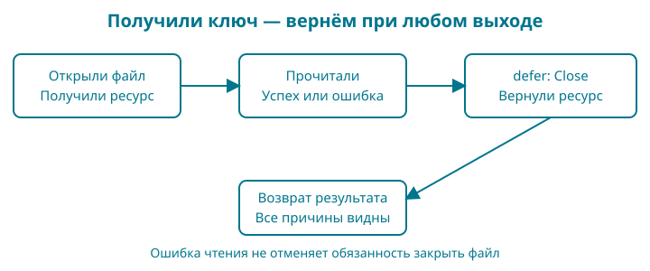

# 9. Файл не открылся: ошибки и освобождение ресурсов

Название книги пока живёт в исходнике. Чтобы исправить опечатку, приходится менять программу. Сегодня вынесем название в `title.txt`, а прежние правила проверки оставим на месте. После удачного чтения карточка пройдёт тот же метод `Publish`, что и в главе 8.

Контрольная точка: `examples/09-errors`. Вам понадобятся функции, несколько возвращаемых значений, структуры и указатели. Новые вещи — значение ошибки, отложенный вызов и небольшой договор чтения — разберём здесь, до самостоятельного задания.

Набираете сами: скопируйте папку главы 8, замените `main.go` листингом этой главы, добавьте `file.go`, `file_test.go`, `defer_test.go` из контрольной точки и обычный текстовый файл `title.txt` в UTF-8 без BOM. Остальные Go-файлы и `go.mod` сохраните. Расширение должно быть `.txt`, а не `.txt.txt`. Терминал запускайте в этой папке: относительный путь к названию отсчитывается от неё.

## Образ: ключ и записка у двери

Представьте читальный зал. Вы получили ключ от шкафчика, достали нужный лист и ушли. Лист уже у вас, но ключ всё ещё надо вернуть. Теперь другой случай: шкафчик открылся, а нужного листа нет. Возвращать ключ нужно и тогда. А если ключ вообще не выдали, возвращать нечего.

Для открытого файла есть похожая обязанность: освободить ресурс после работы. Проверка ошибки отвечает на вопрос «получили ли мы ключ?». `defer` позволяет сразу оставить записку: «перед выходом вернуть». Тогда ранний выход из-за плохого названия не забудет о закрытии файла.

Записка — опора, а не устройство операционной системы. Открытый файл не является бумажным ключом. И закрытие файла не означает автоматического сохранения любых данных на физический носитель. Сейчас мы читаем; надёжную запись разберём отдельно.

## Сначала результат

В готовой папке есть прежние `Book`, расчёт скидки, проверка названия и их тесты. Добавился файл `title.txt`:

<!-- include:examples/09-errors/title.txt -->

Два пробела в начале строки здесь намеренные. После запуска `go run .` получим:

<!-- include:examples/09-errors/stdout.txt -->

Файл нужен только для названия. Цену и валюту оставляем в программе, чтобы не изучать одновременно собственный формат каталога. Это промежуточный шаг, а не готовое хранилище магазина.

Вот новый `main.go`:

<!-- include:examples/09-errors/main.go -->

Сначала `run` получает название, затем создаёт карточку и проверяет её прежним методом. Печать происходит после успешной проверки. Ошибка не превращается в пустую опубликованную книгу.

## Что изменилось по сравнению с bool

Раньше второй результат говорил `true` или `false`. Теперь хочется различать причины: файла нет, прочитать его не удалось, название недопустимо. Для этого функция возвращает `error`.

`error` — предопределённый интерфейс Go. Пока достаточно его маленького договора: значение ошибки умеет предоставлять описание через метод `Error() string`. Интерфейс описывает доступное поведение. Какие конкретные типы могут его выполнять и как устроены наборы методов, подробно разберём в главе 18. Здесь нам нужны два состояния: `nil` означает отсутствие ошибки, ненулевое значение — ошибку.

`errors.New("описание")` создаёт ошибку с сообщением. `return nil` в `run` означает успешное завершение. Это результат функции, а не команда печати. В функции с результатами `(string, error)` успешный возврат выглядит как `return title, nil`, а неудачный — как `return "", err`.

Не делайте вывод о неудаче только по пустой строке. Проверять нужно возвращённую ошибку. В наших функциях при ошибке результат специально очищается, но такой договор не распространяется автоматически на все функции стандартной библиотеки.

## Где принять решение об ошибке

`main` вызывает `run` и решает, как завершить программу. Запись `if err := run(); err != nil` содержит два шага: сначала вызов и объявление `err`, затем условие после точки с запятой. Здесь `;` написана явно: она отделяет подготовительное действие от проверки. Имя `err` доступно внутри этого `if`.

`fmt.Fprintln(os.Stderr, err)` выводит сообщение в стандартный поток ошибок. Обычный результат программы идёт в другой поток — стандартный вывод. Это позволяет инструментам различать данные и диагностические сообщения.

`os.Exit(1)` завершает процесс с ненулевым кодом: запуск закончился неудачей. При успешном возврате из `main` код завершения будет нулевым. Сам по себе `return` из обычной функции не устанавливает ошибочный код процесса.

Важная граница: `os.Exit` не выполняет отложенные вызовы. Поэтому работа с файлом находится глубже, внутри функции чтения, и заканчивается до возвращения ошибки в `main`. К моменту `os.Exit` наша функция уже попыталась закрыть открытый ресурс.

## Три прохода вместо одного большого прыжка

Сначала проследите только `run`: вызов, проверка `err`, ранний `return`, успешный `return nil`. Затем разберите маленькие тесты ниже: у них нет файлов и интерфейса чтения. Только после этого переходите к `file.go`, где эти механизмы работают вместе.

Файл `defer_test.go` из контрольной точки:

<!-- include:examples/09-errors/defer_test.go -->

Запустите `go test -run TestDefer -v .`. Флаг `-run` выбирает тесты по имени, `-v` показывает их имена и результат. Сначала предскажите значения, не меняя код. Первый тест получает `21`: последнее зарегистрированное действие выполняется первым. Во втором обычный аргумент запоминает `1`, а замыкание позднее читает `2`. В третьем `return nil` сначала записывает `nil` в именованный результат `err`, затем отложенное действие заменяет его ошибкой.

Запись `f := func() { ... }` сохраняет функцию в переменную, а `f()` вызывает её. Функция может быть значением, как число или строка, но выполняется только при вызове. В записи `func() (err error)` у неё нет входных параметров и один именованный результат. Если этот разбор пока не получается, остановитесь здесь: для следующего шага нужно объяснить все три наблюдения, а не выучить длинный файл наизусть.

## Открываем и сохраняем причину отказа

Вся работа с файлом находится в `file.go`:

<!-- include:examples/09-errors/file.go -->

Первый шаг — `os.Open(path)`. Он открывает существующий файл для чтения и возвращает указатель на `os.File` и ошибку. Если ошибка есть, мы сразу возвращаемся. Только после успешного открытия передаём файл в `readTitleAndClose`.

`fmt.Errorf` создаёт ошибку по формату. В `"открыть название %q: %w"` спецификатор `%q` добавляет путь в кавычках, а `%w` сохраняет исходную ошибку внутри новой. Так мы добавляем контекст, не теряя причину. `%v` тоже мог бы напечатать текст причины, но не создал бы такую связь.

Для программы полезна проверка `errors.Is(err, fs.ErrNotExist)`: присутствует ли среди причин ошибка отсутствия файла? Не сравнивайте `err.Error()` с английской фразой операционной системы. Текст может зависеть от платформы и добавленного контекста.

Наши `ErrTitleTooLarge` и `ErrInvalidTitle` созданы один раз как переменные пакета. Они служат узнаваемыми причинами отказа. Новый вызов `errors.New` с тем же текстом создаст другую ошибку; совпадение сообщения не делает её тем же значением. В тестах используем именно объявленные переменные.

Путь сейчас задан автором программы: `title.txt` в текущей папке запуска. Это не обработчик адресов скачивания из интернета. Прежде чем принимать путь от пользователя, потребуется отдельный договор о доступных файлах и границах каталогов.

## Почему чтение выделено в отдельную функцию

`readTitleAndClose` получает `io.ReadCloser`. Это интерфейс из стандартной библиотеки: переданное значение должно предоставлять методы чтения `Read` и закрытия `Close`. Настоящий файл это умеет. В тесте мы передадим маленький объект с теми же методами и сможем специально вызвать отказ.

Интерфейс удовлетворяется неявно: у `*os.File` уже есть нужные методы, отдельного слова `implements` в Go нет. В сигнатуре `Read(p []byte) (int, error)` вызывающий передаёт срез для заполнения; метод записывает в него байты и возвращает их число и ошибку. Именно `io.ReadAll` повторяет чтение и собирает результат.

Функция ожидает действительный открытый ресурс. Передавать в неё `nil` нельзя: вызвать у отсутствующего ресурса `Read` или `Close` не получится.

Это первое практическое знакомство с интерфейсом через готовый договор. Мы не строим иерархию абстракций. Разделение нужно для конкретной проверки: удастся ли сохранить одновременно ошибку чтения и ошибку закрытия? Надёжно вызвать такой случай на настоящем диске во всех трёх ОС неудобно.

Название функции и комментарий задают владение ресурсом: после передачи объекта закрытие становится обязанностью `readTitleAndClose`. Поэтому `loadTitle` не вызывает второй `Close`. Если передавать один объект нескольким функциям без такого договора, легко получить двойное закрытие или забытый ресурс.

## Записка defer: что и когда выполняется

В записи `(title string, err error)` результатам даны имена. При входе в функцию это переменные с нулевыми значениями: пустой строкой и `nil`. Именованные результаты нужны здесь, чтобы отложенное действие могло изменить возвращаемую ошибку, если закрытие не удалось.

`defer func() { ... }()` состоит из трёх частей. `func() { ... }` создаёт функцию без имени. Последние `()` обозначают её вызов. `defer` откладывает этот вызов до выхода из окружающей функции. Мы сразу регистрируем действие, но выполняем его позже.

Внутренняя функция обращается к `reader`, `title` и `err` из окружающей функции. Это замыкание: функция сохраняет доступ к нужным переменным своего окружения. В нашем примере важно, что она изменяет именно именованные результаты, а не случайные новые переменные.

При `return title, nil` Go сначала присваивает возвращаемые значения результатам, потом выполняет `defer`, затем отдаёт результат вызывающему коду. Поэтому отложенный вызов ещё успевает заменить `nil` ошибкой закрытия. `data, err := ...` не создаёт новую `err` в этом же блоке: новым является `data`, а именованный результат `err` получает присваивание. Аналогично в `title, ok := ...` новое имя — `ok`, а `title` остаётся результатом функции. Для короткого объявления достаточно хотя бы одного нового имени в том же блоке. Во вложенном блоке новое объявление могло бы скрыть внешнее имя — поэтому здесь важно читать границы скобок.

Везде оставлены явные значения после `return`: читателю легче видеть основной путь.

Если `Close` вернул ошибку, очищаем `title` и вызываем `errors.Join(err, closeErr)`. Эта функция объединяет ненулевые ошибки, сохраняя возможность проверить каждую через `errors.Is`. Если чтение уже отказало, его причина остаётся. Если чтение прошло, но закрытие отказало, наружу всё равно уйдёт ошибка. Это строгий договор нашей функции: успех означает и успешное чтение, и успешное закрытие.

У `defer` есть ещё два правила. Несколько отложенных вызовов выполняются в обратном порядке регистрации. А значения аргументов обычного отложенного вызова вычисляются сразу, при встрече `defer`. Замыкание может обращаться к переменным позже — эти два случая не стоит смешивать. Две короткие проверки ждут вас в задании.

Не регистрируйте закрытие внутри длинного цикла, если рассчитываете освободить каждый файл в конце итерации: `defer` ждёт завершения функции. Наша небольшая функция обработки одного файла как раз задаёт удобную границу.

## Ограничиваем то, что читаем

Название не должно заставлять программу загружать огромный файл целиком. `io.LimitReader(reader, maxTitleFileBytes+1)` ограничивает поток чтения, а `io.ReadAll` собирает прочитанные байты в `[]byte` — срез байтов. Ограничение относится к числу байтов, полученных этим чтением; оно не проверяет заранее размер файла и не закрывает его.

Зачем `+1`? При лимите ровно `1024` мы не отличили бы файл длиной 1024 байта от начала более длинного файла. Разрешив прочитать 1025, получаем возможность обнаружить превышение. Полностью читать оставшиеся мегабайты не требуется.

`len(data)` считает байты. `string(data)` преобразует их в строку, после чего прежняя `normalizeTitle` проверяет UTF-8, убирает краевые пробелы и проверяет название. Лимит файла 1024 байта и лимит названия 80 рун отвечают на разные вопросы. Первый ограничивает объём ввода, второй — правило каталога. Например, большой файл из одних пробелов должен получить отказ ещё до нормализации.

Даже если при ошибке чтения удалось получить часть данных, мы её не используем: программа не должна публиковать обрезанное название. Обычное достижение конца потока само по себе не является ошибкой `io.ReadAll`.

## Читаем новые знаки в тестах

`[]byte("Go")` преобразует строку в срез байтов. `0o600` — целое число в восьмеричной записи: префикс `0o` задаёт основание. Здесь оно передаётся в `os.WriteFile` как права создаваемого тестового файла; интерпретация прав зависит от ОС. Это не настройка прав будущего сервера.

`t.TempDir()` создаёт временную папку, которую тестовая среда затем уберёт. `filepath.Join` соединяет части пути по правилам ОС. `t.Run` запускает именованный подтест; вторым аргументом мы передаём функцию без имени, принимающую `*testing.T`.

`[]struct { ... }` — срез значений структуры, для которой мы не объявили отдельного имени типа. Поля задают вход и ожидаемый результат. В каждой строке таблицы значения идут в порядке полей. `0xff` — число в шестнадцатеричной записи; байт с таким значением позволяет проверить недопустимый UTF-8.

В тестовом `trackedReader` поле `reader` имеет тип `io.Reader`: оно умеет читать. Метод `Read(p []byte) (int, error)` передаёт ему работу. Число в результате — количество прочитанных байтов. Метод `Close` увеличивает счётчик и возвращает заданную тестом ошибку. Так тест наблюдает закрытие без догадок по сообщению программы. `struct{}` у `failingReader` — структура без полей: объекту не нужны данные, чтобы всякий раз вернуть одну проверочную ошибку.

## Проверяем обещания функции

Запустите `go test ./...`. Тесты проверяют настоящее чтение файла, сохранение причины отсутствия файла, пустое название, недопустимый UTF-8, несколько строк, точную границу размера и превышение на один байт. Отдельно проверяются отказ закрытия и совместный отказ чтения с закрытием. Во всех проверках ресурса ожидается ровно один вызов `Close`.

Полный набор находится в `file_test.go`. Начните с `TestMissingTitleKeepsCause`: обёртка добавляет описание, но `errors.Is` продолжает узнавать отсутствие файла. Затем разберите `TestReadAndCloseErrorsBothSurvive`: одна ошибка не должна скрывать другую.

## Задания и опорная карта

**Обязательное.** Добавьте тест: в файле недопустимое пустое название, а `Close` тоже возвращает ошибку. Ожидаем пустой результат, обе причины через `errors.Is` и ровно одно закрытие. Сначала запишите эти четыре условия словами.

**Подсказка.** Возьмите `trackedReader` со `strings.NewReader("")` и заданным `closeErr`. Не создавайте новую `errors.New` при сравнении: сохраните одно значение ошибки в переменной.

**Разбор.** После вызова проверьте `got == ""`, `errors.Is(err, ErrInvalidTitle)`, `errors.Is(err, closeErr)` и `reader.closes == 1`. Если проверка первой причины не проходит, посмотрите, не заменили ли вы ошибку проверки названия простой записью `err = closeErr`.

**Предскажите.** В отдельной маленькой функции запишите `defer fmt.Println("первый")`, затем `defer fmt.Println("второй")` и обычную печать `"работа"`. Результат: «работа», «второй», «первый». Отложенные вызовы идут в обратном порядке.

**Сравните.** Объявите `n := 1`, запишите `defer fmt.Println(n)`, затем `n = 2`. Отложенная печать покажет `1`: аргумент вычислен при регистрации. Если вместо этого написать `defer func() { fmt.Println(n) }()`, увидите `2`: тело замыкания прочитает переменную при выполнении.

**Проверьте отказ.** В собственной копии контрольной точки временно переименуйте `title.txt`, запустите программу и затем верните имя. Вы увидите сообщение с контекстом открытия файла. Внутренние сообщения ОС могут различаться; сравнивать их побуквенно с книгой не нужно.

Нарисуйте короткую опору: **получили ресурс — зарегистрировали закрытие — прочитали — проверили — вернули результат**. Рядом со словом «закрытие» нарисуйте две стрелки: от удачного пути и от отказа. Закройте исходник и объясните, почему обе стрелки приходят в одно действие.

В магазине появилось первое внешнее содержимое. Мы научились принимать его с ограничением, объяснять отказ и завершать работу с ресурсом. В следующей главе разложим код по пакетам так, чтобы эти правила оставались видимыми и проверяемыми.

Справочные правила: [пакет errors](https://pkg.go.dev/errors), [чтение через io](https://pkg.go.dev/io), [файлы os](https://pkg.go.dev/os), [defer в спецификации Go](https://go.dev/ref/spec#Defer_statements).
