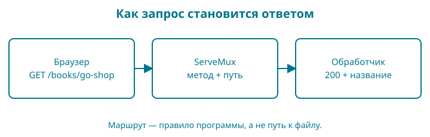

# 11. Каталог отвечает браузеру

HTTP — протокол обмена запросами и ответами между клиентом и сервером. Клиентом будет браузер, сервером — наша программа Go. Результат главы — локальный HTTP-сервер с каталогом и отдельным адресом книги. Данные пока не меняются. Мы проверяем поведение запросов автоматическими тестами, не требующими занятого порта или браузера.

Нужны пакеты главы 10, структуры, срезы, указатели и функции. Восстановите по памяти: почему `catalog` не должен импортировать `web`? Ответ понадобится при отделении правил магазина от способа показа.



## Как запустить контрольную точку

Откройте `examples/11-http`. При ручном переносе скопируйте главу 10, замените путь модуля и его начало во всех внутренних импортах на `11-http`. Сохраните пакеты `catalog` и `titlefile` вместе с тестами. Добавьте `internal/catalog/list.go`, папку `internal/web`, замените `cmd/shop/main.go`. Никакой установки веб-фреймворка не требуется.

`-check` — новый флаг нашего магазина: короткая проверка каталога с выходом вместо ожидания браузера. Он передаётся **после пути запускаемого пакета** `./cmd/shop`. Это не стандартная возможность `go run`: её обрабатывает код `cmd/shop/main.go` этой главы. Команда без флага запускает сервер.

```sh
go run ./cmd/shop -check
go test ./...
go run ./cmd/shop
```

Первая команда печатает `Книг в каталоге: 2` и завершается. Последняя печатает адрес и продолжает работать. Это ожидаемо: сервер ждёт запросов. Откройте в браузере `http://127.0.0.1:8080/`. Для остановки нажмите Ctrl+C в терминале сервера. Для других команд используйте второй терминал в той же папке либо сначала остановите сервер.

URL — адрес ресурса. В `http://127.0.0.1:8080/` часть `http` задаёт протокол, последний `/` — путь главной страницы. `127.0.0.1` — адрес этого компьютера, `8080` — порт, то есть номер точки приёма соединений. Адрес не публикует магазин в интернете. Не заменяйте его на `0.0.0.0` только ради избавления от ошибки: это меняет доступность сервиса для других машин.

## Запрос и ответ

Браузер отправляет метод и путь. Метод `GET` просит представление ресурса. Ответ содержит статус, заголовки и тело. Например, `200` означает успешную обработку, `404` — ресурс не найден, `405` — метод не подходит этому адресу.

| Запрос | Результат |
| --- | --- |
| `GET /` | Две книги, статус 200 |
| `GET /books/go-shop` | Название первой книги, статус 200 |
| `GET /books/missing` | Статус 404 |
| `GET /unexpected` | Статус 404 |
| `POST /books/go-shop` | Статус 405 |

Путь `/books/go-shop` не обязан соответствовать файлу на диске. Это адрес, который программа сопоставляет с обработчиком. Опорный образ — стойка справочной службы: вопрос направляют нужному сотруднику. Граница образа: запросы независимы, и сервер может обслуживать несколько одновременно; нельзя предполагать общий последовательный разговор.

Новые книги создаются в одном месте:

<!-- include:examples/11-http/internal/catalog/list.go -->

Метод `Publish` по-прежнему проверяет название, цену и валюту. `books[i]` позволяет изменить элемент исходного среза; переменная `book` при переборе значений была бы копией. При невалидной карточке возвращаем `false`, и сервер не стартует с частично испорченным каталогом.

## Обработчик и маршрутизатор

<!-- include:examples/11-http/internal/web/web.go -->

`http.NewServeMux()` создаёт маршрутизатор. `HandleFunc` связывает шаблон маршрута с функцией. В записи `GET /{$}` метод входит в шаблон, а `{$}` ограничивает совпадение ровно корнем. Просто `/` совпадало бы и с другими путями. В `/books/{id}` фигурные скобки обозначают переменный сегмент; `r.PathValue("id")` возвращает его значение. Это синтаксис маршрута внутри строки, а не блок Go.

У функции обработчика два параметра. Через `w http.ResponseWriter` пишем ответ. Через `r *http.Request` читаем запрос. `http.ResponseWriter` — интерфейс: он описывает доступные методы, а конкретный объект предоставляет сервер. Как с `error` в главе 9, нам достаточно пользоваться контрактом. Указатель перед `http.Request` уже знаком по структурам.

Заголовок `Content-Type` сообщает вид содержимого и кодировку. Его устанавливают до первой записи тела. `fmt.Fprintln(w, ...)` отправляет текст в ответ вместо терминала. Первая запись тела без явного `WriteHeader` выбирает статус 200. `http.NotFound` сам записывает 404 и тело; после его вызова не следует дописывать успешный ответ.

Возвращаемое `http.Handler` обещает метод `ServeHTTP`. Наш `mux` умеет его выполнять. Это позволяет одному обработчику работать и с настоящим сервером, и в тесте.

Функции маршрутов замыкают `snapshot`: используют значение из внешней функции после её завершения. Мы создаём новый срез и копируем в него карточки. Поэтому последующее изменение среза вызывающего кода не изменяет каталог обработчика. Сейчас `Book` содержит строки, числа и булево поле: копирования значений достаточно. Если позже появится поле-срез или словарь, копия структуры не станет глубокой автоматически.

Обработчики только читают снимок. Это существенное условие: библиотека может вызывать их одновременно. Добавлять общий изменяемый словарь без синхронизации нельзя. Механизм конкурентного исполнения разберём отдельно; сейчас исключаем общую запись из модели.

## Жизненный цикл процесса

<!-- include:examples/11-http/cmd/shop/main.go -->

`flag.Bool` объявляет логический флаг и возвращает указатель на его значение. Три аргумента — имя, значение по умолчанию и текст справки. `flag.Parse()` читает аргументы командной строки; после него `*check` получает выбранное значение. В `go run ./cmd/shop -check` путь пакета равен `./cmd/shop`, а всё после него передаётся магазину. `go run ./cmd/shop -h` показывает справку о флагах этой программы. Она может меняться между главами.

`time.Second` и `time.Minute` — длительности. Поля таймаутов ограничивают чтение заголовков, запроса, запись ответа и ожидание следующего запроса в соединении. Эти значения подходят маленьким учебным ответам; они ещё не являются настройкой для многогигабайтных скачиваний.

`ListenAndServe` занимает текущий вызов до ошибки или остановки. В этой главе Ctrl+C прерывает процесс. Завершение активных запросов без обрыва появится в главе о контексте и остановке. Не называем нынешнюю остановку плавной.

## Тестируем HTTP без сети

<!-- include:examples/11-http/internal/web/web_test.go -->

`httptest.NewRequest` создаёт запрос в памяти. `httptest.NewRecorder` записывает ответ. `handler.ServeHTTP` вызывает тот же код, который обслужит браузер. Вложенный литерал `[]struct{...}` описывает таблицу случаев без отдельного имени типа: поля `method`, `path`, `code` объясняют каждую строку.

Этот тест проверяет маршрутизацию, но не доказывает работоспособность порта, TLS или сетевых таймаутов. Поэтому один раз отдельно открываем страницу браузером. После изменений повторяем `go test ./...`.

## Задание и восстановление

Добавьте адрес `GET /healthz`, возвращающий `ok` и перевод строки со статусом 200. Сначала добавьте случай в таблицу и убедитесь, что тест падает с 404. Подсказка: используйте `mux.HandleFunc` до `return mux`.

Решение — обработчик с `fmt.Fprintln(w, "ok")`. После этого тест должен пройти. Это только проверка доступности процесса, а не готовности будущей базы данных. Проверьте отдельно, что `POST /healthz` получает 405.

Ошибка `address already in use` означает, что порт занят, часто вашим предыдущим запуском. Остановите его Ctrl+C. Если изменяете порт в `Addr`, измените и адрес в браузере. Если браузер показывает старый текст, убедитесь, что перезапустили сервер после редактирования Go: `go run` не следит за файлами автоматически.

Готовность: вы различаете маршрут и путь файла, объясняете статус 404 и 405, запускаете и останавливаете сервер, пишете тест запроса без открытия сетевого порта.
