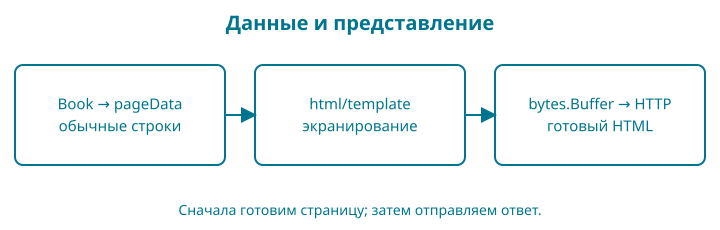

# 12. HTML-шаблон превращает каталог в страницу

В этой главе каталог получает заголовки, ссылки, цены и простой стиль. Мы сохраняем сервер и правила книги, меняем представление ответа. Внешний сборщик, JavaScript и CSS-фреймворк не нужны.

Перед началом объясните, почему заголовок ответа устанавливают раньше тела и почему обработчик возвращает 404 для неизвестной книги. Если не получается, повторите тест маршрутов из главы 11.



## Файлы и быстрый результат

Откройте `examples/12-templates`. При ручном переходе скопируйте главу 11, согласованно замените `11-http` на `12-templates` в `go.mod` и импортах. В `internal/web` замените `web.go`, добавьте `templates.go`, `template_test.go` и `footer_test.go`; прежний `web_test.go` сохраняется. Скопируйте дерево `web` из контрольной точки: `assets.go`, `templates/layouts`, `templates/pages`, `templates/partials` и `static/css/style.css`. Остальные пакеты не меняют поведения.

```sh
go test ./...
go run ./cmd/shop
```

Откройте `http://127.0.0.1:8080/`: увидите две карточки. В меню пока только eGopher: корзина появится в главе 13, регистрация — в главе 19, вход — в главе 20. Ссылки добавляем вместе с работающими маршрутами; отсутствие будущего пункта здесь не ошибка. Переход по названию открывает отдельную страницу книги. Адрес отсутствующей книги по-прежнему даёт 404. Сервер останавливается Ctrl+C.

## Минимум HTML для чтения шаблона

HTML размечает смысл документа. `<h1>` — главный заголовок страницы, `<article>` — самостоятельная карточка, `<a href="...">` — ссылка, `<p>` — абзац. Закрывающий тег начинается с `</`. Атрибуты внутри открывающего тега задают свойства элемента. HTML не является кодом Go.

`lang="ru"` помогает средствам чтения выбрать язык. `charset="utf-8"` задаёт кодировку. `viewport` позволяет странице учитывать ширину экрана. Область `<main>` отделяет основное содержимое, ссылка на `#content` позволяет перейти к нему с клавиатуры. Сначала смысл и порядок чтения, затем оформление.

## Сначала одна подстановка

Не будем одновременно разбирать файлы layout, встраивание и каталог. Откройте `labs/01-template/main.go` в контрольной точке; команда запускается рядом с `go.mod` этой главы.

<!-- include:examples/12-templates/labs/01-template/main.go -->

```sh
go run ./labs/01-template
```

<!-- include:examples/12-templates/labs/01-template/stdout.txt -->

`template.New("card")` создаёт набор с именем `card`. `Parse` разбирает текст шаблона и может вернуть ошибку; `Execute` исполняет его с конкретными данными и записывает результат в `os.Stdout`. Разбор и исполнение — два разных шага. Запись `{{.Title}}` читает поле текущего значения `Page`, переданного вторым аргументом `Execute`.

Мы передали строку `<Go>`. Результат содержит `&lt;` и `&gt;`: HTML-сущности для знаков `<` и `>`. Браузер покажет название текстом, а не новым HTML-тегом. Терминал печатает сами символы разметки: он не является браузером. **Опыт:** замените название на `Go & SQL`; ожидайте `Go &amp; SQL` между тегами. Верните исходное значение после проверки.

Ошибка неизвестного поля может проявиться при **исполнении**, когда появились конкретные данные: попробуйте `{{.Missing}}`. Ошибка незавершённого действия вроде `{{` обнаружится при **разборе**. Сохраните рабочий вариант: позже обработчик должен различать эти стадии и не отправлять половину успешного ответа.

## Затем каркас и повторяемая часть

`define` объявляет именованный шаблон, а `template` исполняет его. Имя в кавычках — ключ в наборе шаблонов, оно не обязано совпадать с именем файла. Последняя точка передаёт текущие данные вложенному шаблону.

<!-- include:examples/12-templates/labs/02-layout/main.go -->

```sh
go run ./labs/02-layout
```

<!-- include:examples/12-templates/labs/02-layout/stdout.txt -->

Сначала `ExecuteTemplate` выбирает `base`, он вызывает `content` и `footer`. Только `content` читает `Title`; подвал здесь содержит постоянную подпись. Измените `Page.Title`: изменится заголовок, каркас и подвал сохранятся. Затем уберите точку из `{{template "content" .}}` и наблюдайте потерю данных во вложенном шаблоне. Восстановите передачу точки. Так мы проверяем назначение аргумента, а не запоминаем скобки наизусть.

В магазине эти три объявления будут разделены по файлам `layouts`, `pages` и `partials`. `embed` решает доставку этих файлов вместе с программой, а CSS — их отображение в браузере. Они не меняют уже изученный принцип «данные → исполнение шаблона → HTML». Ниже добавляем их по отдельности.

## Возвращаемся к каталогу


Содержимое страницы каталога:

<!-- include:examples/12-templates/web/templates/pages/home.html -->

Двойные фигурные скобки — действия шаблона. `{{.Title}}` берёт поле `Title` текущих данных. `{{range .Books}}` проходит по книгам; внутри цикла точкой становится текущая книга. `{{else}}` показывает текст при пустом срезе. `{{end}}` завершает блок. Это отдельный язык `html/template`; слова похожи на Go, но правила принадлежат шаблонизатору.

`{{money .PriceMinor}}` вызывает зарегистрированную функцию форматирования. Цена хранится целым числом минимальных единиц; деление на 100 даёт целую часть, остаток `% 100` — дробную. Формат `%02d` дополняет дробную часть слева нулём. Из 105 получаем `1.05`. Область применения этого помощника — неотрицательные цены нашей валюты с двумя дробными знаками; это не универсальная библиотека денежных расчётов.

## Встраивание и подготовка ответа

Публичные ресурсы сразу разделим по назначению, чтобы рост магазина не превратил `static` в общий склад:

```text
web/static/
    brand/             логотип и фирменные знаки
    css/style.css      таблица стилей
    js/                сценарии браузера, когда понадобятся
    images/            общедоступные изображения
```

Сейчас используются CSS и фирменные изображения. В папках `js` и `images` лежит пустой `.gitkeep`: Git хранит файлы, а не пустые директории, поэтому этот обычный файл сохраняет структуру в репозитории и комплекте примеров. Это соглашение проекта, не специальная команда Git. JavaScript пока не нужен; пустая папка не означает, что нужно писать лишний сценарий.

`brand` содержит постоянную айдентику магазина, `images` — общедоступные иллюстрации и обложки товаров. Полные платные книги, базы, ключи и пользовательские загрузки сюда не относятся. Добавление файла на диск само по себе не открывает ему HTTP-адрес: сервер явно обслуживает `/assets/css/style.css` и перечисленные ниже фирменные изображения. Путь на диске — `web/static/css/style.css`; URL выбирает маршрутизатор. При добавлении новых типов ресурсов расширяем обработку осознанно, без выдачи списка директорий.

### Логотип и маленькая иконка решают разные задачи

В `web/static/brand/gopher-cart.png` лежит логотип: гофер с тележкой по мотивам обложки нашей книги. Это PNG с прозрачным фоном, 256 × 256 пикселей. В шапке он показывается размером 80 × 80; запас разрешения помогает на плотных экранах. Для крошечной вкладки подробная тележка не подходит: отдельная иконка показывает только узнаваемую голову гофера.

`favicon.ico` содержит два размера, 16 × 16 и 32 × 32. Их исходные PNG тоже лежат в `brand`. `apple-touch-icon.png` — квадрат 180 × 180 с белым фоном для сохранения сайта на домашнем экране совместимого устройства. Это иконка, не установка полноценного приложения; манифеста и работы без сети здесь нет. Исходные большие изображения и описание их подготовки находятся в материалах редакции, а в контрольной точке — готовые небольшие файлы.

В `web/templates/layouts/base.html` элементы `link` с `rel="icon"` и `rel="apple-touch-icon"` сообщают браузеру назначение файлов. В `web/templates/partials/header.html` обычный `img` загружает логотип. Атрибуты `width` и `height` резервируют место до загрузки. Ссылка логотипа получает доступное имя через `aria-label="{{brand_name}} — на главную"`. Поэтому у изображения оставлен пустой `alt=""`: программа чтения экрана использует имя ссылки и не повторяет его. Отдельный элемент `nav` с `aria-label="Главное меню"` объединяет текстовые ссылки меню. Функция `brand_name` возвращает короткое название `eGopher`; шапка, подвал и название вкладки используют одну функцию. При смене бренда достаточно изменить это значение в `internal/web/templates.go`.

Добавьте `internal/web/brand.go` и вызов `registerBrand(mux)` сразу после создания маршрутизатора. Функция регистрирует только три разрешённых адреса; содержимое произвольной папки через HTTP не раскрывается. `serveImage` принимает байты и тип содержимого: `image/png` для PNG и `image/vnd.microsoft.icon` для ICO. `w.Write(data)` передаёт двоичные байты без преобразования в текст. Здесь результат единственной записи игнорируется явно: при оборванном соединении повторная запись ответа не восстановит клиента.

<!-- include:examples/12-templates/internal/web/brand.go -->

Логотип и иконки встраиваются через отдельные переменные `[]byte` в пакете `assets`; после замены изображения требуется пересборка программы. Проверьте логотип в шапке и откройте `/favicon.ico` напрямую. Если вкладка показывает прежний значок, учтите кеш браузера: перезагрузите страницу или проверьте её в новом профиле. Тест `TestBrandAssetsAndClosedDirectory` сравнивает ответы с встроенными файлами и проверяет 404 для неизвестного файла и каталога.

<!-- include:examples/12-templates/internal/web/web.go -->

В верхнеуровневом пакете `web` объявлено имя `assets`, чтобы его не путать с обработчиками. Директива `//go:embed templates static` включает дерево файлов в `embed.FS`. Это встроенная файловая система только для чтения. Путь считается от файла с директивой; выйти наверх через `..` нельзя. Поэтому `assets.go` лежит рядом с папками ресурсов. Отдельная строковая переменная `Style` встраивает CSS для простого обработчика одного файла.

<!-- include:examples/12-templates/web/assets.go -->

Каркас документа хранится в layout. `{{define "base"}}` объявляет именованный шаблон, `{{template "content" .}}` исполняет другой шаблон и передаёт ему текущие данные. Partials — небольшие повторяющиеся части, например шапка и подвал. Это соглашение об устройстве файлов, поддержанное средствами стандартной библиотеки, а не сторонний движок.

<!-- include:examples/12-templates/web/templates/layouts/base.html -->

<!-- include:examples/12-templates/web/templates/partials/header.html -->

### Текущий год в общем подвале

Подвал показывает знак ©, текущий год и название магазина. `&copy;` — HTML-сущность: браузер отображает её как ©. `{{year}}` и `{{brand_name}}` вызывают функции без аргументов; точки перед именами нет. В отличие от `{{.Title}}`, они не читают поля данных страницы. Поэтому один подвал работает и с каталогом, и позднее с библиотекой и административными страницами, даже если у них разные структуры данных.

<!-- include:examples/12-templates/web/templates/partials/footer.html -->

Каждая страница определяет `title` и `content`. Для неё создаётся отдельный набор: общий layout, общие partials и ровно один файл страницы. Нельзя разобрать все страницы одним шаблоном: одинаковые имена `content` начнут заменять друг друга. `ParseFS` читает файлы из встроенного `assets.Files`; шаблон пути `*.html` выбирает partials. Имя страницы задаёт наш код при запуске, а не параметр URL. Подготовленные наборы не изменяются во время запросов.

<!-- include:examples/12-templates/internal/web/templates.go -->

`template.FuncMap` — таблица имён функций, доступных шаблону. Регистрируем `money`, `year` и `brand_name` через `Funcs` **до** `ParseFS`: иначе разбор остановится с ошибкой `function "year" not defined`. Функция `brand_name` возвращает название магазина; это значение можно изменить в одном месте для всех подвалов.

Пакет `time` входит в стандартную библиотеку. `time.Now()` читает текущее время, а метод `.Year()` возвращает год как `int`. Запись `func() int { return time.Now().Year() }` создаёт функцию без аргументов: её тело выполняется при вызове `{{year}}`, то есть при каждом формировании страницы. Мы передаём саму функцию, а не заранее вычисленный год. Поэтому работающий сервер автоматически покажет новый год после полуночи 1 января, без пересборки и перезапуска. Уже открытая вкладка обновится при следующей загрузке страницы.

Здесь используется локальная временная зона процесса сервера. На сервере с UTC год сменится по UTC; если магазину нужен календарь определённого региона, временную зону следует задать явно. Это отдельное решение, а не свойство языка шаблонов.

Проверьте: запустите магазин и найдите © с текущим годом внизу каталога и страницы книги. В `footer_test.go` один разобранный шаблон исполняется с тестовой функцией часов сначала для 2026, затем для 2027 года. Такая подмена проверяет смену значения без ожидания Нового года и без изменения системных часов. Числа в тесте — проверочные данные; в работающем магазине год берётся только из `time.Now().Year()`.


При изменении встроенного HTML или CSS перезапустите `go run ./cmd/shop`. Встраивание не делает ресурсы секретными: браузеру передаётся результат HTML и публичный CSS. Платные файлы книги здесь хранить нельзя.

Новая запись `append([]catalog.Book(nil), books...)` создаёт копию элементов среза. `[]catalog.Book(nil)` — пустой nil-срез нужного типа. Три точки после `books` передают элементы среза как отдельные аргументы `append`. Это краткая форма знакомой пары `make` и `copy`, а не «продолжение пропущенного кода». Исходный и новый срез не разделяют изменяемые элементы массива; вложенные ссылки внутри элементов, если появятся, требуют отдельного внимания.

`template.FuncMap` связывает имя `money` с нашей функцией. Функции регистрируются до `Parse`, чтобы имена были известны при разборе. `template.Must` проверяет результат разбора и аварийно останавливает запуск при ошибке встроенного шаблона. Это осознанная граница: неверный шаблон — дефект поставленной программы. Ошибки пользовательской формы позже будем возвращать как обычные ответы, без аварийной остановки.

При исполнении шаблона сначала пишем в `bytes.Buffer` — буфер в памяти. Если `Execute` вернул ошибку, можно ещё честно отправить статус 500. При немедленной записи в сеть часть успешной страницы могла бы уже уйти клиенту, и поменять статус стало бы поздно. После успешного исполнения ставим `Content-Type: text/html; charset=utf-8` и переносим буфер в ответ. Ошибку последней сетевой записи уже нельзя исправить новым статусом; наблюдаемость таких ошибок добавим позднее.

`pageData` — данные конкретного представления. Мы не передаём шаблону весь сервер или будущую запись пользователя с паролем. Это делает границы страницы понятными.

## Текст не должен становиться программой

`html/template` экранирует обычные строки с учётом места вставки. Если название содержит `<script>`, браузер должен увидеть текст, а не исполнить сценарий. Нельзя отключать защиту преобразованием пользовательского ввода в `template.HTML`. Такой тип означает доверенный HTML и снимает часть автоматических проверок.

Тестируем это и пустой каталог:

<!-- include:examples/12-templates/internal/web/template_test.go -->

`&&` в тесте — логическое И: обе проверки должны быть истинны. Вычисление слева направо прекращается при первом ложном условии. В `[][]catalog.Book` внешний срез хранит наборы книг, а внутренний — книги одного сценария. Вложенный литерал может опускать повтор уже известного типа; это сокращение, а не новая структура данных.

Защита от внедрения HTML не заменяет проверку цены, доступов или адресов. Она решает конкретную задачу представления текста. Опорный образ — подпись в рамке: символы остаются подписью, а не становятся указаниями монтажнику. Граница образа: безопасность зависит от контекста вставки, а не от общей «чистоты» строки.

## CSS и проверка удобства

Селектор выбирает элементы, свойства внутри фигурных скобок задают оформление. `max-width` ограничивает длину строки, `margin` задаёт внешние отступы, `padding` — внутренние. `:focus-visible` обозначает видимый фокус при навигации; не убирайте обводку без понятной замены. `rem` соотносится с размером шрифта корневого элемента. В CSS запись `text-align: center;` состоит из имени свойства, двоеточия, значения и точки с запятой. Это язык оформления, а не инструкция Go.

<!-- include:examples/12-templates/web/static/css/style.css -->

Селектор `footer` выбирает подвал из `web/templates/partials/footer.html`. Правило `text-align: center` в `web/static/css/style.css` выравнивает его текст по горизонтальному центру, включая оба абзаца. Блочный подвал занимает доступную ширину; длинные строки по-прежнему переносятся на узком экране. Фиксированная ширина и абсолютное позиционирование для этого не нужны.

Чтобы подвал не поднимался к середине короткой страницы, задаём корневому `html` высоту `100%`, а `body` — `min-height: 100%`, `display: flex` и `flex-direction: column`. Следующая декларация `min-height: 100dvh` использует высоту динамической области просмотра в поддерживающих её браузерах; процентная запись остаётся запасным вариантом. `min-height`, в отличие от жёсткого ограничения высоты, позволяет странице расти вместе с содержимым.

У `footer` свойство `margin-top: auto` забирает свободное место над подвалом. На короткой странице это опускает его к нижнему краю с учётом внутренних отступов `body`; на длинной свободного места нет, и подвал идёт после содержимого. `flex-shrink: 0` не даёт сжимать подвал. Для `main` запись `flex: 0 0 auto` сохраняет естественную высоту содержимого. Здесь не требуется `position: fixed`: закреплённый поверх страницы подвал мог бы закрыть кнопки и текст.

В шапке логотип и `nav` — два элемента горизонтальной flex-раскладки. `header` не переносит эти два блока (`flex-wrap: nowrap`), а ссылки внутри `nav` могут переноситься. `margin-inline-start: auto` отдаёт свободное место перед меню, `justify-content: flex-end` выравнивает его ссылки к правому краю. `flex: 1 1 0` позволяет меню занять оставшуюся ширину, а `min-width: 0` — сжаться на смартфоне. На широком экране логотип остаётся слева, меню справа. В медиазапросе `@media (max-width: 39.999rem)` меняем направление шапки на `column`: логотип располагается по центру, меню под ним. Для меню сбрасываем автоматический боковой отступ, задаём `width: 100%` и `justify-content: center`. Короткая ссылка `eGopher` помогает трём пунктам помещаться в одну строку даже при ширине 320 пикселей. Перенос остаётся разрешённым для увеличенного текста или более длинного перевода: доступность ссылок важнее принудительного удержания одной строки.

Проверяйте три случая: короткую карточку книги, длинный каталог и смартфон в двух ориентациях. Подвал должен оставаться ниже содержимого, логотип — полностью видимым, а ссылки — доступными без горизонтальной прокрутки. Поведение экранной клавиатуры дополнительно проверяется на реальном устройстве: уменьшение окна настольного браузера его не воспроизводит.


Проверьте страницу без мыши: Tab должен последовательно переводить фокус по ссылкам, Enter — открывать выбранную. Увеличьте масштаб браузера до 200%, сузьте окно. Текст и цены должны оставаться читаемыми. Эта небольшая проверка не равна полному аудиту доступности, но выявляет дефекты раньше.

## Самостоятельно: пустое состояние

Предскажите, что отобразится при `New(nil)`. Затем найдите проверку в `template_test.go`. Измените сообщение на «Новые книги скоро появятся» и сначала исправьте ожидаемый текст теста. Проверьте, что тест падает до изменения шаблона и проходит после него.

Подсказка: нужен блок `else` у `range`, а не дополнительная проверка длины в Go. Решение: заменить только текст этого блока и соответствующее ожидание теста. Восстановите исходный вариант перед следующей контрольной точкой.

Если компилятор сообщает `no matching files found`, проверьте дерево ресурсов рядом с `web/assets.go`. Если `ParseFS` не находит страницу, проверьте её имя в `web/templates/pages`. Если сервер завершился с ошибкой разбора шаблона, проверьте пары `range`/`end` и имена функций. Если пропал стиль, откройте `/assets/css/style.css`: должен прийти CSS, а не HTML с 404.

Готовность: вы различаете Go, HTML, CSS и действия шаблона, объясняете автоматическое экранирование и буфер, проверяете пустой каталог и умеете пройти страницу клавиатурой.


## Адаптивность: ширина содержимого, а не название устройства

Страница должна перестраиваться при изменении доступной ширины: смартфон поворачивается, планшет открывает два приложения рядом, пользователь ноутбука увеличивает масштаб. Не определяем устройство по имени браузера и не запрещаем масштабирование. В layout уже задан `width=device-width, initial-scale=1` без `maximum-scale`.

Начинаем с одной колонки. `box-sizing: border-box` включает рамку и внутренние отступы в заданную ширину. Поля занимают `width: 100%`, но не выходят за родителя; `min-width: 0` разрешает им сжиматься. `overflow-wrap: anywhere` переносит даже длинный ID, почту или SHA-256. Не скрываем ошибку через `overflow-x: hidden`: иначе часть содержимого просто исчезнет.

`display: grid` у формы располагает поля по порядку, `gap` создаёт промежутки без набора отдельных отступов. Навигация использует `display: flex` и `flex-wrap: wrap`: ссылки переходят на следующую строку. `clamp` ограничивает размер заголовка снизу и сверху, а среднее значение зависит от ширины окна (`vw`). Кнопки и поля имеют высоту не меньше 2.75rem; это выбранный для проекта удобный размер касания, а не доказательство полной доступности интерфейса.

Селектор `:not` исключает checkbox и скрытые поля из правила текстовых полей. `:has(input[type="checkbox"])` выбирает подпись, содержащую checkbox: вся подпись становится удобной областью нажатия. Без этой дополнительной раскладки обычный label всё равно остаётся связан с вложенным полем. `@media (min-width: 40rem)` расширяет отступы и ограничивает длину формы, когда места достаточно. Отдельного запрета или особой страницы для горизонтальной ориентации не требуется.

Сейчас проверьте каталог, карточку книги и длинное название; после глав 13 и 20 добавьте ошибку формы и вход при размерах 320×568, 390×844, 844×390, 768×1024, 1024×768 и 1366×768. На ноутбуке повторите проверку при масштабе 200%. Не должно быть горизонтальной прокрутки всей страницы, обрезанных полей и перекрывающихся кнопок. Вертикальная прокрутка длинной формы нормальна, в том числе при открытой экранной клавиатуре. В дальнейшем те же правила проверяем для кабинета и административных страниц.

Размер окна эмулятора не воспроизводит полностью Safari на iPhone или экранную клавиатуру Android. Перед коммерческим выпуском дополните автоматическую проверку реальными устройствами. Разбор подхода: https://developer.mozilla.org/en-US/docs/Learn_web_development/Core/CSS_layout/Responsive_Design.

Подвал итоговых примеров содержит динамический год, название и «Учебный интернет-магазин». В главах об оплате используется sandbox: настоящие деньги не списываются. Подробности режима относятся к объяснению платёжного сценария и его странице, а не к общему подвалу.

## Активный раздел меню

Верхнее меню показывает, в каком разделе находится читатель. Функция шаблона `nav_active` принимает ключ раздела и сравнивает его с `active`, выбранным при подготовке шаблона. Каталог и карточка книги относятся к `catalog`; корзина, заказ и учебная оплата — к `cart`; вход, регистрация, библиотека и управление — к `account`. Более поздние страницы появятся в соответствующих главах.

В шапке условие `{{if nav_active "catalog"}}` добавляет `aria-current="true"` только активной ссылке. Значение `true` обозначает текущий пункт набора: здесь это раздел, а не обязательно точное совпадение URL с адресом ссылки. Например, карточка книги сохраняет выделение каталога. Программа чтения экрана получает то же указание, которое зрячий пользователь видит по цвету.

Селектор `header nav a[aria-current="true"]` выбирает активную ссылку. Общий бирюзовый фон `#006078` и белый текст `#fff` выделяют её без зависимости от наведения мыши. Отступы заданы у всех пунктов заранее, поэтому при смене активного пункта ширина меню не скачет. `text-decoration: none` убирает подчёркивание только у верхнего меню; обычные ссылки в содержимом остаются подчёркнутыми. Правило `:focus-visible` сохраняет рамку при переходе клавишей Tab.

`active` хранится в замыкании конкретного, заранее подготовленного шаблона. Не меняйте общую переменную «текущая страница» перед каждым запросом: одновременные посетители могли бы увидеть чужую подсветку. В следующей главе каталог и корзина используют один файл home.html, но получают два независимых подготовленных шаблона. Это разделяет данные запроса и неизменяемые настройки отображения.

`border-radius: 0.5rem` задаёт одинаковое небольшое скругление кнопок, полей ввода и активного пункта меню. При стандартном корневом размере шрифта 16 пикселей это 8 пикселей. Скругление меняет форму границы, а размеры полей и область нажатия сохраняются.

Подвал использует тот же бирюзовый фон `#006078` и белый текст `#fff`, что кнопки и активный пункт меню. Внутренний отступ `padding: 1rem` отделяет текст от края цветного блока; скругление `0.5rem` согласовано с элементами управления. Цвет и оформление не заменяют `margin-top: auto`: именно flex-раскладка сохраняет положение подвала на коротких страницах.

Цвета хранятся в CSS-переменных: `--color-primary` и `--color-on-primary` объявлены в `:root`, который выбирает корневой элемент документа. Имя пользовательского свойства начинается с двух дефисов. Запись `background: var(--color-primary)` подставляет значение переменной; `color: var(--color-on-primary)` задаёт цвет текста на этом фоне. Кнопки, активный пункт меню и подвал используют одну пару переменных. Чтобы сменить цветовую тему, измените два значения в начале style.css, затем пересоберите приложение со встроенным CSS.

## Продолжение: от каталога к работающему магазину

Вы прошли ознакомительный фрагмент: создали модель книги, разделили программу на пакеты, запустили HTTP-сервер и вывели каталог через шаблоны. Проверьте себя: можете ли вы добавить поле карточки, объяснить путь запроса до шаблона и самостоятельно найти причину ошибки?

В полной книге главы 13–42 продолжают этот же проект: формы и хранение данных, регистрация и сессии, корзина и заказы, тестовая оплата и выдача файлов, административная часть, резервные копии и выпуск приложения. Вместе с книгой предоставляются контрольные точки продолжения.

[Посмотреть полную книгу, доступные форматы и условия покупки на shanraq.org](https://shanraq.org/shop/go-book).
