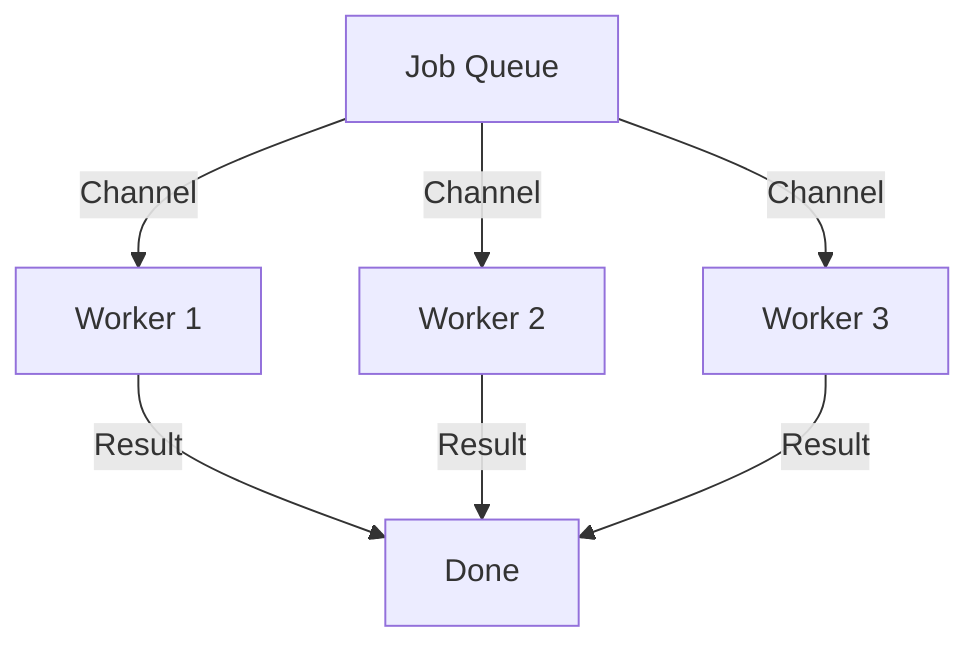

# Chapter 19: Concurrency

> **"Concurrency is not Parallelism."** - Rob Pike

Up until now, your code did one thing at a time. It was a single worker.
But real shops start doing many things at once. One clerk checks credentials, another fetches the product, a third calculates shipping.

In Go, we don't have "Threads" (which are heavy, like 2MB each). We have **Goroutines** (which are light, like 2KB each). You can launch millions of them.

## 19.1 The Worker (Goroutine)
To start a task in the background, just put `go` in front of it.

```go
func main() {
    go sendEmail("Welcome!") // Leaves immediately!
    fmt.Println("Done")
}
```

This spawns a new "Elf" to do the work. The `main` function doesn't wait for him. It finishes and exits.
**Warning**: If `main` dies, all Elves die instantly, even if they aren't finished.

## 19.2 The Conveyor Belt (Channels)
If Elves work silently, how do they talk? They use **Channels**.
Think of a Channel as a pipe. One Elf puts data in one end, another takes it out the other.

```go
ch := make(chan string)
go func() {
    ch <- "Job Done!" // Send
}()
msg := <-ch // Receive (Waits until data arrives)
```

## 19.3 The Worker Pool
Imagine you have 1,000 images to process. If you launch 1,000 goroutines, you might crash the server.
Instead, you hire a fixed team (e.g., 3 Workers) and give them a shared pile of work.



## 19.4 The Toilet Lock (Mutex)
Sometimes, two workers need to use the same resource (like a map or a counter). If they touch it at the same time, data gets corrupted (Race Condition).
We need a lock. In Go, it's `sync.Mutex`.

Think of it like a **Toilet Door**.
1. **Lock()**: You enter and lock the door. Everyone else waits outside.
2. **Unlock()**: You leave. The next person can enter.

```go
mu.Lock()
count++ // Safe zone
mu.Unlock()
```

::: details 🎓 Knowledge Check: What is a Race Condition?
**Answer**: A bug where two threads/goroutines try to write to the same memory at the same time. The result is unpredictable garbage. Fixing it requires synchronization (Mutex or Channels).
:::
