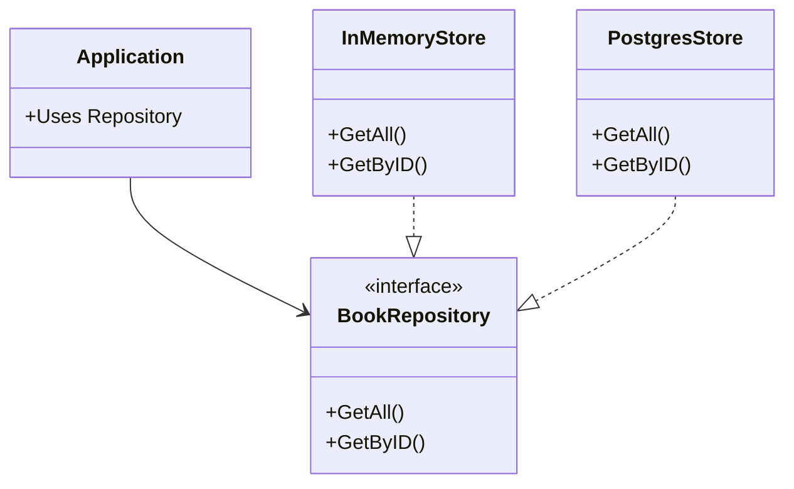

# Database Abstraction & Repository Pattern

## The Power of Interfaces

> [!TIP]
> ⚓ **Visual Anchor:** The Universal Plug

Think of the `BookRepository` interface as a wall socket.
- Your Application is the lamp.
- The Electricity Source can be **Memory**, **PostgreSQL**, or **File System**.

The lamp doesn't care where the electricity comes from, as long as it fits the socket.

## Configuration

The application now reads from Environment Variables to connect to the database.
Check `.env.example` and ensure your `docker-compose.yml` is running.
