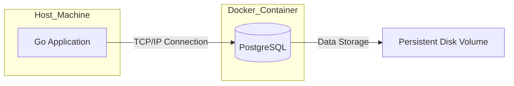

# Infrastructure & Persistence

## Architecture: The Move to Persistence

> [!TIP]
> ⚓ **Visual Anchor:** Application vs. Database

Up until now, our data lived in the **Application Memory**. If the app restarted, the data vanished. Use a **Database** to persist data forever.



## Why a Real Database? (Pedagogy)

For a "Middle" level engineer, understanding databases is non-negotiable.

1.  **Persistence**: RAM is volatile; Disk is permanent. We need to store user data safely.
2.  **Concurrency**: PostgreSQL handles multiple users reading/writing at the same time safely (ACID properties). A simple map/slice in Go needs careful Mutex locking to avoid race conditions.
3.  **Scalability**: The database engine is optimized to search millions of records efficiently (Indexing). Scanning a Go slice is O(N) and slow for large data.

## Running the Database

We use **Docker Compose** to spin up PostgreSQL without installing it on your host machine.

```bash
docker-compose up -d
```

Check the `.env.example` file for connection details.
