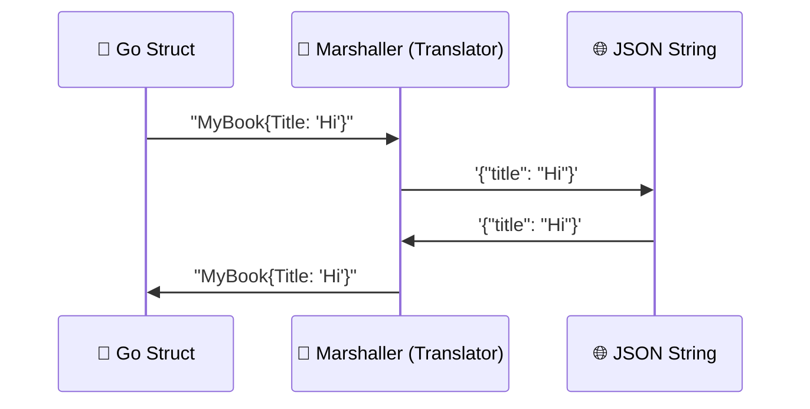

# Chapter 11: JSON (The Universal Language)

**Goal**: Learn how to trade data with the outside world.
**Concept**: Your Go program sends structs. The Browser wants JSON (JavaScript Object Notation). We need a translator.

## 1. The Sticker (Struct Tags)
A struct groups named fields. Here `type Book struct { ... }` defines the type, `Book{...}` creates a value, and `book.Title` selects a field. Exported fields start with uppercase letters. See Middle chapter 3 for methods and copying. But how does Go know that `BookTitle` in Go code should be `title` in JSON?
**Tags**. Think of them as sticky notes attached to the fields for the translator to read.

```go
type Book struct {
    Title  string  `json:"title"`       // lowercase "title" in JSON
    PriceMinor int64 `json:"price_minor"`
    Currency string `json:"currency"`
    Hidden string  `json:"-"`           // Ignore this field!
}
```

## 2. Marshaling (Packing)
**Marshal** = Converting Go Struct -> JSON String.
(Ideally, a byte slice, but think of it as text).

```go
myBook := Book{Title: "Go Guide", PriceMinor: 1999, Currency: "USD"}
jsonData, err := json.Marshal(myBook)
if err != nil {
    log.Fatal(err)
}
fmt.Println(string(jsonData))
// Output: {"title":"Go Guide","price_minor":1999,"currency":"USD"}
```

## 3. Unmarshaling (Unpacking)
**Unmarshal** = JSON String -> Go Struct.

```go
jsonStr := `{"title":"Go Guide","price_minor":1999,"currency":"USD"}`
var newBook Book
if err := json.Unmarshal([]byte(jsonStr), &newBook); err != nil {
    log.Fatal(err) // CLI example; HTTP handlers should return an error response.
}
```

## 4. Visual Signal: The Translator 🗣️
**Concept**: Serialization/Deserialization.
**Signal**: A Universal Translator. The Go Gopher speaks "Struct", the Browser speaks "JSON". The Translator converts between them.



## Why do we care?
When you build your API in the next level, JSON endpoints may involve these operations (HTML pages, downloads, and requests without a body use different paths):
1.  Unmarshaling user Input (JSON -> Struct).
2.  Marshaling your Response (Struct -> JSON).
