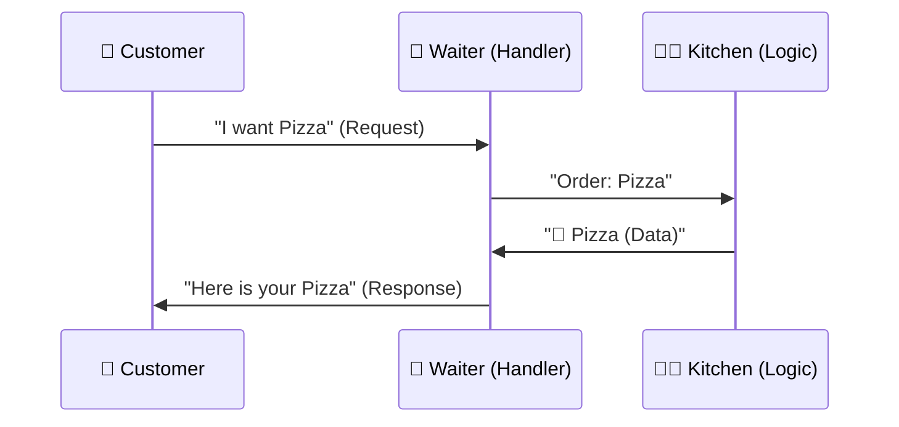

# Chapter 13: The Basic Server

**Goal**: Make the computer listen and talk back.
**Concept**: `net/http` is the standard library for web servers.

<<< @/../lessons/01-server/main.go

::: details 🎓 Knowledge Check: What does `http.ListenAndServe` do?
**Answer**: It starts the server and keeps it running (listening) in a loop. Without it, your program would exit immediately!
:::

## 4 The Visual Signal (The Waiter)
**Concept**: Request/Response Cycle.
**Signal**: A Restaurant Waiter.
1. **Request**: Customer orders food.
2. **Handler**: Waiter takes order to kitchen.
3. **Response**: Waiter brings food back.

