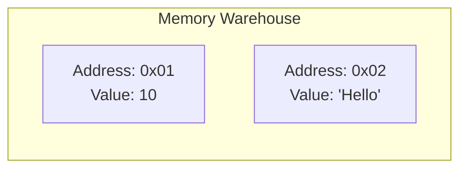

# Chapter 04: Variables & Data

Computers are not magic. They are machines that manipulate data in **Memory**.
To be a professional engineer, you must understand what happens inside the machine.

## 4.1 The Memory Cell (The Box)
Imagine your computer's RAM (Random Access Memory) as a giant warehouse filled with millions of small numbered boxes.



Each box has:
1.  **An Address**: A unique number (e.g., `0x001`).
2.  **A Value**: What is inside (e.g., `10`).

When you create a **Variable**, you are claiming one of these boxes and giving it a human name.

```go
var age int = 25
```

## 4.2 Declaration Styles (Why two ways?)
In Go, you will see two ways to create variables.

### A. The Formal Way (Explicit)
```go
var username string = "Gopher"
```
Use this when:
- You want to be very clear about the type.
- You want to declare it now but fill it later.

### B. The Short Way (Inference)
```go
username := "Gopher"
```
- **`:=`**: The "Walrus Operator".
- It means: *"Create the box, look at the value on the right ("Gopher"), guess the type (String), and put it in."*
- **Constraint**: You can ONLY use this *inside* functions.

> [!TIP]
> **🛡️ Interview Defense: "The Legend"**
>
> **Interviewer:** "When do you use `:=` vs `var`?"
>
> **You:** "I prioritize **readability** and **scope control**:
> *   I use `:=` (short declaration) for local variables where the type is obvious or inferred, to keep code concise.
> *   I use `var` when I need to declare a variable without initializing it immediately (zero value), or when specifically initializing package-level variables where `:=` is not allowed."

## 4.3 The Zero Value (No "Nulls")
In many languages (Java, Python), if you create a variable but don't give it a value, it becomes `null` or `None`. This causes equivalent of "The Box is Missing", leading to crashes.

**Go is safer.** In Go, variables **always** have a value. If you don't provide one, Go gives it a "Zero Value".

| Type | Zero Value | Meaning |
| :--- | :--- | :--- |
| `int` | `0` | Empty Count |
| `float64` | `0.0` | Empty Account |
| `bool` | `false` | Default Off |
| `string` | `""` | Blank Paper |
| `pointer` | `nil` | No Address |

```go
var count int
fmt.Println(count) // Output: 0
```
*The box is not missing. The box is just empty (contains 0).*

## 4.4 Basic Types (The Shop Objects)
Let's map Go types to real-world objects in our Gopher Shop.

| Go Type | Shop Concept | Example |
| :--- | :--- | :--- |
| `int` | **Inventory Count** | `var stock int = 50` |
| `float64` | **Price** | `var price float64 = 19.99` |
| `string` | **Book Title** | `var title string = "Go Guide"` |
| `bool` | **Is On Sale?** | `var onSale bool = true` |


## 4.5 Constants (The Stone Tablets)
Variables can change (`age = 25`, then `age = 26`).
**Constants** cannot.

```go
const Pi = 3.14159
```
*Metaphor*: Carved in stone. You cannot overwrite it.

## 4.6 Basic Math (The Calculator)
Computer = Compute.

- `+` (Add): `10 + 5` -> `15`
- `-` (Sub): `10 - 5` -> `5`
- `*` (Mul): `10 * 5` -> `50`
- `/` (Div): `10 / 2` -> `5`
    - *Note*: `10 / 3` (Integers) -> `3` (Cuts off decimal).
- `%` (Mod): `10 % 3` -> `1` (The Remainder).

---
**Visual Anchor**:
> A Variable is a **Labeled Box** at a specific **Address** in the memory warehouse.

::: details 🎓 Knowledge Check
1.  **What is the difference between `var` and `:=`?**
    `var` can be used anywhere. `:=` (short declaration) can ONLY be used inside functions.
2.  **What is the zero value of an `int`?**
    `0`.
3.  **Can you change the type of a variable?**
    No. Go is statically typed. An `int` is always an `int`.
:::
