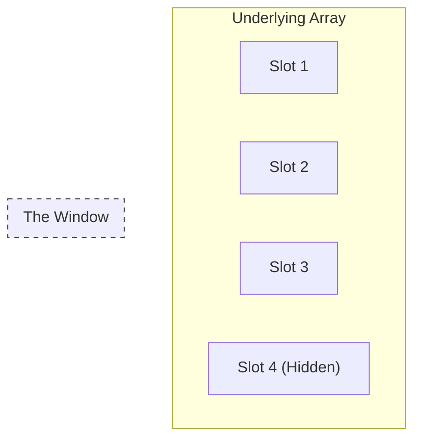

# Chapter 07: Arrays & Slices

> **"Data without structure is just sand."**

In the previous chapter (Loops), we learned how to process items one by one. But where do we store these items?
We need containers. In Go, there are two types: the **Rigid Box (Array)** and the **Magic Bag (Slice)**.

## 7.1 The Egg Carton (Array)
An **Array** is a fixed-size container.
- **Rule**: When you buy an egg carton for 12 eggs, it always has 12 slots. You cannot magically stretch it to hold 13.
- **Syntax**: `[3]int` (An array of exactly 3 integers).

```go
var carton [3]string
carton[0] = "Egg 1"
carton[1] = "Egg 2"
carton[2] = "Egg 3"
// carton[3] = "Egg 4" // ERROR! Out of bounds.
```

## 7.2 The Magic Bag (Slice)
A **Slice** is a window into an underlying array. It can grow and shrink.



- **Rule**: If you need more space, Go automatically buys a bigger bag and moves your stuff there.
- **Syntax**: `[]int` (Note: No number inside `[]`).

```go
var backpack []string
backpack = append(backpack, "Flashlight")
backpack = append(backpack, "Water")
```

### Anatomy of a Slice
A slice is actually a small structure with 3 fields:
1.  **Pointer**: Where the data starts in memory.
2.  **Length (`len`)**: How many items are in the bag right now.
3.  **Capacity (`cap`)**: How big the current underlying array is (before we need to buy a bigger one).

## 7.3 Common Operations

### Creating
```go
// Empty slice
var list []int

// Slice with initial values
numbers := []int{1, 2, 3}

// Slice with specific size (make)
// "Give me a slice of size 5"
fiveZeros := make([]int, 5) 
```

### Accessing
```go
fmt.Println(numbers[0]) // First item
fmt.Println(numbers[len(numbers)-1]) // Last item
```

### Slicing a Slice (Inception)
You can take a piece of a slice using the `[start:end]` syntax.
```go
// Index: 0  1  2  3  4
nums := []int{10, 20, 30, 40, 50}

// Take items from index 1 up to (but not including) 3
subset := nums[1:3] // Result: {20, 30}
```

## 7.4 Practice: The Book List
In our shop, we need to store a list of books. Since we don't know how many books we'll have, we use a **Slice**.

<<< @/../lessons/03-data/main.go

::: details 🎓 Knowledge Check: What is the difference between a Struct and a Slice?
**Answer**:
*   **Struct (The Box)**: defined shape, mixed types (Name: string, Price: int).
*   **Slice (The Shelf)**: growable list, same type (List of Books).
:::
