# Visual Signals Reference 🚦

This page uses the **Shatalov Method** of "Visual Signals" to explain complex Go concepts. Memorize these images, not the text.

## 1. The Interface (The Power Socket)
**Concept**: Decoupling implementation from usage.
**Signal**: A Universal Power Socket. The Lamp doesn't care if the power comes from a wall, a battery, or a generator, as long as the plug fits.

```mermaid
graph LR
    subgraph Client [The User]
        Lamp["🔌 Lamp (Needs Power)"]
    end

    subgraph Interface [The Interface]
        Socket(("Socket (Method: GivePower)"))
    end

    subgraph Implementations [Concrete Types]
        Wall["Wall Outlet"]
        Battery["Battery Pack"]
        Generator["Diesel Generator"]
    end

    Lamp --> Socket
    Wall -.-> Socket
    Battery -.-> Socket
    Generator -.-> Socket

    style Socket fill:#f9f,stroke:#333
    style Lamp fill:#ff9,stroke:#333
```

---

## 2. Channels (The Conveyor Belt)
**Concept**: Safe communication between concurrent Goroutines.
**Signal**: A Factory Conveyor Belt. Workers (Goroutines) put items on, other workers take them off. No one fights over the item; the belt manages the handoff.

```mermaid
sequenceDiagram
    participant G1 as 👷 Goroutine 1 (Producer)
    participant Ch as 📦 Channel (Conveyor)
    participant G2 as 👷 Goroutine 2 (Consumer)

    G1->>Ch: Arrow ("Make Item")
    Note over Ch: Item travels safely...
    Ch->>G2: Arrow ("Take Item")
    G2->>G2: Process Item
```

---

## 3. Structs vs Pointers (The Blueprint vs The House)
**Concept**: Value types vs Reference types.
**Signal**: A Photocopy vs The Shared Document.

```mermaid
graph TD
    subgraph Value_Type ["Struct (Value)"]
        Original["📄 Document A"]
        Copy["📄 Document B (Copy)"]
        Original -- "Copying" --> Copy
        Note["If I edit Copy, Original is UNCHANGED"]
    end

    subgraph Pointer_Type ["Pointer (*Struct)"]
        Shared["📄 shared_doc.txt"]
        Ref1["Ptr 1"]
        Ref2["Ptr 2"]
        Ref1 -- "Points to" --> Shared
        Ref2 -- "Points to" --> Shared
        Note2["If Ptr 1 edits Doc, Ptr 2 SEES IT"]
    end
```

---

## 4. The Quality Gate (Validation)
**Concept**: Fail early, fail fast.
**Signal**: Airport Security. You don't get on the plane (Database) if you have a knife (Invalid Data).

```mermaid
flowchart LR
    Input[User Input] --> Gate{👮 Security Gate}
    
    Gate -- "Invalid (No Name)" --> Reject[❌ 400 Bad Request]
    Gate -- "Invalid (Price < 0)" --> Reject
    
    Gate -- "Valid" --> Logic[🧠 Business Logic]
    Logic --> DB[(🗄️ Database)]
    
    style Gate fill:#ffcccc,stroke:#r00
    style DB fill:#ccffcc,stroke:#0f0
```

