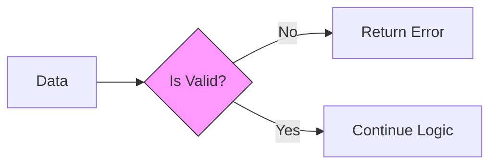

# Chapter 21: Validation

## 21.1 Errors as Values
In Java or Python, if validation fails, you **Throw an Exception**. The program explodes, and you hope someone catches the debris.
In Go, an error is just a value, like an integer or a string. We pass it back politely.

### Comparison: Error Handling
**Python (Exception)**:
```python
def check(price):
    if price < 0:
        raise ValueError("Invalid Price") # KABOOM!
```

**Go (Values)**:
```go
func check(price int) error {
    if price < 0 {
        return errors.New("Invalid Price") # Polite Return
    }
    return nil # No error
}
```

## 21.2 Guard Clauses (The "Quality Gate" Pattern)
We handle errors immediately at the top of the function.

```go
if title == "" {
    return errors.New("missing title")
}
// ... Continue ..
```

### Anatomy of `errors.New`
1.  **`errors`**: Standard library package.
2.  **`New`**: Constructor function.
3.  **Returns**: An interface called `error`. (It's basically just an object with an `Error() string` method).

## 21.3 Why "No Exceptions"?
Go believes exceptions hide control flow. By forcing you to check `if err != nil`, your code becomes:
- **Explicit**: You see exactly where things can go wrong.
- **Reliable**: You handle the error right there, instead of bubbling it up 10 layers.



::: details 🎓 Knowledge Check: Why doesn't Go use "Exceptions" (try/catch)?
**Answer**: Go prefers **Errors as Values**. Exceptions hide control flow (you don't know where they might explode). Returning an error forces you to handle it explicitly (`if err != nil`), making code safer and more readable.
:::

