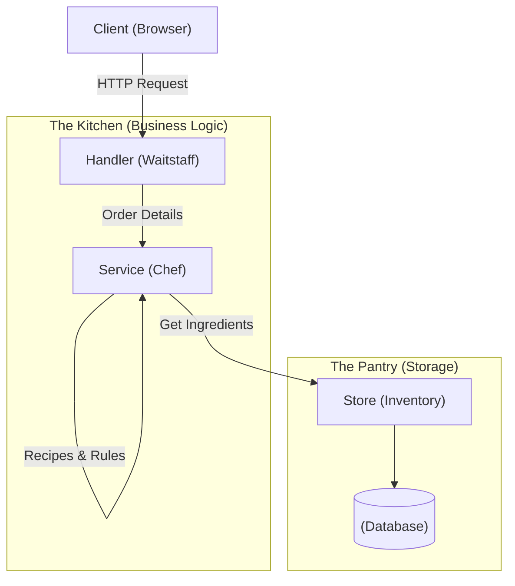

# Chapter 01: Architecture

**Goal**: Serve HTML (The Storefront) instead of plain text.
**Concept**: `html/template` allows us to inject data into HTML.

<<< @/../lessons/02-structure/main.go

::: details 🎓 Knowledge Check: Why do we use `html/template` instead of just writing HTML in strings?
**Answer**: Templates allow us to enforce structure and inject dynamic data safely. Writing HTML in strings is error-prone and hard to maintain ("Spaghetti Code").
:::

## 2 The 3-Layer Cake (Architecture)
As our shop grows, we need to organize our code like a professional bakery.

1.  **Handler (Transport)**: Takes the order (HTTP), parses it, and gives it to the Chef.
2.  **Service (Business Logic)**: The "Chef". Decides *how* to cook. Checks rules ("Do we have enough logic?").
3.  **Store (Repository)**: The "Pantry". Just retrieves raw data. It doesn't ask questions.

