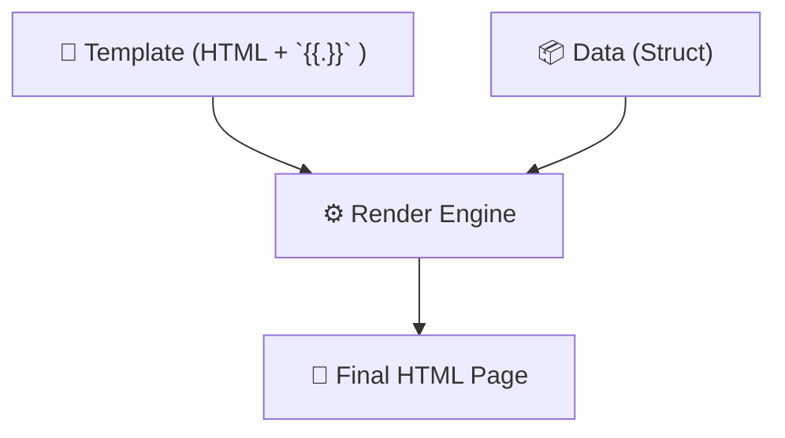

# Chapter 02: Templating

> **"Don't build a new house for every guest. Just change the furniture."**

In the "Basic Server" chapter, we served simple HTML. But what if we want to show 100 books? We can't write 100 HTML files.
We need **Templates**.

## 1 The Mechanic: `html/template`
Go has a powerful standard library for this. It takes a skeleton (Template) and data (Go Struct), and merges them.

```go
// Skeleton
<h1>Hello, {​{.Name}}!</h1>

// Data
User{Name: "Alice"}

// Result
<h1>Hello, Alice!</h1>
```

## 2 Structure: The Layout Pattern
Professional apps don't copy-paste the `<head>` and `<footer>` into every file.
We use the **Layout Pattern** (The Sandwich).

1.  **Layout (`base.html`)**: The Bread. Contains `<html>`, `<body>`, generic CSS. It defines a "hole" for the content.
2.  **Page (`home.html`)**: The Meat. Contains only the unique content for that page.
3.  **Partial (`footer.html`)**: The Pickle. Small reusable bits.

### The Code
**Layout (The Bread)**:
```go
{​{define "base"}}
<html>
  <body>
    {​{template "content" .}}  <!-- The Hole -->
  </body>
</html>
{​{end}}
```

**Page (The Meat)**:
```go
{​{define "content"}}
  <h1>Welcome!</h1>
{​{end}}
```

## 3 The Dot (`.`)
You will see `.` everywhere.
`{​{template "footer" .}}`

**What is it?**
The Dot is the **Data** you passed to the template.
- If you pass a `User` struct, `.` is the User.
- If you pass `{​{.Name}}`, you are saying "Look inside the Data (Dot) and find Name".

When you include a partial: `{​{template "footer" .}}`, you are passing the **same data** down to the footer. If you wrote `{​{template "footer"}}` (no dot), the footer would receive **nothing** and crash if it tried to print the Year.

## 4 Practice: Refactoring
We have refactored our `cmd/web-demo` to use this structure.
- `layouts/base.html`
- `pages/home.html`
- `parts/header.html`

Go ahead and explore the `templates/` folder!

::: details 🎓 Knowledge Check: Why do we pass the Dot `.` to partials?
**Answer**: To give the partial access to the data (like `.Year` or `.User`). Without the dot, the partial receives `nil` data.
:::

## 5 The Visual Signal (The Mad Libs)
**Concept**: HTML Templates.
**Signal**: A "Mad Libs" game or a Form Letter. The structure is fixed (Dear ____,), we just fill in the blanks.


