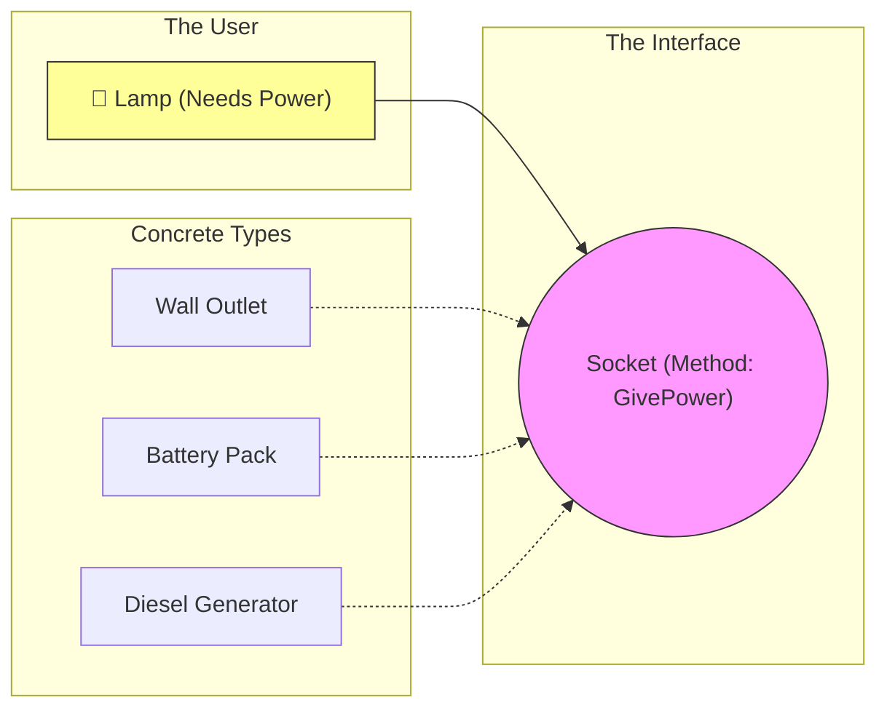

# Chapter 04: Interfaces

## 1 The Implicit Contract (Duck Typing)
In strict languages (Java, C++), you must **explicitly** sign the contract.
`class MyStore implements BookRepository`.

In Go, the contract is **implicit**. This is called "Duck Typing".
> *"If it walks like a duck and quacks like a duck, it is a duck."*

If your struct has the methods `GetAll()` and `GetByID()`, Go automatically considers it a `BookRepository`.

### Anatomy of an Interface
```go
type BookRepository interface {
    GetAll() ([]Book, error)
    GetByID(id string) (Book, error)
}
```
1.  **`type`**: New Type Definition.
2.  **`BookRepository`**: The name (Contract Name).
3.  **`interface`**: The Kind. It contains only Method Signatures, no code.
4.  **`GetByID`**: Method Name.
5.  **`(id string)`**: Usage requirements (Input).
6.  **`(Book, error)`**: Expected result (Output).

### Where to Define Interfaces?
Beginners often define the interface in the **Implementation** package (e.g., inside `store/`).
**Idiomatic Go**: Define the interface where it is **USED** (e.g., in `main.go` or `api/`), not where it is implemented.
-   **Java**: Producer defines the interface.
-   **Go**: Consumer defines the interface.
*(Note: In this project, we keep it in `store/` for simplicity, but strictly speaking, `main` should define what it needs).*

> [!TIP]
> **🛡️ Interview Defense: "The Legend"**
>
> **Interviewer:** "Why did you use an interface for `BookRepository`?"
>
> **You:** "I used an interface to **decouple** the business logic from the specific database implementation. This allows me to:
> 1.  **Swap Infrastructure:** Switch from InMemory to PostgreSQL without rewriting the application logic.
> 2.  **Testability:** Easily mock the database in unit tests to verify logic without a running DB connection.
> 3.  **Flexibility:** Adhere to the Open/Closed Principle—open for extension (new stores), closed for modification (existing logic)."

## 2 Dependency Injection (DI)
Big phrase, simple concept.
**Don't build your tools inside your house. Buy them and bring them in.**

**Bad (Tight Coupling)**:
```go
func NewHandler() *Handler {
    repo := PostgresStore{} // Hardcoded! Can't switch to Memory.
    return &Handler{repo: repo}
}
```

**Good (Dependency Injection)**:
```go
func NewHandler(repo BookRepository) *Handler {
    return &Handler{repo: repo} // Flexible! Accepts any repo.
}
```
Now `main.go` decides which tool to use.

::: details 🎓 Knowledge Check: Why do we use Interfaces for Dependency Injection?
**Answer**: To decouple our code. If `Handler` depends on an `Interface`, we can swap the real database for a "Fake Database" (Mock) during testing, or switch from Postgres to MySQL without rewriting the Handler.
:::

## 3 The Visual Signal (The Power Socket)
**Concept**: Decoupling implementation from usage.
**Signal**: A Universal Power Socket. The Lamp doesn't care if the power comes from a wall, a battery, or a generator, as long as the plug fits.



