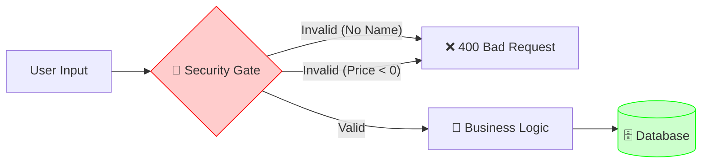
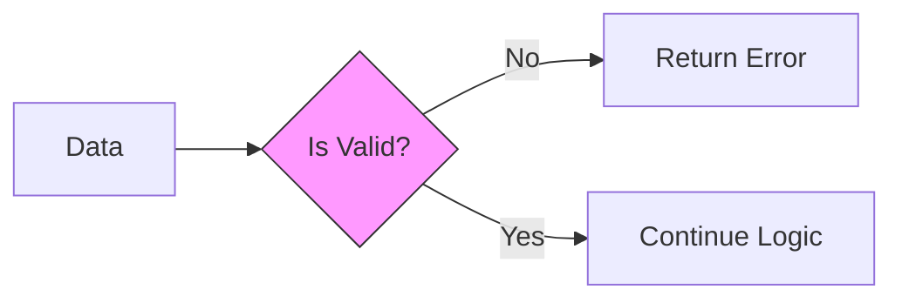

# Chapter 07: Validation

## 1 Errors as Values
Java and Python often report validation failures with exceptions that callers can handle. Go commonly returns an error value.
In Go, an error is just a value, like an integer or a string. We pass it back politely.

### Comparison: Error Handling
**Python (Exception)**:
```python
def check(price):
    if price < 0:
        raise ValueError("Invalid Price") # KABOOM!
```

**Go (Values)**:
```go
func check(price int) error {
    if price < 0 {
        return errors.New("Invalid Price") // Return an error value
    }
    return nil // No error
}
```

## 2 Guard Clauses (The "Quality Gate" Pattern)
We handle errors immediately at the top of the function.

```go
if title == "" {
    return errors.New("missing title")
}
// ... Continue ..
```

### Anatomy of `errors.New`
1.  **`errors`**: Standard library package.
2.  **`New`**: Constructor function.
3.  **Returns**: An interface called `error`. (It's basically just an object with an `Error() string` method).

## 3 Why "No Exceptions"?
Go does not force an error check. Explicit checks let your code become:
- **Explicit**: You see exactly where things can go wrong.
- **Reliable**: You handle the error right there, instead of bubbling it up 10 layers.

### 3.1 The Visual Signal (Airport Security)
**Concept**: Fail early, fail fast.
**Signal**: Airport Security. You don't get on the plane (Database) if you have a knife (Invalid Data).





::: details 🎓 Knowledge Check: Why doesn't Go use "Exceptions" (try/catch)?
**Answer**: Go prefers **Errors as Values**. Exceptions hide control flow (you don't know where they might explode). Returning an error makes the failure available to the caller. The caller still has to check it, handle it, or return it with context.
:::

