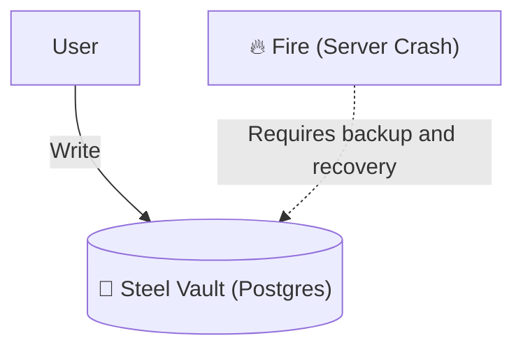

# Chapter 09: Postgres

## 1 The Low-Level Driver
To talk to a SQL database, Go uses the standard package `database/sql`.
However, `database/sql` is just a **Manager**. It needs a worker (Driver) to speak the specific language of PostgreSQL.

We import the driver **Blankly**:
```go
import _ "github.com/lib/pq"
```
### Anatomy of the Blank Import (`_`)
1.  **`import`**: Bring in code.
2.  **`_` (Underscore)**: "I am not going to call this package directly in my code."
    - *Why?* We only want the package's `init()` function to run.
    - Inside `lib/pq`, the `init()` function registers itself with Go's SQL Manager: "Hey, I know how to talk to Postgres!"

### The Enemy: SQL Injection
If you concatenate strings (`"SELECT * FROM users WHERE name = " + input`), you create a **Hole in the Wall**. A hacker can pass `'; DROP TABLE users; --` and destroy your database.

**The Solution: Armored Windows ($1)**
When you use placeholders (`$1`, `$2`), you send the data in a separate, sealed envelope. The database treats it strictly as *text*, never as *commands*.

```go
// BAD (Hole in the Wall)
db.Query("SELECT * FROM users WHERE id = " + id)

// GOOD (Armored Window)
db.Query("SELECT * FROM users WHERE id = $1", id)
```

### 2 Connect & Ping
on Pooling (`sql.Open`)
```go
db, err := sql.Open("postgres", "user=dake dbname=shop...")
```
**Crucial Concept**: `sql.Open` may only validate arguments without connecting. Use `PingContext` with a deadline to check connectivity and handle its error.
It prepares a **Connection Pool**.
- It opens connections only when needed.
- It keeps them open for reuse (Performance).
- Connection management does not make failed transactions safe to retry automatically. The outcome may need reconciliation.

See [database/sql](https://pkg.go.dev/database/sql): pooling and cancellation depend partly on the driver. Always check query errors, close successful `Rows`, and check `Rows.Err()` after iteration.

## 4 The Visual Signal (The Bank Vault)
**Concept**: Persistent Database (Postgres).
**Signal**: A heavy Bank Vault. It takes longer to open than a whiteboard, but durability is subject to storage and configuration. Backups and tested recovery are needed for disk loss or accidental deletion.



