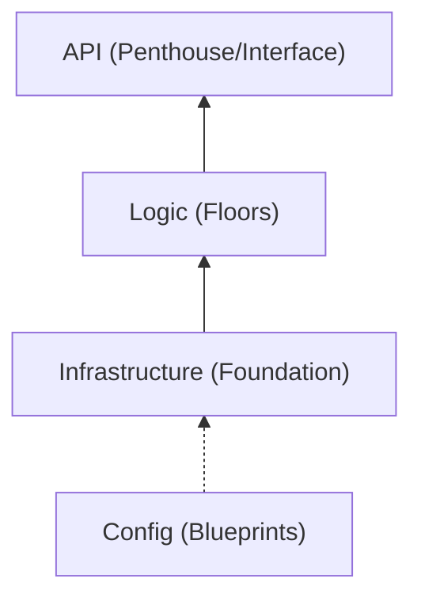

# Chapter 13: Grand Assembly

You have bricks, wood, and glass. Now let's build the house.
In this final chapter, we look at `cmd/api/main.go`. This is where all the isolated pieces we learned about (Router, Config, Database) are wired together.

## 1 Standard Project Layout
Why isn't everything in the root folder?
There is no mandatory universal Go project layout. This project uses these conventions; see [Organizing a Go module](https://go.dev/doc/modules/layout):

1.  **`cmd/`**: The Main Applications.
    - `cmd/api/main.go`: The entry point for our API.
    - `cmd/cli/main.go`: (Optional) CLI tools.
    - *Rule*: No logic here. Just wiring.
2.  **`internal/`**: The Library Code.
    - `internal/models`: Data Structures.
    - `internal/store`: Database Logic.
    - *Rule*: Imports are restricted to code inside the parent directory tree of `internal`.

## 2 The Main Wiring
Open `cmd/api/main.go`. Let's read it like a schematic.

### Step 1: Power On (Configuration)
```go
cfg := config.Load()
```
- **Why?**: Before doing anything, we need to know *how* to run (Port, DB Password).
- **Chapter**: 5 (Configuration).

### Step 2: Unlock the Warehouse (Database)
```go
db, err := sql.Open("postgres", cfg.DB.DSN())
```
- **Why?**: We establish the connection pool. We don't query yet; we just prepare the line.
- **Chapter**: 9 (Postgres).

### Step 3: Hire the Staff (Dependency Injection)
```go
var bookStore store.BookRepository = store.NewPostgresBookStore(db)
```
- **Why?**: We create the `bookStore` worker and **give** it the database connection (`db`).
- **Concept**: Dependency Injection (Chapter 4).

### Step 4: Security Checkpoints (Middleware)
```go
server := &http.Server{
    Handler: middleware.Recoverer(middleware.Logger(mux)),
}
```
- **Why?**: We wrap the router (`mux`) in our "Onion Layers".
    1.  Request hits `Recoverer` (Safety Net).
    2.  Hits `Logger` (Record keeping).
    3.  Hits `mux` (The Router).
- **Chapter**: 10 (Middleware).

### Step 5: Open for Business
```go
server.ListenAndServe()
```
- **Why?**: This starts the infinite loop that listens for traffic on the port.
- **Chapter**: Junior 13 (Web Server).

## 3 Graceful Shutdown (Dying with Dignity)
In production, servers restart often. You don't want to kill active users mid-request.
We catch OS signals (`SIGINT`, `SIGTERM`) and give the server a standardized timeout (e.g., 5 seconds) to finish current jobs before quitting.

```go
// Wait for Ctrl+C
quit := make(chan os.Signal, 1)
signal.Notify(quit, syscall.SIGINT, syscall.SIGTERM)
<-quit

// Give 5 seconds to finish
ctx, cancel := context.WithTimeout(context.Background(), 5*time.Second)
defer cancel()
srv.Shutdown(ctx)
```

## 4 You Did It!
You have assembled a teaching API. It is not a complete store: authentication, authorization, durable orders, payment verification, migrations, and recovery still need implementation and tests.

## The Checklist
- [ ] **Data**: `struct` with JSON tags? (Middle 3)
- [ ] **Logic**: Handlers inject a Repository? (Middle 4)
- [ ] **Safety**: Unit Tests passed? (Middle 11)
- [ ] **Deployment**: CI/CD pipeline green? (Middle 12)

Use the checklist to identify what you can demonstrate and what still needs practice. Completing it does not establish a job level.

::: details 🎓 Knowledge Check: Why shouldn't we put business logic in `cmd/api/main.go`?
**Answer**: Separation of Concerns. `cmd/` is only for **wiring** (starting the engine). Logic belongs in `internal/` so it can be tested in isolation and reused.
:::

## 5 The Visual Signal (The Skyscraper)
**Concept**: The Grand Assembly (main.go).
**Signal**: Constructing a Skyscraper.
1. **Foundation**: Database & Config.
2. **Floors**: Services & Logic.
3. **Elevators**: HTTP Handlers.
`main.go` is the Architect who makes sure the elevator connects to the floors, and the floors sit on the foundation.




The precise `internal` rule: an import is allowed only from code inside the tree rooted at the parent of that `internal` directory. This is an import boundary, not data privacy or an authorization mechanism.
