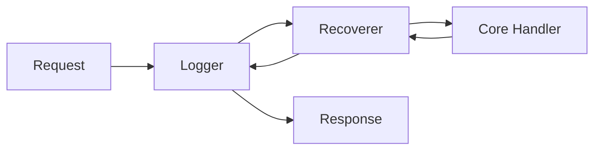

# Middleware & The "Onion" Architecture

## The Onion Pattern

> [!TIP]
> ⚓ **Visual Anchor:** The Onion

Middleware wraps your application logic like layers of an onion.
A request must pass through **Logger** and **Recoverer** layers *before* reaching the core handlers.

## "Eyes and Ears" (Pedagogy)

Why Log?
- **Eyes**: See what's happening (Path, Status, Duration).
- **Ears**: Hear when things break (Panics).

A Middle-level engineer doesn't fly blind. They implement observability from Day 1.
