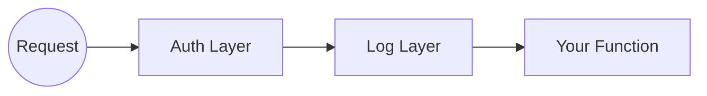

# 14. The Onion (Middleware)

This is one of the most advanced concepts in Go web servers.
Let's dissect it carefully.

## 14.1 Functions as Values
In Go, a function is a value. You can:
1.  Store it in a variable.
2.  Pass it as an argument.
3.  Return it from another function.

## 14.2 The Middleware Signature
```go
func Logging(next http.Handler) http.Handler {
    return http.HandlerFunc(func(w http.ResponseWriter, r *http.Request) {
        // Pre-Processing
        fmt.Println("Start")
        
        next.ServeHTTP(w, r) // Pass the baton
        
        // Post-Processing
        fmt.Println("End")
    })
}
```

### Line-by-Line Anatomy
1.  **`func Logging(next http.Handler) http.Handler`**:
    - Input: The **Next** layer of the onion (the inner handler).
    - Output: A **New** handler that wraps the old one.
2.  **`return http.HandlerFunc(...)`**:
    - We are building a new handler on the fly.
3.  **`func(w, r)`**:
    - This is the **Closure**. It captures the `next` variable from outside.
4.  **`next.ServeHTTP(w, r)`**:
    - **Crucial**: This calls the original handler.
    - If you forget this line, the request stops here. The User never gets a response.

If `Transport` talks to `Service`, and `Service` talks to `Repository`... who checks if the user is logged in? Who measures speed?
This is the **Middleware**.

## The Matryoshka (Russian Doll)
Middleware is like a Matryoshka doll. You put your Handler inside a Logger. You put the Logger inside an Authenticator.
When a request comes in, it has to drill through all the outer layers to reach the center (your logic).



### The Chain
When we wrap handlers: `Logging(Auth(HomeHandler))`

1.  Request arrives $\rightarrow$ **Logging** starts.
2.  Logging calls `next` $\rightarrow$ **Auth** starts.
3.  Auth calls `next` $\rightarrow$ **HomeHandler** (Business Logic).
4.  HomeHandler returns.
5.  **Auth** finishes.
6.  **Logging** finishes.

::: details 🎓 Knowledge Check: What happens if a middleware forgets to call `next.ServeHTTP(w, r)`?
**Answer**: The request **stops** there! It never reaches the next middleware or your business logic. The user will likely see a blank screen or a timeout.
:::

