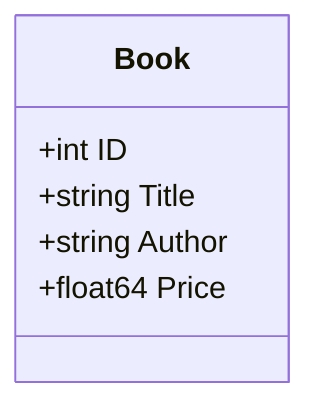

# Domain Models

## The Book Entity

> [!TIP]
> ⚓ **Visual Anchor:** This is the core data structure we pass around.

The `Book` struct is defined in `internal/models/book.go`. It uses JSON tags to ensure that when we send this data over the API, the field names are lowercase (snake_case convention is common in JSON, though here we use simple lowercase matching the Go field names but lowercased).
