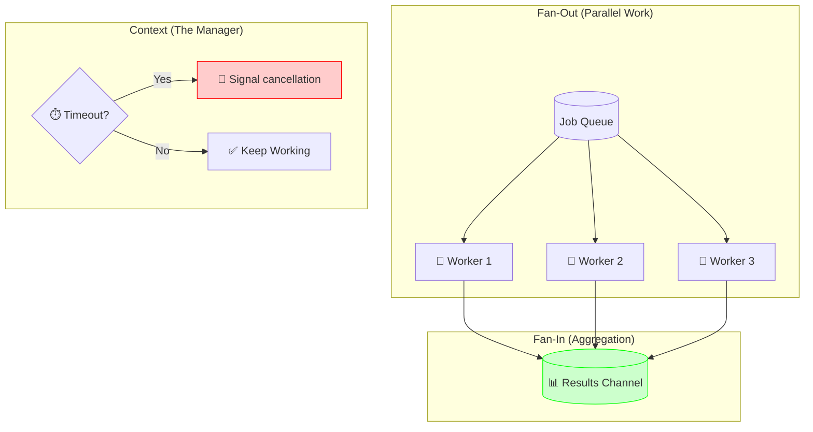

# Chapter 02: Advanced Concurrency Patterns

In the Junior level, you learned `go func()`.
In the Middle level, you learned Worker Pools.
Now, let's learn how to orchestrate thousands of Goroutines without crashing the server.

## 1. Fan-Out / Fan-In
**Scenario**: You need to process 1,000 images.
**Approach**:
1.  **Fan-Out**: Spin up 1,000 workers (or 10 workers) to process them in parallel.
2.  **Fan-In**: Collect all the results into a single channel to save them.

### The Code
Create a separate module and save this complete program as `main.go`. Run `go run .`; expect the squares 1, 4, 9, 16, 25, in no guaranteed order. This finite example has no early consumer exit: if you add one, workers need cancellation so they cannot remain blocked sending.

```go
package main

import "fmt"

func worker(in <-chan int, out chan<- int) {
    for n := range in {
        out <- n * n
    }
}

func main() {
    work := []int{1, 2, 3, 4, 5}
    in := make(chan int)
    out := make(chan int)

    // Fan-Out (Launch Workers)
    for i := 0; i < 3; i++ {
        go worker(in, out)
    }

    // Feed the workers
    go func() {
        for _, n := range work {
            in <- n
        }
        close(in)
    }()

    // Fan-In (Collect Results)
    for i := 0; i < len(work); i++ {
        result := <-out
        fmt.Println("Result:", result)
    }
}
```

## 2. The Context (Timeout & Cancellation)
What if a worker gets stuck? Do we wait forever?
No. **Professionals set deadlines.**

Cancellation is cooperative: work must observe the context. SQL drivers differ in cancellation support; a deadline does not prove rollback of an accepted operation. The following is a fragment inside a function with an initialized `db` and imports `context`, `time`, and `fmt`.

The `context` package allows you to carry:
1.  **Deadlines**: "Stop after 5 seconds."
2.  **Cancellation Signal**: "Stop now, the user cancelled."
3.  **Request-Scoped Values**: "TraceID = xyz".

```go
ctx, cancel := context.WithTimeout(context.Background(), 2*time.Second)
defer cancel()

rows, err := db.QueryContext(ctx, "SELECT * FROM huge_table")
if err != nil {
    fmt.Println("Query failed:", err) // Not every error is a timeout.
    return
}
defer rows.Close()
// Process rows with Next and Scan; then check rows.Err().
```

## 3. Visual Signal (The Traffic Control) 🚦
**Concept**: Orchestrating concurrency.
**Signal**: An Airport Traffic Control Tower.
-   **Fan-Out**: multiple planes taking off at once.
-   **Fan-In**: All planes lining up to land on one runway.
-   **Context (Timeout)**: "If you don't land in 5 minutes, divert to another airport (Abort)."



## 4. Graceful Shutdown
We discussed this briefly in Middle Level. But strictly speaking:
-   **Listen** for `SIGTERM`.
-   **Call** `server.Shutdown(ctx)`.
-   **Wait** for connections to drain.

*Never just pull the plug.*
