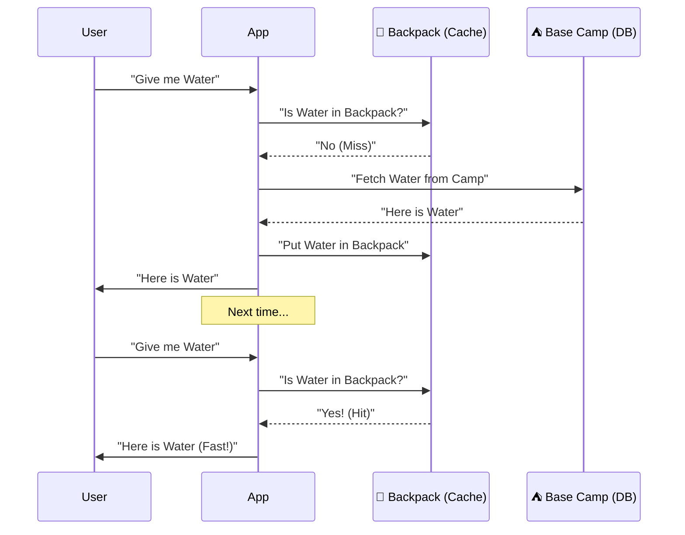

# Chapter 03: Caching (Redis)

> **"There are only two hard things in Computer Science: cache invalidation and naming things."** - Phil Karlton

PostgreSQL and the operating system cache data in memory. Redis keeps its working dataset in memory and supports persistence options. End-to-end latency includes networking and application work; measure it rather than deriving it from raw memory-versus-disk timings. See [Redis persistence](https://redis.io/docs/latest/operate/oss_and_stack/management/persistence/).

## 1. The Strategy: Cache-Aside
We don't just "use Redis". We use a pattern called **Cache-Aside**.

1.  **Ask Cache**: "Do you have the book details?"
2.  **Hit**: Return it immediately (Fast!).
3.  **Miss**:
    -   Ask Database (Slow).
    -   Save result to Cache (for next time).
    -   Return result.

### Pseudocode, not a runnable Go client

The names below stand for application-specific adapters. A real adapter must distinguish cache miss, corrupt data, and transport failure, and handle database and cache-write errors. Choose the client and its version before turning this sketch into executable code.
```go
func GetBook(id string) Book {
    // 1. Check Cache
    val, err := redis.Get("book:" + id)
    if err == nil {
        return Unmarshal(val)
    }

    // 2. Check DB
    book := db.Find(id)

    // 3. Save to Cache (Set Expiry!)
    redis.Set("book:"+id, Marshal(book), 10*time.Minute)

    return book
}
```

## 2. Invalidation (The Hard Part)
If I update the book price in Postgres, Redis still has the old price!
**Solution**:
Deleting the cache key after a committed database update is a starting policy, not a consistency guarantee. A concurrent reader can fetch an old database value before the update and cache it after deletion. Define acceptable staleness, TTL, and a versioning or invalidation protocol. Determine the checkout price from authoritative state and preserve it in the order.

```go
func UpdateBook(book Book) {
    db.Save(book)
    redis.Del("book:" + book.ID) // Force next fetch to hit DB
}
```

## 3. Visual Signal (The Backpack) 🎒
**Concept**: Caching Layers.
**Signal**: A Hiker's Backpack vs The Base Camp.

-   **Redis (Backpack)**: Small, fits only essential items, instant access.
-   **Postgres (Base Camp)**: Huge warehouse, fits everything, but takes a long walk to get there.



## 4. When to Cache?
-   **Read-Heavy Data**: Product catalogs, user profiles.
-   **Slow Queries**: Reports that take 5 seconds to generate.
-   **Don't Cache**: Real-time stock prices, transactional data that changes every second.
