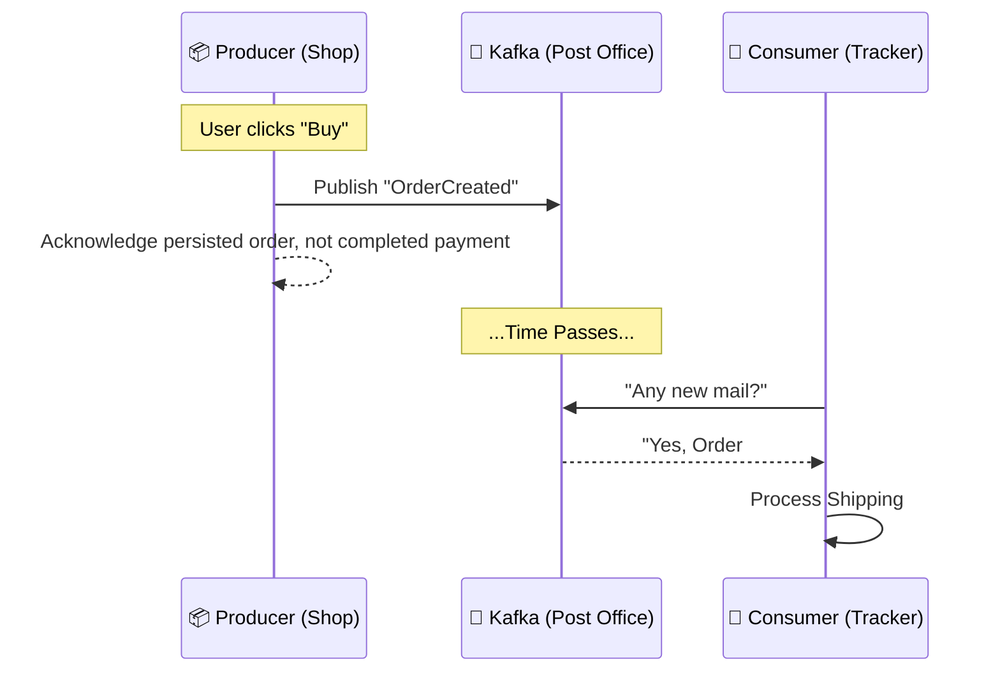

# Chapter 04: Message Brokers (Kafka)

> **"Don't call me, I'll call you."** - The Hollywood Principle

In a standard API (REST/gRPC), Service A calls Service B and **WAITS** for an answer. This is **Synchronous**.
What if Service B is down? Service A fails. The user sees an error.

**Message Brokers** allow us to be **Asynchronous**.

## 1. Producer & Consumer
1.  **Producer (Shop)**: "A new order was created!" (Drops letter in mailbox).
2.  **Broker (Kafka)**: Stores the letter safely.
3.  **Consumer (Tracker)**: "Oh, a new order? I'll ship it." (Picks up letter when ready).

Records remain subject to retention and storage settings. Durability depends on producer acknowledgements, replication, and failures. A broker does not atomically save the shop order and its event; that boundary needs a transactional outbox or another explicit protocol.

### The Topic (The Mailbox)
In Kafka, messages are organized into **Topics**.
-   `orders.created`
-   `user.registered`
-   `payment.failed`

### Adapter fragments (Sarama Library)

These fragments require a configured producer/consumer and versioned dependency; they are not standalone programs. Check publish errors and only commit consumed progress after the business transaction succeeds.
```go
// Producer
msg := &sarama.ProducerMessage{
    Topic: "orders.created",
    Value: sarama.StringEncoder(`{"order_id": 123}`),
}
if _, _, err := producer.SendMessage(msg); err != nil {
    return err
}
```

```go
// Consumer
for msg := range partitionConsumer.Messages() {
    fmt.Printf("Received Order: %s\n", string(msg.Value))
    shipOrder(msg.Value)
}
```

## 2. Visual Signal (The Post Office) 🏣
**Concept**: Asynchronous Decoupling.
**Signal**: Dropping a letter at the Post Office.
-   **You (Producer)** don't wait for the recipient to open the door. You drop the letter and go home.
-   **The Postman (Broker)** ensures delivery.
-   **The Recipient (Consumer)** reads it when they wake up.



## 3. At-Least-Once Delivery
At-least-once processing requires appropriate producer and consumer behavior, including committing progress after processing. It is not unconditional. See [Kafka delivery semantics](https://kafka.apache.org/41/design/design/).
It might be delivered **twice** (network retries).
Your Consumer must be **Idempotent**.
*   **Bad**: `balance = balance - 10` (Run twice -> -20).
*   **Also unsafe**: a separate `if !processed(msg.ID)` check and balance update can race or be interrupted by a crash.
*   **Required contract**: atomically insert a unique event ID and apply the balance change in the same database transaction. On duplicate ID, do not apply it again. For external payments, use the provider’s idempotency mechanism and reconcile unknown outcomes; a local transaction cannot roll back an external charge.

## 4. Why use it?
-   **Decoupling**: Services don't need to know about each other.
-   **Buffering**: If Black Friday traffic spikes, the Broker holds the messages until Consumers can catch up.
-   **Replayability**: New consumers (Analytics Service) can read old messages to build history.
