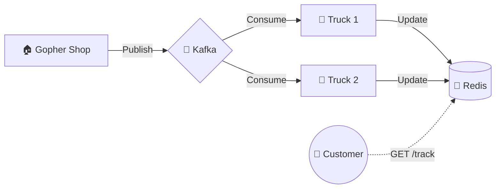

# Chapter 05: Project "GoTracker"

> **"Theory is nice. Practice is better."**

We are going to build **GoTracker**.
It is a microservice that listens for `orders.created` and simulates shipping.

## 1. The Specification

### Tech Stack
-   **Language**: Go
-   **Storage**: Redis (For package status)
-   **Broker**: Kafka (or Redpanda for dev)
-   **Protocol**: gRPC (for admin queries) + HTTP (for public tracking)

### Features
1.  **Ingest**: Listen to Kafka topic `orders.created`.
2.  **Process**:
    -   Parse JSON.
    -   Generate a "Tracking Number" (UUID).
    -   Save to Redis: `SET tracking:123 "Preparing"`
3.  **Simulate**:
    -   Wait 10 seconds -> Update to "Shipped".
    -   Wait 10 seconds -> Update to "Delivered".
4.  **Query**:
    -   `GET /track/{id}` returns the status.

## 2. Directory Structure
We will create a **separate repository** (or folder) for this.
```text
go-tracker/
├── cmd/
│   └── tracker/
│       └── main.go
├── internal/
│   ├── consumer/ (Kafka Logic)
│   ├── store/    (Redis Logic)
│   └── service/  (Business Logic)
└── docker-compose.yml
```

## 3. Visual Signal (The Delivery Fleet) 🚚
**Concept**: Background Workers.
**Signal**: A fleet of delivery trucks waiting for orders.
-   **Shop**: The Storefront.
-   **Kafka**: The Loading Dock.
-   **GoTracker**: The Trucks that take boxes from the Dock and drive them to the customer.



## 4. The Challenge
This is an optional design exercise about physical deliveries, outside the digital-book project. No completed service or step-by-step implementation is included here.

Start with an in-memory event processor and a test: processing the same event twice creates one parcel. Then introduce persistence and test a process restart. Only after those work add the broker adapter and demonstrate a crash between saving a parcel and committing consumer progress. Explain why replay does not create a second parcel. Redis configuration and eviction rules must be explicit if it stores authoritative state.

If you cannot explain the first test, return to Middle chapters 4 and 11. If restart loses the parcel, revisit persistence before adding Kafka. Completion requires recorded failure experiments, not only a directory tree.
