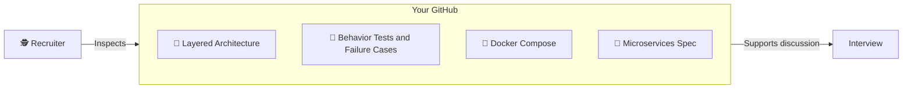

# Chapter 07: The Career (The Portfolio)

> **"Show, don't tell."**

Reading these chapters does not establish a job level. Use the project to demonstrate specific working features, tests, and decisions. Describe only what you actually implemented and measured.

## 1. The Resume Defense
Stop writing "I know Go".
Write **Impact**.

-   **Bad**: "Wrote Go code for a shop."
-   **Good**: "Designed and implemented a distributed microservice architecture using Go, Kafka, and Redis, capable of handling async order processing with graceful degradation."

## 2. The Portfolio Project
**"The Gopher Shop" is your Portfolio.**
Don't just hide it on GitHub.
1.  **Pin it** to your profile.
2.  **Write a README** that explains the Architecture (use the diagrams from this course!).
3.  **Deployed Demo**: If possible, deploy it (Render.com, Railway.app) and link it.

## 3. Visual Signal (The Portfolio) 💼
**Concept**: Proof of Competence.
**Signal**: An Artist's Portfolio.
-   A Junior brings a sketch.
-   A Senior brings a Gallery.

## 4. The Interview Defense (Go Mafia Style)
**Q: Why Go?**
A: "Its standard networking library and tooling fit this project. Performance depends on the workload; I would demonstrate it with measurements."

**Q: Why Microservices?**
A: "To decouple scaling and failure domains. But only if the complexity is justified."

**Q: Why Interfaces?**
A: "To decouple implementation from behavior, enabling testing (Mocking) and flexibility."

---

## Graduation 🎓
You started as a Gopher in a Garage.
Keep practicing with independently chosen requirements and explain the limits of your solution.

**Go forth and build.**
