# Visual Anchors (The Pedagogical Signals)

To ensure "No Dark Zones", we use consistent visual metaphors throughout the course.
This catalog tracks every signal used to explain an abstract concept.

## 1. The Container (Structs)
*A Blueprint for a composite object.*

## 2. The Shelf (Slices)
*A window into a growing array.*

## 3. The Conveyor Belt (Loops)
*Processing items one by one.*

## 4. The Quality Gate (Validation)
*Previously "The Club Bouncer"*
*Rejects bad data immediately.*

```mermaid
graph TD
    Input[Incoming Data] --> Gate{Is Valid?}
    Gate -- No --> Reject[🛑 Error 400]
    Gate -- Yes --> Warehouse[(✅ Database)]
    style Gate fill:#007d9c,color:white
    style Reject fill:#d9534f,color:white
```

## 5. The Universal Plug (Interfaces)
*Dependency Injection.*

