# Visual Anchors (The Pedagogical Signals)

To ensure "No Dark Zones", we use consistent visual metaphors throughout the course.
This catalog tracks every signal used to explain an abstract concept.

## The Collection

```mermaid
graph TD
    A[Concepts] --> B(Variables)
    A --> C(Logic)
    A --> D(Data)
    A --> E(Architecture)

    B --> B1["📦 The Box (Memory Cell)"]
    B --> B2["🏷️ The Sticker (Variable Name)"]
    B --> B3["🗿 The Stone Tablet (Constants)"]
    
    C --> C1["⚖️ The Scales (Comparison)"]
    C --> C2["🛤️ The Railroad Switch (If/Else)"]
    
    D --> D1["📚 The Shelf (Array)"]
    D --> D2["🏗️ The Blueprint (Struct)"]
    D --> D3["🎫 The Coat Check (Map)"]
    D --> D4["📝 The Address Card (Pointer)"]
    
    E --> E1["🔌 The Universal Plug (Interface)"]
    E --> E2["🛡️ The Quality Gate (Validation)"]
    E --> E3["🧅 The Onion (Middleware)"]
    E --> E4["🏭 The Warehouse (Database)"]
```

## Detailed Explanations

### 1. The Quality Gate (Validation)
*Formerly "The Bouncer"*
- **Concept**: Guard Clauses.
- **Signal**: A factory gate that rejects defective parts immediately.
- **Why**: Explains why we check specific errors at the top of the function.

### 2. The Universal Plug (Interfaces)
- **Concept**: Dependency Injection.
- **Signal**: A wall socket that accepts any device.
- **Why**: Explains why `BookRepository` is an interface, not a concrete struct.

### 3. The Coat Check (Maps)
- **Concept**: Key-Value Stores.
- **Signal**: You give a ticket (Key), getting a specific item (Value).
- **Why**: Explains that maps are not ordered like arrays (Shelves).
